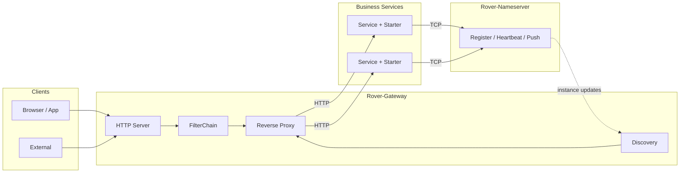

<div align="center">

<img src="data:image/png;base64,iVBORw0KGgoAAAANSUhEUgAAAgAAAAIACAYAAAD0eNT6AAAOiUlEQVR42u3dvW5URxgG4O+M3G9AQkbUqZxboKFJg5BCkY4UUa4LpQhdCiJFNGlouIW4So2wkGz2CpwiAiVEAtvs7pmZ93maSPljz+yZ+d755uzuUnRpc3xyaRSA0W3PThej0CdvjAIPICAIACj2AEKBAICCDyAQCAAo+AACgQCg6AMgDAgAij4AwoAAoOgDIAwIAAo/AIKAAKDoAyAMCAAKPwCCgACg8AMgCAgACj8AgoAAoPADIAgIAAo/AILAdTXFHwDy6sbiDQSAvG7AovADQF4QaIo/AOTVl8UbAwB53YCm+ANAXt1p3gQAyKs/i4EHgIo7EmiKPwDk1aVmkAEgrz4tBhYAKu5IoCn+AJBXt5pBBIC8+tUMHgDk1bFm0AAgr541gwUAeXWtGSQAyKtvzeAAQF6dawYFAPLqXTMYAJBX95pBAIC8+tcUfwDIq4NN8QeAvBDQFH8AyAsBTfEHgLwQ0BR/AMgLAU3xB4C8ENAMNwDkaXb/AJDXBWiKPwDkhYCm+ANAXgjwDAAAlGcA7P4BIKAL0BR/AMgLAU3xB4C8EOAZAAAozwDY/QNAQBegKf4AkBcCHAEAQDkCsPsHgIAugA4AAOgA2P0DQEIXoCn+AJAXAhwBAEA5ArD7B4CALoAOAADoANj9A0BCF0AHAAB0AOz+ASChC6ADAAA6AHb/AJDQBdABAAAdALt/AEjoAugAAIAOAAAgAJT2PwDUhMcAOgAAoANg9w8ACV0AHQAA0AEAAKIDgPY/ANS0xwBHhghgN37/6avP/juPnr4zUHRh0QEA2G/RFwZYy/bsdLlWAFD8AfZX+AUBeggBAgDASoVfEGDNAOBTAAAdFP9D/P/hkwHA7h9gveIsBFAH+jSADgBAZ0VZCMAXAQGEFX8hAAEAILT4CwEcPAA4/wfoq/gKAdSengPQAQAARwAA9Lbr1gVAAAAAdhsAnP8D9Lvb1gWgdvwcgA4AADgCAAAEAIDS/vf6EAAAgHkCgAcAAaCiHgTUAQAARwAAgAAAAAgAAIAAAAAIAACAAAAwmEdP33l95AQA3wEAABX3XQA6AADgCACgHAN4XQgAAIAAAKALYPePAAAACAAAugB2/wgAAIAAAAAIAACAAAAACAAAgAAAAAgAAIAAAAAIAACAAAAACAAAgAAAAAIAACAAAAACAAAgAAAAAgAAIAAAAAIAACAAAAACAAAgAAAAAgAAIAAAAAIAACAAAAACAAAgAAAAAgAACAAAgAAAAAgAAIAAAAAIAACAAAAA9O3IELCWr0++MQiT+Ov0T4MAAgAo+OnvrUAAAgAo/MHvuSAAAgAKP4IAIACg8CMIAOVTACj+uD8AAQCLO+4ToBwBYEHHkQCgA4Dij/sHEACweOM+AgQAAEAAwK4N9xMgAGCxxn0FCABYpHF/gQAAAAgAYHeG+wwEAABAAMCuDNxvIAAAAAIAdmPgvgMBAAAQAAAAAQAAEAAo57Dg/gMBAAAQAAAAAQAAEAAAAAEAABAAAAABAAAEAABAAAAABAAAQAAAAAQAAEAAAAAEAABAAAAABAAAQAAAAAQAAEAAAAAEAABAAAAABAAAQAAAAAQAABAAAAABAAAQAAAAAQAAEAAAAAEAABAAAAABAAAQAAAAAQAAEAAAAAEA4JAePX0X/ecjAAAAAgCALoDdPwIAgBCg+CMAAAgBij/9OzIEVFVtbt8yCLg3P+PJ83/++uzx5R7+38tBr3d7fuHmEgCwoAI3KdazrQNCgQCAgv/B2zev687dewaRVbx989ogrLhWCAQCAHb6QPAaIggIACj6QPi6IgwIACj8gK4A5WOArDgZ9138ncNSzv9ZYe1BAMCuH7AOIQCwRvK2G8P9hm6AAIC0DWB9EgBImVx2ZbjPEALKpwAwoQB8UkAHgJDib3eG+wubFwGA0MljkcZ9hRAgABA6aSzWuJ8QAgQATBYA65oAQMoksWvDfYQQIAAQOjks3rh/EALKxwDJXsTv3L1nMFD4QQeAtFRsUcd9gi6AAEDoZLC44/5ACChHAGROAkcCKPxcdf3zbYECAJ4NQOEHBAC7f0EAhR9dAAQAxX/KoiAQKPggBAgAKBoAlE8B2P0DWBcRAAAAAUDKBbA+IgAAAAIAACAAlPYWgHUSAQAAEACkWgDrpQAAAAgAAIAAAAAIAJTzLADrpgAAAAgAAED5OWC4ulcvXxiEj9x/8LCb1/Ls8aU35MCePF8MAju1bI5PzORylqXwCwIKvyDQm+35hTd8X2N7dro4AlD8FX/jpPgPJOl9sH6WZwBQ1Fh3vBR/IQABABT/sHFTbIQABAAAQAAAu//Zx88uUxcAAQAAEAAAAAEAABAAAAABAAAQAAAAAQAAEAAAAAEAABAAAAABAAAQAAAAAQAAEAAAAAEAAAQAAEAAAAAEAABAAAAABAAAQAAAAAQAAEAAAAAEAABAAAAABAAAQAAAAAQAAEAAYEj3Hzw0CB2P35Pni0HumPcHAQAAEACwizVudpl2/yAAoJgZL8VG8QcBAEXNOCk6ij8sm+OTS8OwP5vbtwzCDbx6+cIgdByQnj22bCj8h7E9v/Dm72Ncz04XAUAAABAAAgOAIwAAKM8AAAACAAAgAAAAAgAAIAAAAAIAACAAAAACAAAgAAAAAgAAIAAAAAIAACAAAAACAAAgAAAAAgAAIAAAgAAAAAgAAIAAAAAIAACAAAAACAAAgAAAAAgAAIAAAAAIAACAAAAACAAAgAAAAAgAAIAAAAAIAACAAAAAAgAAIAAAAAIAN7Q9vzAIANZPAQAAEAAAAAEAABAAAAABoDzIAmDdRAAAAAQAAEAAAAAEgHKeBWC9RAAAAAEAqRbAOikAAAACAAAgAFDaWwDWRwEAABAAkHIBrIsCAAAgACDtAlgPBQA3PYB1EAEAABAApF8A6x8CgEkAYN1DADAZAKx3CAAAgAAgFQNY5xAATA4A6xsCgEkCYF0TADBZAKxnAgAmDYB1TADA5AGwfs3myBCMM4k2t28ZDEDhRwfApAKwTqEDEDO59tUJ+Pbhd1f+d/948Zs3AzrSw/xV/MeybI5PLg3DmL40CFxnwRAIYNyCv+/5q/APuJk8O10EgLAQsMtFQxiAcYv+ruav4i8A0HkQOMTCIQjAuIX/uvNX4RcA6DwIrLFwCAIwbuH/3PxV+AUABvD9Dz9281qEABiv+L/36y8/e0MEABR+QQBSCr8gMHcA8D0Air/FDcyPKdYXyhcBKf4WOVD8hQDK9wAo/qWdCOav+Us5ArB4eN1gHpi/5QgAi4fXD+5/81cAwORzHeC+N38FAEw61wPud/NXAAAABACkbdcF7nPzt3wMEJOsUj9edJ33xkeoMsfP/KU6+hjgkWGAwy/mH/+3iYum8QMdAOwehtlFHOI9mLmYJY+f+YsOAChcV/qzZlpEjR/oAGD3MNQuoodxH7mQGT/zF18FDIqXr4o1ftARRwAwQMEYqa1t/KB8DwB2MKNdd+9j7fW5p8xfBAAIXbB6fZ3GDwQAUPzDXq/xAwEAFP/ykJ3xAwEAi1TX1+/32I2f8XH9AgBYnFyH8QMBABR/12P8QAAAAAQAsNtLvS7jBwIAWOTLQ23GDwQAAEAAALu7ma7T+IEAAAAIAGBXN/v1Gj8QAAAAAYB9S//9cr/fjvvX9SMAQGnnHv66jR8IAACAAAAACACUczTXDe5j81cAgHKOO/r1Gz/PASAAAAACAKWd5nrB/ex6BQAAQABAqnadYP4iAAAAnQWA7dnpYhika9cH7m/Xl+F93dcBMMlcF7jPXZcjAABAAEDadj3gfjd/BQBMOtcB7nvzVwDA5Ov+9fs99p+Nn/vT60cAsEh53WAemL8IABYRrxfMB/M3OwD4LgCLiNcJ5oX5WzHfAaADYBGJeH1+j934uVfNJf7vyBDMu3D19FvmFg4wfynPAJA1aS0eYP7Snw9nAZvjk0vDMa81dhO9LRw97ahGHHvjZ/5SUz0DcPTvvykEaCtaOMD8Zf7i/58OgC6ArkDCopGwi93ne2H8zF/mCQAeArSruNGCYsEA85ea4xkAHQBK58Pu1fiZIMR0ANqn/iFY5F2X8YP5ir+PAQJA+R4A0AVwPcYPBAAQAlyH8YOYAOA5AIQAr9/4QU19/q8DAH6P3fiBDgAIAV6v8YPoAOAYACHA6zR+UNO2/3UAwO+xe31QvgmwfCsgVJffeDdi4TJ+MGgHwDEAugEesjN+MGfx/2QHQBcA/B678QMBAPB77MYPUgKAEAB+j934wXzFXwCAlQqagmX8oPsAIAQAwFzFv8r3AABA+SZAAEAAKN8JAAA1W/tfBwAAdAB0AQAgYfevAwAAOgC6AACQsPvXAQAAHQBdAABI2P3rAACADoAuAAAk7P51AABAB0AXAAASdv9f3AEQAgBgvOLvCAAAyhGALgAABOz+dQAAQAdAFwAAEnb/O+0ACAEAMEbxdwQAAOUIQBcAAAJ2/3vpAAgBANB/XW0jvVgAUPw9AwAA9BYAdAEAoN862kZ+8QCg+Hd6BCAEAEB/ddMzAABQngHQBQCAyXf/B+0ACAEA0E+dbDNfHAAo/p08AyAEAMD6dbElXSwAKP4rfwpACABA8a+KCwBCAACKf2gAEAIAUPxDA4AQAIDiHxoAhAAAFP/QACAEAKD4hwYAIQAAxT80AAgBACj+wb8GKAQAoPiH/hywEACA4h8YAIQAABT//RiquG6OTy7dWgAo/AEdAN0AANSn8AAgBACgLlXeEUA5EgBA4c/sAOgGAKD+hAcAIQAAdafyjgDKkQAACn9mB0A3AAD1JbwDoBsAgMIfHgAEAQAU/so4AnAsAIC6oQOgGwCAwi8ACAIAKPzRAUAQACD9iNj5uCAAoPALAIKAUQBQ+AUAYQAARV8AEAQAUPgFAGEAAEVfABAGAFD0BQBhAABFXwAQCABQ8AUAgQAABV8AEAoAFHsEAAQEQIEHAGC3/gZ3jAZ3sy91VwAAAABJRU5ErkJggg==" alt="Rover-Suite" width="96" />

# Rover-Suite

Lightweight Microservice Middleware Suite

Java 17 + Netty · Registry · HTTP Gateway · Spring Boot Starter

[English](README.md) · [简体中文](README.zh-CN.md) · [Architecture](docs-public/architecture.md)


[Intro](#-introduction) · [Features](#-features) · [Architecture](#-architecture) · [Quick Start](#-quick-start) · [Integration](#-integration) · [Roadmap](#-roadmap)

</div>

---

## 📖 Introduction

**Rover-Suite** is a lightweight, independently deployable microservice infrastructure:

| Component | Description |
| :--- | :--- |
| **Rover-Nameserver** | TCP-based service registry and discovery |
| **Rover-Gateway** | Netty HTTP gateway (routing, discovery, load balancing, reverse proxy) |
| **Rover-Starter** | Spring Boot integration for automatic registration |
| **Rover-Admin** | Optional console for runtime configuration |

It is designed for lightweight deployment, clear request paths, and private / customizable environments.

---

## ✨ Features

| Feature | Description |
| :--- | :--- |
| **Self-contained core** | Nameserver and Gateway are built on Netty without Spring Cloud |
| **Standalone processes** | Registry and gateway can run as separate executable jars |
| **Low-intrusion SDK** | Register with Starter + YAML only |
| **Static / dynamic routing** | Fixed upstreams and registry-based discovery share load balancing |
| **Extensible SPI** | Filters, load balancers, and service discovery adapters |
| **Runtime management** | Admin console for viewing and updating runtime config |

---

## 🗺️ Architecture



See **[docs-public/architecture.md](./docs-public/architecture.md)** for module dependencies and request flow.

---

## 🏗️ Modules

| Module | Role |
| :--- | :--- |
| `rover-common` | Protocol, codec, and shared utilities |
| `rover-nameserver-core` | Registry core |
| `rover-nameserver-server` | Nameserver executable |
| `rover-nameserver-client` | Registry client |
| `rover-nameserver-starter` | Spring Boot Starter |
| `rover-gateway-core` | Gateway core |
| `rover-gateway-bootstrap` | Gateway executable |
| `rover-gateway-adapter-nacos` | External registry adapter |
| `rover-admin` | Admin console |
| `rover-demo` | Sample business service |

---

## 🚀 Quick Start

### Prerequisites

- JDK 17+
- Maven 3.6+

### 1. Build

```bash
git clone https://gitee.com/zzl-java/roverSuite.git
cd roverSuite
mvn clean package -DskipTests
```

### 2. Start Nameserver

```bash
java -jar rover-nameserver-server/target/rover-nameserver-server-1.0.0-SNAPSHOT.jar
```

Default TCP port: `8888`.

### 3. Start Gateway

```bash
java -jar rover-gateway-bootstrap/target/rover-gateway-bootstrap-1.0.0-SNAPSHOT.jar
```

Port is configured in `rover-gateway.yml` (change to `8080` locally if needed).

### 4. Start the sample service

```bash
mvn -pl rover-demo spring-boot:run
```

### 5. Optional: Admin

```bash
mvn -pl rover-admin spring-boot:run
```

Default URL: `http://127.0.0.1:9090`

---

## 🔌 Integration

### Dependency

```xml
<dependency>
    <groupId>com.rover</groupId>
    <artifactId>rover-nameserver-starter</artifactId>
    <version>1.0.0-SNAPSHOT</version>
</dependency>
```

### Configuration

```yaml
spring:
  application:
    name: demo-service

server:
  port: 8081

rover:
  nameserver:
    enabled: true
    address: 127.0.0.1:8888
    host: 127.0.0.1
    weight: 100
    ephemeral: true
    heartbeat-interval-ms: 5000
```

Gateway example:

```yaml
rover:
  gateway:
    discovery:
      type: nameserver
      nameserver:
        address: 127.0.0.1:8888
    loadbalance:
      strategy: round_robin
    routes:
      - id: demo-api
        businessPrefix: /api/demo
        serviceName: demo-service
        stripPrefix: /api/demo
```

---

## 📊 Comparison

| Dimension | Typical Spring Cloud Stack | Rover-Suite |
| :--- | :--- | :--- |
| Deployment | Heavier component ecosystem | Core path runs as standalone jars |
| Coupling | Often tightly coupled to Spring Cloud | Core on Netty; only Starter uses Spring Boot |
| Registry | Commonly Nacos, etc. | Self-built TCP Nameserver |
| Gateway | Commonly Spring Cloud Gateway | Self-built Netty Gateway |
| Fit | Large-scale platforms | Lightweight and customizable deployments |

---

## 🗺️ Roadmap

- [x] Nameserver register / heartbeat / push
- [x] Gateway routing, discovery, load balancing, and reverse proxy
- [x] Spring Boot Starter
- [x] Admin runtime management
- [ ] Traffic governance enhancements
- [ ] External registry adapters
- [ ] High availability / clustering

---

## 📚 Documentation

- [Public docs index](./docs-public/README.md)
- [Architecture](./docs-public/architecture.md)

---

## 🤝 Contributing

Issues and pull requests are welcome.

---

## 📄 License

Licensed under the [Apache License 2.0](./LICENSE).

---

## 📮 Contact

- Repository: https://gitee.com/zzl-java/roverSuite
- Issues: please open a ticket in the repository

<p align="center">
  <sub>Rover-Suite — Lightweight microservice infrastructure.</sub>
</p>
