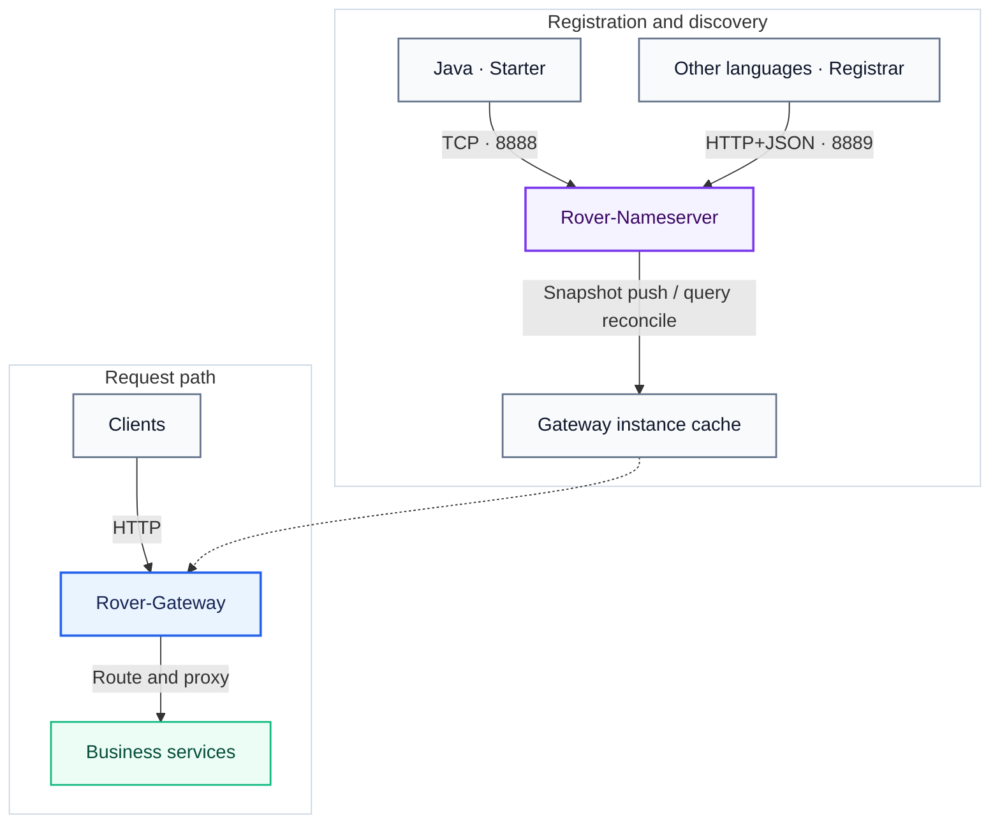

<div align="center">


<br/>

[English](README.md) · [简体中文](README.zh-CN.md) · [Documentation](docs-public/README.md) · [Architecture](docs-public/architecture.md)

<br/>


<br/>

[Intro](#-introduction) · [Features](#-features) · [Architecture](#-architecture) · [Quick Start](#-quick-start) · [Integration](#-integration) · [Roadmap](#-roadmap)

</div>

> **作者 Author：Daylight**
>
> **开源许可 Open Source：Rover-Suite 采用 Apache License 2.0。Rover 名称、Logo 等品牌标识不随 Apache-2.0 授权，详见 [NOTICE](NOTICE)。**

---

## 📖 Introduction

**Rover-Suite** is a lightweight microservice infrastructure designed for small teams. It solves a common problem:

> You have multiple monolithic backend services (possibly in Java/Python/PHP/Go), multiple frontend apps each hardcoding backend ports, Nginx requires manually maintaining static configs, and OpenResty/APISIX feels too heavy and hard to customize.

Rover-Suite provides an **all-in-one lightweight solution with a built-in registry**: backend services auto-register on startup, while the gateway tracks instance changes through snapshot push plus periodic reconciliation — no manual IP/port maintenance needed.

| Component | Description |
| :--- | :--- |
| **Rover-Nameserver** | In-memory service registry with Java TCP and multi-language HTTP registration |
| **Rover-Gateway** | Netty HTTP gateway (routing, discovery, load balancing, reverse proxy) |
| **Rover-Starter** | Spring Boot integration for auto-registration and graceful shutdown |
| **Rover-Admin** | Optional console for runtime configuration management |

## 🧭 Where should I start?

Most users only need one of these paths first:

| I want to... | Read this |
| :--- | :--- |
| Run Rover-Suite once and verify the full request path | [Quick Start](docs-public/quick-start.md) |
| Understand daily configuration, routes, Admin, and runtime boundaries | [User Guide](docs-public/user-guide.md) |
| Open the Admin console and understand each page | [Admin User Guide](docs-public/admin-guide.md) |
| Register Java or non-Java services | [Service Registration](docs-public/service-registration.md) |
| Check every YAML/Admin configuration key | [Configuration Reference](docs-public/configuration-reference.md) |
| Write and mount a custom Filter or LoadBalancer plugin | [Plugin Development](docs-public/plugin-development.md) |
| Deploy with Docker Compose or production-like settings | [Docker Compose](deploy/docker/README.md) · [Production Deployment](docs-public/production-deployment.md) · [Small-team go-live](docs-public/small-team-go-live.md) |
| Diagnose 404/502/registration/performance issues | [Troubleshooting and Performance](docs-public/troubleshooting-performance.md) |

The full documentation index is here: **[docs-public/README.md](docs-public/README.md)**.

---

## ✨ Features

| Feature | Description |
| :--- | :--- |
| **Self-contained core** | Nameserver and Gateway are built on Netty without Spring Cloud |
| **Standalone processes** | Two jars are enough to run the full request path |
| **Low-intrusion SDK** | Register with Starter + YAML only, supports graceful shutdown |
| **Multi-language registration** | HTTP+JSON Registrar references for Node.js, Python, Go, PHP, and C++ |
| **Health check** | Heartbeat timeout auto-evicts ephemeral instances / marks persistent ones unhealthy; Gateway refreshes through push and reconciliation |
| **Static / dynamic routing** | Fixed upstreams and registry-based discovery share load balancing |
| **Multiple load balancing** | Round-robin, weighted round-robin, random, IP hash, least connections |
| **Focused extension points** | Filter and load-balancer plugin JARs; source-level service-discovery and registration adapters |
| **Basic traffic protection** | Built-in local rate limiting, plus custom business limiting through Filter plugins |
| **Runtime management** | Admin console for viewing and updating runtime config, hot route updates |
| **Management security** | Configurable bind address + token auth for the management API and registration/subscription protocol |
| **Java native** | Customize with Java SPI, zero learning cost for Java teams, source code fully modifiable |

---

## 🗺️ Architecture



See **[docs-public/architecture.md](./docs-public/architecture.md)** for module dependencies and request flow.

---

## 🏗️ Modules

| Module | Role |
| :--- | :--- |
| `rover-common` | Protocol, codec, and shared utilities |
| `rover-nameserver-core` | Registry core |
| `rover-nameserver-bootstrap` | Nameserver executable |
| `rover-nameserver-client` | Registry client |
| `rover-nameserver-starter` | Spring Boot Starter |
| `rover-gateway-core` | Gateway core |
| `rover-gateway-bootstrap` | Gateway executable |
| `rover-gateway-adapter-nacos` | Reserved adapter skeleton; Nacos runtime integration is not implemented yet |
| `rover-admin` | Admin console |
| `rover-gateway-test/demo/backend` | Test backend service for gateway verification |
| `rover-gateway-test/demo/frontend` | Test frontend panel (separate from core suite) |

---

## 🚀 Quick Start

For the complete first-run path, including the recommended local `8080` Gateway config and verification
commands, see the **[Quick Start guide](./docs-public/quick-start.md)**.

### Prerequisites

- JDK 17+
- Maven 3.6+

### 1. Build

```bash
git clone https://gitee.com/zzl-java/roverSuite.git
cd roverSuite
mvn clean install -DskipTests
```

Before starting the local demo, follow the detailed guide to copy both bundled configs and move Gateway to
`8080`. The guide also binds listeners to `127.0.0.1` so local development is not exposed accidentally. The
project intentionally defaults to all-interface, unauthenticated listeners for zero-config startup on a trusted
network; configure bind addresses, tokens, CORS, and outer network policy when access control is required.

### 2. Start Nameserver

```bash
java -jar rover-nameserver-bootstrap/target/rover-nameserver-bootstrap-1.0.0-SNAPSHOT.jar
```

Default TCP port: `8888`.

### 3. Start Gateway

```bash
java -jar rover-gateway-bootstrap/target/rover-gateway-bootstrap-1.0.0-SNAPSHOT.jar
```

The bundled configuration uses port `80`; the detailed guide sets the external local configuration to `8080`.
External configuration has priority over the classpath file.

### 4. (Optional) Test the gateway

If you want to test gateway routing and load balancing:

```bash
# Backend test service (after the full build above)
java -jar rover-gateway-test/demo/backend/target/rover-demo-1.0.0-SNAPSHOT.jar

# Frontend test panel (separate project)
cd rover-gateway-test/demo/frontend && npm install && npm run dev
```

See **[rover-gateway-test/README.md](./rover-gateway-test/README.md)** for full test suite details.

### 5. Optional: Admin

```bash
mvn -pl rover-admin spring-boot:run
```

Default URL: `http://127.0.0.1:9090`

---

## 🔌 Integration

Detailed setup and lifecycle behavior are documented in **[Service Registration](./docs-public/service-registration.md)**.

### Dependency

The current `1.0.0-SNAPSHOT` must first be installed from this source tree; it is not documented as published to
a public Maven repository yet.

```xml
<dependency>
    <groupId>com.rover</groupId>
    <artifactId>rover-nameserver-starter</artifactId>
    <version>1.0.0-SNAPSHOT</version>
</dependency>
```

### Configuration

```yaml
spring:
  application:
    name: demo-service

server:
  port: 8081

rover:
  nameserver:
    enabled: true
    address: 127.0.0.1:8888
    host: 127.0.0.1
    weight: 100
    ephemeral: true
    heartbeat-interval-ms: 5000
```

For non-Java providers, enable the opt-in HTTP Registration API on Nameserver and copy the small Registrar for your language:

```yaml
rover:
  nameserver:
    clientApiEnabled: true
    token: "" # optional; when set, Registrars send the same value as a Bearer token
```

See [the Node.js, Python, Go, PHP, and C++ reference integrations](./examples/http-registration/README.md). They only implement the provider lifecycle (`register → heartbeat → unregister`); Java discovery queries and Gateway push subscriptions remain on the existing TCP path.

Gateway example:

```yaml
rover:
  gateway:
    discovery:
      type: nameserver
      nameserver:
        address: 127.0.0.1:8888
    loadbalance:
      strategy: round_robin
    routes:
      - id: demo-api
        businessPrefix: /api/demo
        serviceName: demo-service
        stripPrefix: /api/demo
```

### Optional deployment hardening

Listeners bind `0.0.0.0` by default and management/protocol auth is disabled. This intentionally favors zero-config
startup on a local or trusted network rather than enforcing a security policy. When a deployment crosses a trust
boundary, harden it as needed:

- `rover.nameserver.bindHost` / `manageBindHost`, `rover.gateway.server.bindHost` — restrict listen addresses
- `rover.nameserver.token` / `adminToken`, `rover.gateway.adminToken`, `rover.admin.admin-token` — enable token auth

When a protocol token is set, the Starter uses `rover.nameserver.token`, Gateway discovery uses
`rover.gateway.discovery.nameserver.token`, and HTTP Registrars send the same value as a Bearer token. Admin
uses the separate `X-Rover-Admin-Token` management header. The HTTP Registration API is disabled by default. When
isolation is needed, keep control ports on a trusted network and use different protocol/admin token values.
Tokens authenticate but do not encrypt traffic. Use a private network, VPN, TLS tunnel, or outer HTTPS proxy when
transport encryption is required. Gateway `/_manage/**` shares the business listener and can be restricted with
`adminToken` plus an outer ACL/proxy.

The source tree is still a single-node `1.0.0-SNAPSHOT`. Current runtime boundaries — including last-instance empty
snapshots, grouped discovery, cold-start recovery, and proxy buffering — are documented in the
[User Guide](./docs-public/user-guide.md#9-current-runtime-boundaries).

---

## 📊 Comparison

### vs. Common Alternatives

| Dimension | Nginx | OpenResty / APISIX | Spring Cloud | **Rover-Suite** |
| :--- | :--- | :--- | :--- | :--- |
| Service discovery | None, static config | Requires external registry | Yes (Nacos, etc.) | **Built-in registry** |
| Backend onboarding | Manually maintain upstreams | Manually configure routes | Add SDK | **Starter or small HTTP Registrar** |
| Customization | C modules | Lua scripts | Java | **Java SPI, zero learning cost** |
| Deployment deps | None | etcd (APISIX) | Heavier ecosystem | **Two jars, no external deps** |
| Fit | Static proxying | Large-scale traffic governance | Large-scale microservices | **Small teams, multi-monolith, lightweight** |

### Rover-Suite is for you if

- You have multiple monolithic backends (mixed Java/Python/PHP/Go stack)
- You don't want each frontend app hardcoding backend ports
- Nginx static config is a maintenance burden, but APISIX feels too heavy
- Your team is Java-based and wants to customize the gateway in Java
- Traffic is moderate — you don't need millions of QPS, just dynamic discovery and basic load balancing

### Rover-Suite is NOT for you if

- You need full traffic governance such as distributed rate limiting, circuit breaking, WAF, or auth policies out of the box
- You need large-scale cluster high availability (currently single-node, clustering planned)
- You need extreme gateway performance (Nginx-based solutions like APISIX have a higher ceiling)

---

## 🗺️ Roadmap

**Done:**

- [x] Nameserver register / heartbeat / push / health check
- [x] Gateway routing, discovery, load balancing (5 strategies), and reverse proxy
- [x] Spring Boot Starter (auto-registration + graceful shutdown)
- [x] HTTP+JSON Registration API (Node/Python/Go/PHP/C++ providers)
- [x] Admin runtime management (config hot-reload, hot route updates)
- [x] SPI plugin extension (Filter and load balancer) plus source-level service-discovery contract
- [x] Built-in local rate limiting and custom rate limiting through Filter plugins
- [x] Runtime config management (YAML + hot-reload)
- [x] Lightweight in-memory metrics and bounded request trace timeline management APIs
- [x] Admin live dashboard and Prometheus text export

**Planned:**

- [ ] Distributed tracing integration beyond the local Gateway timeline
- [ ] Advanced traffic governance (auth policies, circuit breaking, distributed limiting)
- [ ] External registry adapters
- [ ] Nameserver cluster high availability (online instances remain lease-based soft state)

---

## 📚 Documentation

- [Public docs index](./docs-public/README.md)
- [Quick Start](./docs-public/quick-start.md)
- [User Guide](./docs-public/user-guide.md)
- [Service Registration](./docs-public/service-registration.md)
- [Admin User Guide](./docs-public/admin-guide.md) · [Admin API](./docs-public/admin-api.md)
- [Configuration Reference](./docs-public/configuration-reference.md)
- [Production Deployment](./docs-public/production-deployment.md) · [Troubleshooting and Performance](./docs-public/troubleshooting-performance.md)
- [Architecture](./docs-public/architecture.md)
- [Development Guide](./docs-public/development-guide.md)
- [Plugin Development and Integration](./docs-public/plugin-development.md)
- [Release Checklist](./docs-public/release-checklist.md)
- [Gateway test suite](./rover-gateway-test/README.md) - **Test project only**

---

## 💬 Issues and feedback

Issues, discussions, and focused pull requests are welcome. Read the
[Contribution Guide](./CONTRIBUTING.md) before reporting a bug or proposing a feature. Teams maintaining a private
fork can use the [Development Guide](./docs-public/development-guide.md).

---

## 📄 License

Rover-Suite is licensed under the [Apache License 2.0](LICENSE). Rover names, logos, and other brand identifiers are
not granted as trademarks; third-party dependencies remain under their respective licenses (see [NOTICE](NOTICE)).

---

## 📮 Contact

- Repository: [gitee.com/zzl-java/roverSuite](https://gitee.com/zzl-java/roverSuite)
- Issues: [report a bug or request a feature](https://gitee.com/zzl-java/roverSuite/issues)

<p align="center">
  <sub>Rover-Suite — Lightweight microservice infrastructure.</sub>
</p>
