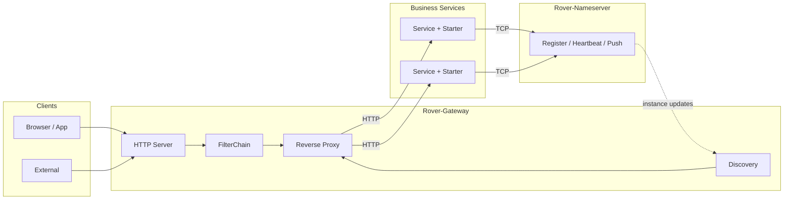

<div align="center">


<br/>

[English](README.md) · [简体中文](README.zh-CN.md) · [Architecture](docs-public/architecture.md)

<br/>


<br/>

[Intro](#-introduction) · [Features](#-features) · [Architecture](#-architecture) · [Quick Start](#-quick-start) · [Integration](#-integration) · [Roadmap](#-roadmap)

</div>

---

## 📖 Introduction

**Rover-Suite** is a lightweight microservice infrastructure designed for small teams. It solves a common problem:

> You have multiple monolithic backend services (possibly in Java/Python/PHP/Go), multiple frontend apps each hardcoding backend ports, Nginx requires manually maintaining static configs, and OpenResty/APISIX feels too heavy and hard to customize.

Rover-Suite provides an **all-in-one lightweight solution with a built-in registry**: backend services auto-register on startup, the gateway detects instance changes in real time — no manual IP/port maintenance needed.

| Component | Description |
| :--- | :--- |
| **Rover-Nameserver** | TCP-based service registry (heartbeat, health check, instance change push) |
| **Rover-Gateway** | Netty HTTP gateway (routing, discovery, load balancing, reverse proxy) |
| **Rover-Starter** | Spring Boot integration for auto-registration and graceful shutdown |
| **Rover-Admin** | Optional console for runtime configuration management |

---

## ✨ Features

| Feature | Description |
| :--- | :--- |
| **Self-contained core** | Nameserver and Gateway are built on Netty without Spring Cloud |
| **Standalone processes** | Two jars are enough to run the full request path |
| **Low-intrusion SDK** | Register with Starter + YAML only, supports graceful shutdown |
| **Health check** | Heartbeat timeout auto-evicts ephemeral instances / marks persistent ones unhealthy, gateway notified in real time |
| **Static / dynamic routing** | Fixed upstreams and registry-based discovery share load balancing |
| **Multiple load balancing** | Round-robin, weighted round-robin, random, IP hash, least connections |
| **Extensible SPI** | Filters, load balancers, and service discovery adapters; supports plugin jar hot-loading |
| **Runtime management** | Admin console for viewing and updating runtime config, hot route updates |
| **Management security** | Configurable bind address + token auth for the management API and registration/subscription protocol |
| **Java native** | Customize with Java SPI, zero learning cost for Java teams, source code fully modifiable |

---

## 🗺️ Architecture



See **[docs-public/architecture.md](./docs-public/architecture.md)** for module dependencies and request flow.

---

## 🏗️ Modules

| Module | Role |
| :--- | :--- |
| `rover-common` | Protocol, codec, and shared utilities |
| `rover-nameserver-core` | Registry core |
| `rover-nameserver-bootstrap` | Nameserver executable |
| `rover-nameserver-client` | Registry client |
| `rover-nameserver-starter` | Spring Boot Starter |
| `rover-gateway-core` | Gateway core |
| `rover-gateway-bootstrap` | Gateway executable |
| `rover-gateway-adapter-nacos` | External registry adapter |
| `rover-admin` | Admin console |
| `rover-gateway-test/demo/backend` | Test backend service for gateway verification |
| `rover-gateway-test/demo/frontend` | Test frontend panel (separate from core suite) |

---

## 🚀 Quick Start

### Prerequisites

- JDK 17+
- Maven 3.6+

### 1. Build

```bash
git clone https://gitee.com/zzl-java/roverSuite.git
cd roverSuite
mvn clean package -DskipTests
```

### 2. Start Nameserver

```bash
java -jar rover-nameserver-bootstrap/target/rover-nameserver-bootstrap-1.0.0-SNAPSHOT.jar
```

Default TCP port: `8888`.

### 3. Start Gateway

```bash
java -jar rover-gateway-bootstrap/target/rover-gateway-bootstrap-1.0.0-SNAPSHOT.jar
```

Port is configured in `rover-gateway.yml` (change to `8080` locally if needed).

### 4. (Optional) Test the gateway

If you want to test gateway routing and load balancing:

```bash
# Backend test service
mvn -pl rover-gateway-test/demo/backend spring-boot:run --server.port=8081

# Frontend test panel (separate project)
cd rover-gateway-test/demo/frontend && npm install && npm run dev
```

See **[rover-gateway-test/demo/README.md](./rover-gateway-test/demo/README.md)** for full test suite details.

### 5. Optional: Admin

```bash
mvn -pl rover-admin spring-boot:run
```

Default URL: `http://127.0.0.1:9090`

---

## 🔌 Integration

### Dependency

```xml
<dependency>
    <groupId>com.rover</groupId>
    <artifactId>rover-nameserver-starter</artifactId>
    <version>1.0.0-SNAPSHOT</version>
</dependency>
```

### Configuration

```yaml
spring:
  application:
    name: demo-service

server:
  port: 8081

rover:
  nameserver:
    enabled: true
    address: 127.0.0.1:8888
    host: 127.0.0.1
    weight: 100
    ephemeral: true
    heartbeat-interval-ms: 5000
```

Gateway example:

```yaml
rover:
  gateway:
    discovery:
      type: nameserver
      nameserver:
        address: 127.0.0.1:8888
    loadbalance:
      strategy: round_robin
    routes:
      - id: demo-api
        businessPrefix: /api/demo
        serviceName: demo-service
        stripPrefix: /api/demo
```

### Security (optional)

Listeners bind `0.0.0.0` by default and management/protocol auth is disabled for backward compatibility. To harden a deployment:

- `rover.nameserver.bindHost` / `manageBindHost`, `rover.gateway.server.bindHost` — restrict listen addresses
- `rover.nameserver.token` / `adminToken`, `rover.gateway.adminToken`, `rover.admin.admin-token` — enable token auth

When a token is set, clients must present the same value: the Starter and Gateway discovery read `rover.nameserver.token`, and Admin sends `X-Rover-Admin-Token` to management endpoints. All options are documented with comments in `rover-nameserver.yml`, `rover-gateway.yml`, and `rover-admin`'s `application.yml`.

---

## 📊 Comparison

### vs. Common Alternatives

| Dimension | Nginx | OpenResty / APISIX | Spring Cloud | **Rover-Suite** |
| :--- | :--- | :--- | :--- | :--- |
| Service discovery | None, static config | Requires external registry | Yes (Nacos, etc.) | **Built-in registry** |
| Backend onboarding | Manually maintain upstreams | Manually configure routes | Add SDK | **Add Starter, auto-register** |
| Customization | C modules | Lua scripts | Java | **Java SPI, zero learning cost** |
| Deployment deps | None | etcd (APISIX) | Heavier ecosystem | **Two jars, no external deps** |
| Fit | Static proxying | Large-scale traffic governance | Large-scale microservices | **Small teams, multi-monolith, lightweight** |

### Rover-Suite is for you if

- You have multiple monolithic backends (mixed Java/Python/PHP/Go stack)
- You don't want each frontend app hardcoding backend ports
- Nginx static config is a maintenance burden, but APISIX feels too heavy
- Your team is Java-based and wants to customize the gateway in Java
- Traffic is moderate — you don't need millions of QPS, just dynamic discovery and basic load balancing

### Rover-Suite is NOT for you if

- You need full traffic governance (rate limiting, circuit breaking, auth — on the roadmap)
- You need large-scale cluster high availability (currently single-node, clustering planned)
- You need extreme gateway performance (Nginx-based solutions like APISIX have a higher ceiling)

---

## 🗺️ Roadmap

**Done:**

- [x] Nameserver register / heartbeat / push / health check
- [x] Gateway routing, discovery, load balancing (5 strategies), and reverse proxy
- [x] Spring Boot Starter (auto-registration + graceful shutdown)
- [x] Admin runtime management (config hot-reload, hot route updates)
- [x] SPI plugin extension (Filter, load balancer, service discovery)
- [x] Runtime config management (YAML + hot-reload)

**Planned:**

- [ ] Observability (built-in lightweight metrics + Admin dashboard)
- [ ] Request trace timeline (gateway phase breakdown + traceId propagation)
- [ ] HTTP registration API (for non-Java services: Python/PHP/Go, etc.)
- [ ] Traffic governance (rate limiting, auth, circuit breaking)
- [ ] External registry adapters
- [ ] Nameserver persistence and cluster high availability

---

## 📚 Documentation

- [Public docs index](./docs-public/README.md)
- [Architecture](./docs-public/architecture.md)
- [Gateway test suite](./rover-gateway-test/demo/README.md) - **Test project only**

---

## 🤝 Contributing

Issues and pull requests are welcome.

---

## 📄 License

Licensed under the [Apache License 2.0](./LICENSE).

---

## 📮 Contact

- Repository: https://gitee.com/zzl-java/roverSuite
- Issues: please open a ticket in the repository

<p align="center">
  <sub>Rover-Suite — Lightweight microservice infrastructure.</sub>
</p>
