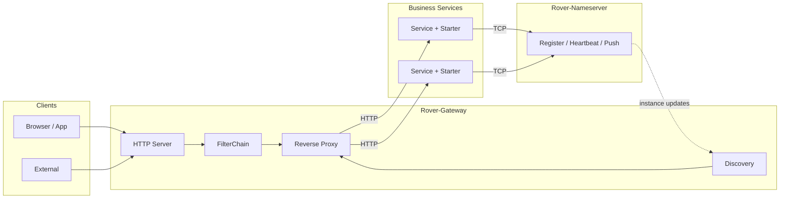

<div align="center">


# Rover-Suite

Lightweight Microservice Middleware Suite

Java 17 + Netty · Registry · HTTP Gateway · Spring Boot Starter

[English](README.md) · [简体中文](README.zh-CN.md) · [Architecture](docs-public/architecture.md)


[Intro](#-introduction) · [Features](#-features) · [Architecture](#-architecture) · [Quick Start](#-quick-start) · [Integration](#-integration) · [Roadmap](#-roadmap)

</div>

---

## 📖 Introduction

**Rover-Suite** is a lightweight, independently deployable microservice infrastructure:

| Component | Description |
| :--- | :--- |
| **Rover-Nameserver** | TCP-based service registry and discovery |
| **Rover-Gateway** | Netty HTTP gateway (routing, discovery, load balancing, reverse proxy) |
| **Rover-Starter** | Spring Boot integration for automatic registration |
| **Rover-Admin** | Optional console for runtime configuration |

It is designed for lightweight deployment, clear request paths, and private / customizable environments.

---

## ✨ Features

| Feature | Description |
| :--- | :--- |
| **Self-contained core** | Nameserver and Gateway are built on Netty without Spring Cloud |
| **Standalone processes** | Registry and gateway can run as separate executable jars |
| **Low-intrusion SDK** | Register with Starter + YAML only |
| **Static / dynamic routing** | Fixed upstreams and registry-based discovery share load balancing |
| **Extensible SPI** | Filters, load balancers, and service discovery adapters |
| **Runtime management** | Admin console for viewing and updating runtime config |

---

## 🗺️ Architecture



See **[docs-public/architecture.md](./docs-public/architecture.md)** for module dependencies and request flow.

---

## 🏗️ Modules

| Module | Role |
| :--- | :--- |
| `rover-common` | Protocol, codec, and shared utilities |
| `rover-nameserver-core` | Registry core |
| `rover-nameserver-server` | Nameserver executable |
| `rover-nameserver-client` | Registry client |
| `rover-nameserver-starter` | Spring Boot Starter |
| `rover-gateway-core` | Gateway core |
| `rover-gateway-bootstrap` | Gateway executable |
| `rover-gateway-adapter-nacos` | External registry adapter |
| `rover-admin` | Admin console |
| `rover-demo` | Sample business service |

---

## 🚀 Quick Start

### Prerequisites

- JDK 17+
- Maven 3.6+

### 1. Build

```bash
git clone https://gitee.com/zzl-java/roverSuite.git
cd roverSuite
mvn clean package -DskipTests
```

### 2. Start Nameserver

```bash
java -jar rover-nameserver-server/target/rover-nameserver-server-1.0.0-SNAPSHOT.jar
```

Default TCP port: `8888`.

### 3. Start Gateway

```bash
java -jar rover-gateway-bootstrap/target/rover-gateway-bootstrap-1.0.0-SNAPSHOT.jar
```

Port is configured in `rover-gateway.yml` (change to `8080` locally if needed).

### 4. Start the sample service

```bash
mvn -pl rover-demo spring-boot:run
```

### 5. Optional: Admin

```bash
mvn -pl rover-admin spring-boot:run
```

Default URL: `http://127.0.0.1:9090`

---

## 🔌 Integration

### Dependency

```xml
<dependency>
    <groupId>com.rover</groupId>
    <artifactId>rover-nameserver-starter</artifactId>
    <version>1.0.0-SNAPSHOT</version>
</dependency>
```

### Configuration

```yaml
spring:
  application:
    name: demo-service

server:
  port: 8081

rover:
  nameserver:
    enabled: true
    address: 127.0.0.1:8888
    host: 127.0.0.1
    weight: 100
    ephemeral: true
    heartbeat-interval-ms: 5000
```

Gateway example:

```yaml
rover:
  gateway:
    discovery:
      type: nameserver
      nameserver:
        address: 127.0.0.1:8888
    loadbalance:
      strategy: round_robin
    routes:
      - id: demo-api
        businessPrefix: /api/demo
        serviceName: demo-service
        stripPrefix: /api/demo
```

---

## 📊 Comparison

| Dimension | Typical Spring Cloud Stack | Rover-Suite |
| :--- | :--- | :--- |
| Deployment | Heavier component ecosystem | Core path runs as standalone jars |
| Coupling | Often tightly coupled to Spring Cloud | Core on Netty; only Starter uses Spring Boot |
| Registry | Commonly Nacos, etc. | Self-built TCP Nameserver |
| Gateway | Commonly Spring Cloud Gateway | Self-built Netty Gateway |
| Fit | Large-scale platforms | Lightweight and customizable deployments |

---

## 🗺️ Roadmap

- [x] Nameserver register / heartbeat / push
- [x] Gateway routing, discovery, load balancing, and reverse proxy
- [x] Spring Boot Starter
- [x] Admin runtime management
- [ ] Traffic governance enhancements
- [ ] External registry adapters
- [ ] High availability / clustering

---

## 📚 Documentation

- [Public docs index](./docs-public/README.md)
- [Architecture](./docs-public/architecture.md)

---

## 🤝 Contributing

Issues and pull requests are welcome.

---

## 📄 License

Licensed under the [Apache License 2.0](./LICENSE).

---

## 📮 Contact

- Repository: https://gitee.com/zzl-java/roverSuite
- Issues: please open a ticket in the repository

<p align="center">
  <sub>Rover-Suite — Lightweight microservice infrastructure.</sub>
</p>
