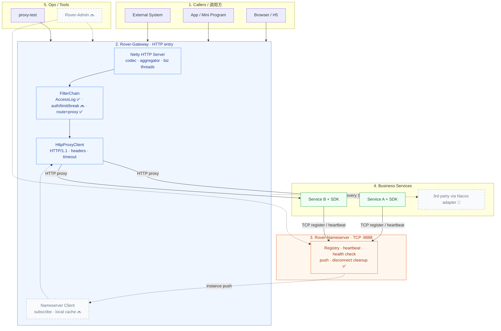
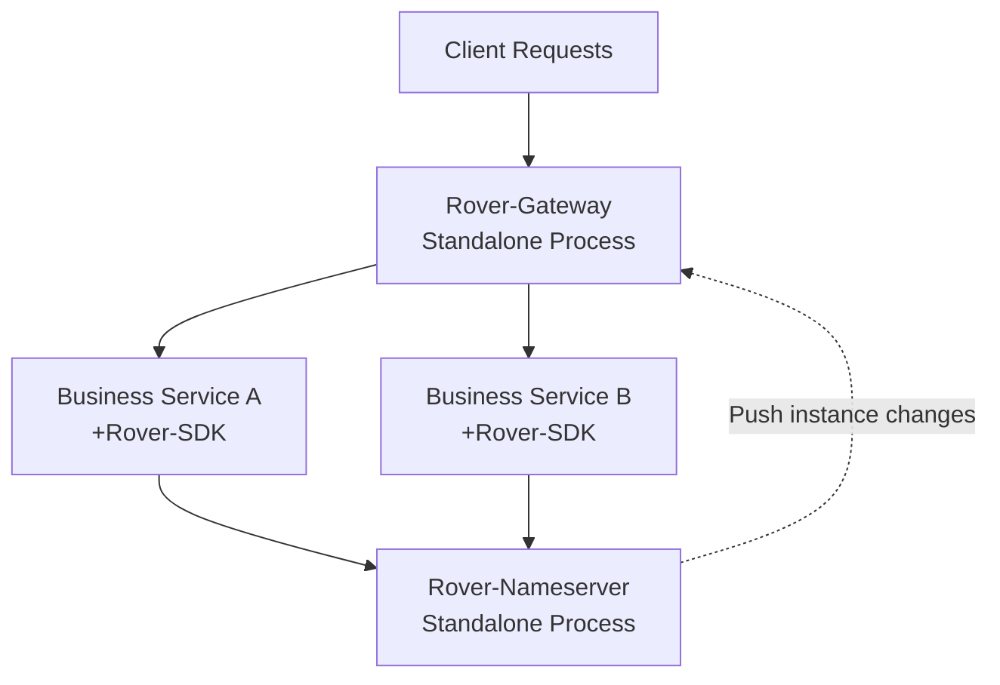
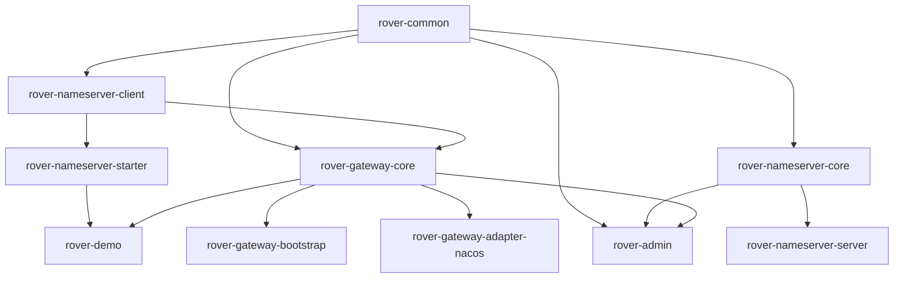

# Rover-Suite / A Lightweight Self-Developed Microservice Middleware Suite

> [English](README.md) | [简体中文](README.zh-CN.md)

> A self-developed lightweight microservice infrastructure suite powered by Java 17 + Netty: a TCP registry center (Nameserver) + a lightweight gateway.

---

## 📖 Introduction

Rover-Suite is a fully self-developed lightweight microservice infrastructure suite, consisting of a Netty-based TCP registry center (Nameserver) and a lightweight gateway (Gateway). It targets lightweight scenarios without heavy framework wrapping, follows a strict layered Maven multi-module architecture, and lets business services register and discover instances by simply importing one Spring Boot Starter. The gateway dynamically learns about instance changes by subscribing to the registry. It fits scenarios that are sensitive to deployment footprint, want to understand the underlying internals, or need private/customized deployment.

> Companion docs: [Full architecture model (sequence diagrams / module deps / roadmap)](./docs/ARCHITECTURE.md)

---

## 🗺️ The Project at a Glance

> Diagram annotations are in Chinese; ✅ implemented, 🔜 planned, 🧩 placeholder.



> The full architecture model (deployment topology / module dependencies / core sequence diagrams / SPI extension points / roadmap) lives in **[docs/ARCHITECTURE.md](./docs/ARCHITECTURE.md)**.

---

## ✨ Core Features

- ✅ **Fully Self-Developed**: Built on Java 17 + Netty + Protostuff; both the TCP registry and the gateway are self-implemented, with no framework wrapping.
- ✅ **Layered Architecture**: Base → Communication → Core → Integration → Deployment; module dependencies strictly flow bottom-up with no cycles.
- ✅ **Independent Processes**: Nameserver and Gateway are each packaged as executable Jars running standalone; core logic is fully separated from bootstrap entry points.
- ✅ **Zero-Intrusion Integration**: Business services only need to add `rover-nameserver-starter` and configure a YAML file — registration and discovery require no business code.
- ✅ **SPI Extensibility**: SPI extension points such as `ServiceDiscovery` and `Filter` are pre-designed (the Nacos adapter module is a placeholder for now); other registries can be plugged in as needed.

---

## 🏗️ Architecture

### Deployment Architecture



### Module Structure

> Arrow direction indicates dependency flow: `A --> B` means "B depends on A".



### Module List

| Module | Responsibility |
|---|---|
| `rover-common` | Shared base: protocol models, TCP codec, utilities, event bus, SPI, exceptions |
| `rover-nameserver-core` | Registry core logic: registry table, heartbeat detection, active push, health checks, data models |
| `rover-nameserver-server` | Standalone bootstrap for the registry (executable Jar, shaded) |
| `rover-nameserver-client` | Generic TCP client: connection management, handlers, local cache (codec lives in common) |
| `rover-nameserver-starter` | Spring Boot Starter: autoconfiguration; the business-facing SDK (the only module depending on Spring Boot) |
| `rover-gateway-core` | Gateway core: filters, routes, static multi-upstream / discovery, pluggable load balancing, reverse proxy, SPI |
| `rover-gateway-bootstrap` | Standalone bootstrap for the gateway (executable Jar, shaded) |
| `rover-gateway-adapter-nacos` | Nacos adapter: implements the `ServiceDiscovery` SPI to connect Nacos (placeholder, not yet implemented) |
| `rover-admin` | Admin dashboard: view & submit runtime config for Gateway / Nameserver |
| `rover-demo` | Functional demo: example business service (placeholder, not yet implemented) |

> There is also a standalone gateway proxy test project `proxy-test/` (a Spring Boot project with its own pom; not a Maven module, excluded from rover build & release). It verifies the gateway's reverse-proxy capability — see the "Gateway Proxy Test" section below.

---

## 🚀 Quick Start

### Prerequisites

- JDK 17
- Maven 3.6+
- (Optional) Git

### 1. Build

```bash
git clone <your-repo-url> rover-suite
cd rover-suite
mvn clean package
```

> Current version is `1.0.0-SNAPSHOT`. This produces Jars for all 10 modules; `rover-nameserver-server` and `rover-gateway-bootstrap` are standalone executable Jars.

### 2. Start Nameserver

```bash
java -jar rover-nameserver-server/target/rover-nameserver-server-1.0.0-SNAPSHOT.jar
```

> Listens on port 8888 (configured in `rover-nameserver.yml` inside `rover-nameserver-server`).

Expected output:

```
Rover Nameserver starting...
```

### 3. Start Gateway

```bash
java -jar rover-gateway-bootstrap/target/rover-gateway-bootstrap-1.0.0-SNAPSHOT.jar
```

> Listens on port 8080 by default (`rover.gateway.port` in `rover-gateway.yml` inside `rover-gateway-bootstrap`; switch back to 80 if it's free on your machine).

Expected output:

```
Rover Gateway starting...
```

### 4. Start a Business Service

Business services (e.g. `rover-demo`) run as standalone Spring Boot applications, auto-registering with Nameserver and receiving gateway traffic.

```bash
mvn -pl rover-demo spring-boot:run
```

---

## 🧪 Gateway Proxy Test (proxy-test)

`proxy-test/` is a **standalone Spring Boot test project, independent of the rover project** (own pom, excluded from rover build & release, tracked in git). It verifies the gateway's reverse-proxy capability with 31 enterprise-scenario test cases.

### Start (Run `main` directly in IDE, no packaging needed)

1. Backend instance 1 (port 8081 by default, also serves the test page): `com.rover.test.MockBackendApplication`
2. Backend instance 2 (target of the gateway's `test-api` route): add `--server.port=8070` to the Run configuration
3. The system under test: `com.rover.gateway.bootstrap.GatewayApplication` (gateway on 8080)

### Request Flow

```
Browser(test page http://127.0.0.1:8081/) → Gateway(8080) → MockBackend(8081 / 8070) → Gateway → Browser
```

### Coverage

- **Basic passthrough**: GET/POST/PUT/PATCH/DELETE/HEAD/OPTIONS, JSON / form / Chinese query, status codes 201/204/404/500, slow requests, 1MB big response, no-route 404
- **Enterprise scenario verification** (backend asserts field by field; expectations delivered via the `X-Verify-Spec` header): auth credentials, tenant headers, trace IDs, standard forwarding headers, Host rewriting, Accept negotiation, gzip request body, 256KB large body, deeply nested JSON, multipart upload, cookie round-trip, route rewriting, per-value query checks

## 📝 Usage Example

### Add Dependency

```xml
<dependency>
    <groupId>com.rover</groupId>
    <artifactId>rover-nameserver-starter</artifactId>
    <version>1.0.0-SNAPSHOT</version>
</dependency>
```

### Configuration

```yaml
rover:
  registry:
    address: 127.0.0.1:8888
    service-name: demo-service
```

> The config above is a placeholder; the exact fields and default port will follow the implementation of the corresponding milestone.

---

## 📊 Comparison with Mainstream Solutions

| Dimension | Nacos + Spring Cloud Gateway | Rover-Suite |
|---|---|---|
| Deployment Weight | Heavy, depends on Nacos Server + the SCG ecosystem | Lightweight, two executable Jars run standalone |
| Framework Dependency | Strongly coupled to the Spring Cloud stack | Zero Spring dependency in core; only the Starter module uses Spring Boot |
| Registry | Nacos (or depends on its Server) | Self-developed TCP registry (Nameserver) |
| Gateway | Spring Cloud Gateway (WebFlux) | Self-developed Netty gateway with a customizable filter chain |
| Config Management | Built-in config center | Not built in; can be adapted via SPI |
| Extensibility | Official ecosystem + SPI | Self-developed SPI (`ServiceDiscovery`, `Filter`) |
| Use Case | Large-scale microservice governance | Lightweight scenarios, learning practice, private customization |

> Positioning: Rover-Suite targets lightweight and self-developed scenarios; it is not intended to replace Nacos/SCG's large-scale governance capabilities.

---

## 🗺️ Roadmap

**V1.0 Planned**

- [x] Project skeleton and Maven multi-module structure
- [x] `rover-common` base module (utilities, constants, event bus, SPI skeleton)
- [x] Registry core: registry table, heartbeat detection, active push, health checks
- [x] Nameserver standalone process with protocol codec (TCP + Protostuff)
- [x] Generic TCP client (connection management, local cache, subscription push)
- [x] Gateway core: route matching, filter chain, load balancing, reverse proxy
- [x] Gateway proxy test kit (`proxy-test`, 31 enterprise-scenario cases)
- [ ] Spring Boot Starter autoconfiguration (placeholder, not yet implemented)
- [ ] Nacos adapter module (placeholder, not yet implemented)
- [ ] End-to-end demo verification (placeholder, not yet implemented)

---

## 🤝 Contributing

Contribution guidelines are to be added. Issues and Pull Requests are welcome; concrete guidelines (code style, commit messages, branching) will be filled in later.

`<!-- TODO -->`

---

## 📄 License

This project is planned to be released under the **Apache License 2.0**. The license file and copyright notice are to be confirmed and added later.

`<!-- TODO -->`

---

## 📮 Contact

Contact information is to be filled in later (email / WeChat group / community links).

`<!-- TODO -->`
