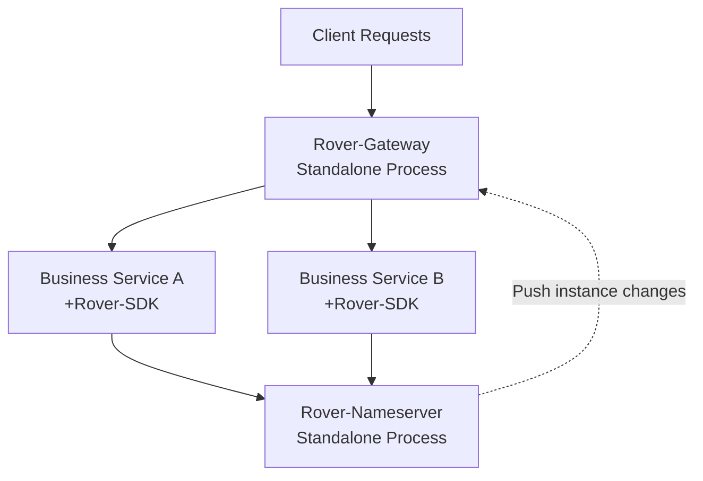
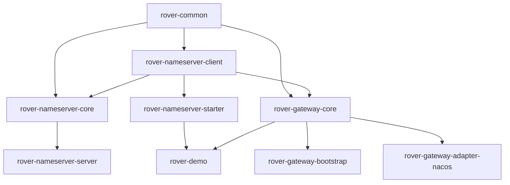

# Rover-Suite / A Lightweight Self-Developed Microservice Middleware Suite

> [English](README.md) | [简体中文](README.zh-CN.md)

> A self-developed lightweight microservice infrastructure suite powered by Java 17 + Netty: a TCP registry center (Nameserver) + a lightweight gateway.

---

## 📖 Introduction

Rover-Suite is a fully self-developed lightweight microservice infrastructure suite, consisting of a Netty-based TCP registry center (Nameserver) and a lightweight gateway (Gateway). It targets lightweight scenarios without heavy framework wrapping, follows a strict layered Maven multi-module architecture, and lets business services register and discover instances by simply importing one Spring Boot Starter. The gateway dynamically learns about instance changes by subscribing to the registry. It fits scenarios that are sensitive to deployment footprint, want to understand the underlying internals, or need private/customized deployment.

---

## ✨ Core Features

- ✅ **Fully Self-Developed**: Built on Java 17 + Netty + Protostuff; both the TCP registry and the gateway are self-implemented, with no framework wrapping.
- ✅ **Layered Architecture**: Base → Communication → Core → Integration → Deployment; module dependencies strictly flow bottom-up with no cycles.
- ✅ **Independent Processes**: Nameserver and Gateway are each packaged as executable Jars running standalone; core logic is fully separated from bootstrap entry points.
- ✅ **Zero-Intrusion Integration**: Business services only need to add `rover-nameserver-starter` and configure a YAML file — registration and discovery require no business code.
- ✅ **SPI Extensibility**: SPI extension points such as `ServiceDiscovery` and `Filter` are pre-designed; a Nacos adapter module is provided, and other registries can be plugged in as needed.

---

## 🏗️ Architecture

### Deployment Architecture



### Module Structure

> Arrow direction indicates dependency flow: `A --> B` means "B depends on A".



### Module List

| Module | Responsibility |
|---|---|
| `rover-common` | Common base module: utilities, constants, event bus interfaces, SPI interfaces, unified models, exception hierarchy, annotations |
| `rover-nameserver-core` | Registry core logic: registry table, heartbeat detection, active push, health checks, data models |
| `rover-nameserver-server` | Standalone bootstrap for the registry (executable Jar, shaded) |
| `rover-nameserver-client` | Generic TCP client: connection management, handlers, local cache |
| `rover-nameserver-starter` | Spring Boot Starter: autoconfiguration; the business-facing SDK (the only module depending on Spring Boot) |
| `rover-gateway-core` | Gateway core capabilities: filter chain, route matching, load balancing, reverse proxy, SPI |
| `rover-gateway-bootstrap` | Standalone bootstrap for the gateway (executable Jar, shaded) |
| `rover-gateway-adapter-nacos` | Nacos adapter: implements the `ServiceDiscovery` SPI to connect Nacos |
| `rover-demo` | Functional demo: example business service (service / controller) |

---

## 🚀 Quick Start

### Prerequisites

- JDK 17
- Maven 3.6+
- (Optional) Git

### 1. Build

```bash
git clone <your-repo-url>
cd surge-gateway
mvn clean package
```

> Current version is `1.0.0-SNAPSHOT`. This produces Jars for all 9 modules; `rover-nameserver-server` and `rover-gateway-bootstrap` are standalone executable Jars.

### 2. Start Nameserver

```bash
java -jar rover-nameserver-server/target/rover-nameserver-server-1.0.0-SNAPSHOT.jar
```

Expected output:

```
Rover Nameserver starting...
```

### 3. Start Gateway

```bash
java -jar rover-gateway-bootstrap/target/rover-gateway-bootstrap-1.0.0-SNAPSHOT.jar
```

Expected output:

```
Rover Gateway starting...
```

### 4. Start a Business Service

Business services (e.g. `rover-demo`) run as standalone Spring Boot applications, auto-registering with Nameserver and receiving gateway traffic.

```bash
mvn -pl rover-demo spring-boot:run
```

---

## 📝 Usage Example

### Add Dependency

```xml
<dependency>
    <groupId>com.rover</groupId>
    <artifactId>rover-nameserver-starter</artifactId>
    <version>1.0.0-SNAPSHOT</version>
</dependency>
```

### Configuration

```yaml
rover:
  registry:
    address: 127.0.0.1:8888
    service-name: demo-service
```

> The config above is a placeholder; the exact fields and default port will follow the implementation of the corresponding milestone.

---

## 📊 Comparison with Mainstream Solutions

| Dimension | Nacos + Spring Cloud Gateway | Rover-Suite |
|---|---|---|
| Deployment Weight | Heavy, depends on Nacos Server + the SCG ecosystem | Lightweight, two executable Jars run standalone |
| Framework Dependency | Strongly coupled to the Spring Cloud stack | Zero Spring dependency in core; only the Starter module uses Spring Boot |
| Registry | Nacos (or depends on its Server) | Self-developed TCP registry (Nameserver) |
| Gateway | Spring Cloud Gateway (WebFlux) | Self-developed Netty gateway with a customizable filter chain |
| Config Management | Built-in config center | Not built in; can be adapted via SPI |
| Extensibility | Official ecosystem + SPI | Self-developed SPI (`ServiceDiscovery`, `Filter`) |
| Use Case | Large-scale microservice governance | Lightweight scenarios, learning practice, private customization |

> Positioning: Rover-Suite targets lightweight and self-developed scenarios; it is not intended to replace Nacos/SCG's large-scale governance capabilities.

---

## 🗺️ Roadmap

**V1.0 Planned**

- [x] Project skeleton and Maven multi-module structure
- [x] `rover-common` base module (utilities, constants, event bus, SPI skeleton)
- [ ] Registry core: registry table, heartbeat detection, active push, health checks
- [ ] Nameserver standalone process with protocol codec
- [ ] Generic TCP client (connection management, local cache)
- [ ] Spring Boot Starter autoconfiguration
- [ ] Gateway core: route matching, filter chain, load balancing, reverse proxy
- [ ] Nacos adapter module
- [ ] End-to-end demo verification

---

## 🤝 Contributing

Contribution guidelines are to be added. Issues and Pull Requests are welcome; concrete guidelines (code style, commit messages, branching) will be filled in later.

`<!-- TODO -->`

---

## 📄 License

This project is planned to be released under the **Apache License 2.0**. The license file and copyright notice are to be confirmed and added later.

`<!-- TODO -->`

---

## 📮 Contact

Contact information is to be filled in later (email / WeChat group / community links).

`<!-- TODO -->`
