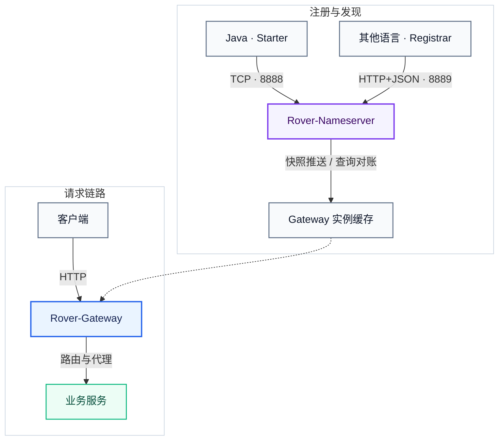

<div align="center">


<br/>

[English](README.md) · [简体中文](README.zh-CN.md) · [公开文档](docs-public/README.md) · [架构](docs-public/architecture.zh-CN.md)

<br/>


<br/>

[简介](#-项目简介) · [特性](#-核心特性) · [架构](#-架构概览) · [快速开始](#-快速开始) · [接入](#-业务接入) · [路线图](#-路线图)

</div>

> **作者 Author：Daylight**
>
> **开源许可：Rover-Suite 采用 Apache License 2.0。Rover 名称、Logo 等品牌标识不随 Apache-2.0 授权，详见 [NOTICE](NOTICE)。**

---

## 📖 项目简介

**Rover-Suite** 是一套面向小团队的轻量微服务基础设施，解决的核心问题是：

> 后端有多个单体项目，可能是 Java/Python/PHP/Go 等不同语言。前端多个 App 各自硬编码后端端口，用 Nginx 做反向代理又需要手动维护大量静态配置。OpenResty/APISIX 能力更完整，但对小团队来说可能偏重，也未必适合深度定制。

Rover-Suite 提供**自带 Nameserver 的一体化轻量方案**：后端服务启动后自动注册，Gateway 通过快照推送与周期对账感知实例变化，无需手动维护 IP 端口。

| 组件 | 说明 |
| :--- | :--- |
| **Rover-Nameserver** | 纯内存 Nameserver，兼容 Java TCP 与多语言 HTTP 注册 |
| **Rover-Gateway** | 基于 Netty 的 HTTP Gateway（路由、发现、负载均衡、反向代理） |
| **Rover-Starter** | Spring Boot 接入，业务侧自动注册与优雅下线 |
| **Rover-Admin** | 可选管理控制台，支持运行时配置查看与更新 |

## 🧭 我应该先看哪篇文档？

大多数用户先按目标选一篇就够了：

| 我想做什么 | 先看这里 |
| :--- | :--- |
| 本地跑通一次完整请求链路 | [快速上手](docs-public/quick-start.zh-CN.md) |
| 理解日常配置、路由、Admin 和运行边界 | [使用指南](docs-public/user-guide.zh-CN.md) |
| 打开 Admin 并理解每个页面 | [Admin 使用手册](docs-public/admin-guide.zh-CN.md) |
| 接入 Java 或非 Java 服务注册 | [服务注册指南](docs-public/service-registration.zh-CN.md) |
| 查询全部 YAML/Admin 配置项 | [配置项参考](docs-public/configuration-reference.zh-CN.md) |
| 写并挂载自定义 Filter / LoadBalancer 插件 | [插件开发与接入](docs-public/plugin-development.zh-CN.md) · [插件挂载操作手册](docs-public/plugin-mounting-guide.zh-CN.md) |
| 用 Docker Compose 或生产化方式部署 | [Docker Compose](deploy/docker/README.md) · [生产部署](docs-public/production-deployment.zh-CN.md) · [小团队上线 10 条](docs-public/small-team-go-live.zh-CN.md) |
| 排查 404 / 502 / 注册失败 | [故障排查](docs-public/troubleshooting.zh-CN.md) |
| 设计可复现压测、定位 Gateway 瓶颈 | [性能测试指南](docs-public/benchmark-guide.zh-CN.md) |
| 查看压测方法和参考数据 | [性能报告](docs-public/performance-report.zh-CN.md) |

完整文档索引见：**[docs-public/README.md](docs-public/README.md)**。

---

## ✨ 核心特性

| 特性 | 说明 |
| :--- | :--- |
| **自研核心组件** | Nameserver 与 Gateway 均基于 Netty 实现，核心不依赖 Spring Cloud |
| **独立进程部署** | Nameserver 与 Gateway 均可单独打包运行，两个 jar 即可跑通全链路 |
| **低侵入接入** | 引入 Starter 并完成 YAML 配置即可注册，支持优雅下线 |
| **多语言注册** | 提供 Node.js、Python、Go、PHP、C++ 的 HTTP+JSON Registrar 参考实现 |
| **健康检查** | 心跳超时自动剔除临时实例 / 标记持久实例不健康，Gateway 通过推送与对账更新缓存 |
| **静态 / 动态路由** | 支持固定上游与 Nameserver 动态发现，共用负载均衡能力 |
| **多种负载均衡** | 轮询、加权轮询、随机、IP Hash、最少连接数 |
| **聚焦的扩展面** | Filter/负载均衡插件 JAR，以及源码级服务发现与注册适配层 |
| **基础流量保护** | 内置本地限流、进程内熔断、连不上换台；复杂业务限流可通过 Filter 插件二开 |
| **运行时管理** | Admin 可查看并更新 Gateway / Nameserver 运行时配置，路由热更新 |
| **管理面安全** | 监听地址可配置 + 管理口与注册/订阅协议 token 鉴权 |
| **Java 原生** | 定制开发使用 Java SPI，对 Java 团队学习成本低，也方便按需二开 |

---

## 🗺️ 架构概览



模块依赖与主链路说明见 **[架构与权衡](./docs-public/architecture.zh-CN.md)**。

---

## 🏗️ 模块一览

| 模块 | 职责 |
| :--- | :--- |
| `rover-common` | 协议、编解码与公共能力 |
| `rover-nameserver-core` | Nameserver 核心逻辑 |
| `rover-nameserver-bootstrap` | Nameserver 可执行进程 |
| `rover-nameserver-client` | Nameserver 客户端 |
| `rover-nameserver-starter` | Spring Boot Starter |
| `rover-gateway-core` | Gateway 核心逻辑 |
| `rover-gateway-bootstrap` | Gateway 可执行进程 |
| `rover-gateway-adapter-nacos` | 可选 Nacos 服务发现适配器；使用 `-Pnacos` 打包带 Nacos 的 Gateway |
| `rover-admin` | 管理控制台 |
| `rover-gateway-test/demo/backend` | Gateway 验证测试服务 |
| `rover-gateway-test/demo/frontend` | 测试前端面板（独立于核心套件） |

---

## 🚀 快速开始

完整的首次运行链路（包括本地 `8080` Gateway 配置与验收命令）见
**[快速上手](./docs-public/quick-start.zh-CN.md)**。

### 环境要求

- JDK 17+
- Maven 3.6+

### 1. 构建

```bash
git clone https://gitee.com/zzl-java/roverSuite.git
cd roverSuite
mvn clean install -DskipTests
```

启动本地 demo 前，请按详细指南复制两份内置配置，并将 Gateway 改为 `8080`。指南同时把监听地址收紧到
`127.0.0.1`，避免本地联调意外对外暴露。项目默认监听所有网卡且鉴权为空，是为了零配置启动与可信网络内使用；
有访问控制要求时再配置绑定地址、token、CORS 与外层网络策略。

### 2. 启动 Nameserver

```bash
java -jar rover-nameserver-bootstrap/target/rover-nameserver-bootstrap-1.0.0-SNAPSHOT.jar
```

默认监听 TCP `8888`。

### 3. 启动 Gateway

```bash
java -jar rover-gateway-bootstrap/target/rover-gateway-bootstrap-1.0.0-SNAPSHOT.jar
```

内置配置使用 `80` 端口；详细指南会将本地外部配置设为 `8080`。外部配置优先于 classpath 文件。

### 4. （可选）测试 Gateway

如需测试 Gateway 路由与负载均衡：

```bash
# 后端测试服务（执行上面的完整构建后）
java -jar rover-gateway-test/demo/backend/target/rover-demo-1.0.0-SNAPSHOT.jar

# 前端测试面板（独立项目）
cd rover-gateway-test/demo/frontend && npm install && npm run dev
```

完整测试套件见 **[rover-gateway-test/README.md](./rover-gateway-test/README.md)**。

### 5. 可选：Admin

```bash
mvn -pl rover-admin spring-boot:run
```

默认访问地址：`http://127.0.0.1:9090`

---

## 🔌 业务接入

详细配置与生命周期语义见 **[服务注册指南](./docs-public/service-registration.zh-CN.md)**。

### Maven 依赖

当前 `1.0.0-SNAPSHOT` 需先从本源码仓库执行 Maven install，尚不能按已发布到公共 Maven 仓库使用。

```xml
<dependency>
    <groupId>com.rover</groupId>
    <artifactId>rover-nameserver-starter</artifactId>
    <version>1.0.0-SNAPSHOT</version>
</dependency>
```

### 配置示例

```yaml
spring:
  application:
    name: demo-service

server:
  port: 8081

rover:
  nameserver:
    enabled: true
    address: 127.0.0.1:8888
    host: 127.0.0.1
    weight: 100
    ephemeral: true
    heartbeat-interval-ms: 5000
```

非 Java 服务需要在 Nameserver 显式开启默认关闭的 HTTP Registration API，然后复制对应语言的小型 Registrar：

```yaml
rover:
  nameserver:
    clientApiEnabled: true
    token: "" # 可选；配置后 Registrar 需发送同一个 Bearer token
```

接入示例见 [Node.js、Python、Go、PHP、C++ Registrar](./examples/http-registration/README.md)。它们只实现提供方生命周期（`register → heartbeat → unregister`）；Java 查询与 Gateway 推送订阅继续使用现有 TCP 链路。

Gateway 动态发现示例：

```yaml
rover:
  gateway:
    discovery:
      type: nameserver
      nameserver:
        address: 127.0.0.1:8888
    loadbalance:
      strategy: round_robin
    routes:
      - id: demo-api
        businessPrefix: /api/demo
        serviceName: demo-service
        stripPrefix: /api/demo
```

### 可选部署加固

监听地址默认绑定 `0.0.0.0`，管理口与注册/订阅协议默认不鉴权。这是为了本地或可信网络中的零配置接入，
不是强制安全策略。如部署跨越信任边界，可按需加固：

- `rover.nameserver.bindHost` / `manageBindHost`、`rover.gateway.server.bindHost` —— 收紧监听地址
- `rover.nameserver.token` / `adminToken`、`rover.gateway.adminToken`、`rover.admin.admin-token` —— 开启 token 鉴权

开启协议 token 后，Starter 使用 `rover.nameserver.token`，Gateway 发现使用
`rover.gateway.discovery.nameserver.token`，HTTP Registrar 把同一个值作为 Bearer token 发送。Admin 使用独立的
`X-Rover-Admin-Token` 管理请求头。HTTP Registration API 默认关闭。需要隔离时，可将控制端口放在可信网络，
并为协议面与管理面配置不同 token。token 只做鉴权，不加密流量；需要链路加密时由 VPN、TLS 隧道或外层
HTTPS 代理承担。Gateway `/_manage/**` 与业务流量共用监听端口，可通过 `adminToken` 和外层 ACL/代理限制访问。

当前源码仍是单机 `1.0.0-SNAPSHOT`。已知运行边界（包括最后实例空快照、分组发现、冷启动恢复、WebSocket/SSE，
以及网关进程不终止 HTTPS）集中记录在[使用指南](./docs-public/user-guide.zh-CN.md#9-当前运行边界)。

---

## 📊 定位对比

### 与常见方案对比

| 维度 | Nginx | OpenResty / APISIX | Spring Cloud | **Rover-Suite** |
| :--- | :--- | :--- | :--- | :--- |
| 服务发现 | 无，静态配置 | 需对接外部发现源 | 有（Nacos 等） | **自带 Nameserver** |
| 后端接入 | 手动维护 upstream | 手动配置路由 | 引入 SDK | **Starter 或小型 HTTP Registrar** |
| 定制开发 | C 模块 | Lua 脚本 | Java | **Java SPI，学习成本低** |
| 部署依赖 | 无 | etcd（APISIX） | 组件生态较重 | **两个 jar，无外部依赖** |
| 适用场景 | 静态代理 | 大规模流量治理 | 大规模微服务 | **小团队多单体、轻量私有化** |

### Rover-Suite 适合你，如果

- 后端有多个单体项目（Java/Python/PHP/Go 等混合技术栈）
- 不想为每个前端 App 硬编码后端端口
- 嫌 Nginx 静态配置维护麻烦，又不想上 APISIX 那么重的方案
- 团队是 Java 技术栈，希望用 Java 做 Gateway 定制开发
- 并发量不大，不需要百万 QPS，但需要动态注册和基本的负载均衡

### Rover-Suite 不适合你，如果

- 需要开箱即用的完整流量治理能力，例如分布式限流、集群熔断、WAF、鉴权策略等
- 需要大规模集群高可用（当前为单点部署，集群在规划中）
- 需要极致的 Gateway 性能（APISIX 等基于 Nginx 的方案性能上限更高）

---

## 🗺️ 路线图

**已完成：**

- [x] Nameserver 注册 / 心跳 / 推送 / 健康检查
- [x] Gateway 路由、发现、负载均衡（5 种策略）与反向代理
- [x] Spring Boot Starter 接入（自动注册 + 优雅下线）
- [x] HTTP+JSON Registration API（Node/Python/Go/PHP/C++ 服务提供方）
- [x] Admin 运行时管理（配置热更新、路由热更新）
- [x] Filter/负载均衡 SPI 插件，以及源码级服务发现契约
- [x] 内置本地限流，以及基于 Filter 插件的自定义业务限流
- [x] 进程内熔断（连续失败，`all` / `half` 恢复）
- [x] 连不上换台（默认关，最多 1 次，不重试业务 5xx）
- [x] 运行时配置管理（YAML 配置 + 热更新）
- [x] 轻量内存指标与有界请求时间线管理 API
- [x] Admin 实时仪表盘与 Prometheus 文本导出

**规划中：**

- [ ] 本地 Gateway 时间线之外的分布式追踪集成
- [ ] 进阶流量治理能力（鉴权策略、分布式限流）
- [ ] Nameserver 集群高可用（在线实例继续保持租约软状态，不持久化恢复）

---

## 📚 文档

- [公开文档索引](./docs-public/README.md)
- [快速上手](./docs-public/quick-start.zh-CN.md)
- [使用指南](./docs-public/user-guide.zh-CN.md)
- [服务注册指南](./docs-public/service-registration.zh-CN.md)
- [Admin 使用手册](./docs-public/admin-guide.zh-CN.md) · [Admin API](./docs-public/admin-api.zh-CN.md)
- [配置项参考](./docs-public/configuration-reference.zh-CN.md)
- [生产部署](./docs-public/production-deployment.zh-CN.md) · [故障排查](./docs-public/troubleshooting.zh-CN.md) · [性能测试指南](./docs-public/benchmark-guide.zh-CN.md) · [性能报告](./docs-public/performance-report.zh-CN.md)
- [架构说明](./docs-public/architecture.zh-CN.md)
- [二次开发指南](./docs-public/development-guide.zh-CN.md)
- [插件开发与接入](./docs-public/plugin-development.zh-CN.md)
- [插件挂载操作手册](./docs-public/plugin-mounting-guide.zh-CN.md)
- [发布前检查清单](./docs-public/release-checklist.zh-CN.md)
- [Gateway 测试套件](./rover-gateway-test/README.md) - **仅用于测试**

---

## 💬 Issue 反馈

欢迎提交 Issue、讨论和 Pull Request。提交缺陷或功能建议前请阅读
[贡献指南](./CONTRIBUTING.md)；维护私有分支或进行二开可参考[二次开发指南](./docs-public/development-guide.zh-CN.md)。

---

## 📄 许可证

Rover-Suite 采用 [Apache License 2.0](LICENSE)。Rover 名称、Logo 和其他品牌标识不作为商标授权；第三方依赖
继续遵循各自许可证，汇总说明见 [NOTICE](NOTICE)。

---

## 📮 联系

- 仓库：[gitee.com/zzl-java/roverSuite](https://gitee.com/zzl-java/roverSuite)
- Issue：[提交缺陷反馈或功能建议](https://gitee.com/zzl-java/roverSuite/issues)

<p align="center">
  <sub>Rover-Suite — Lightweight microservice infrastructure.</sub>
</p>
