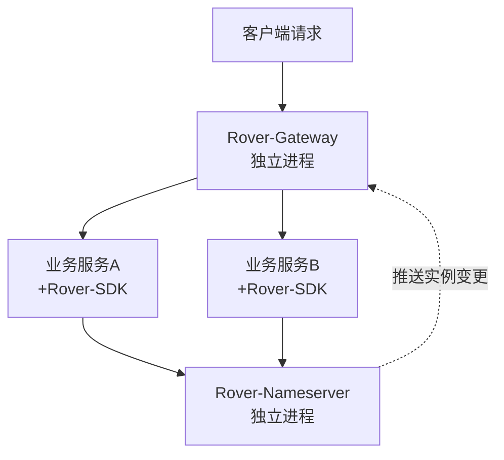
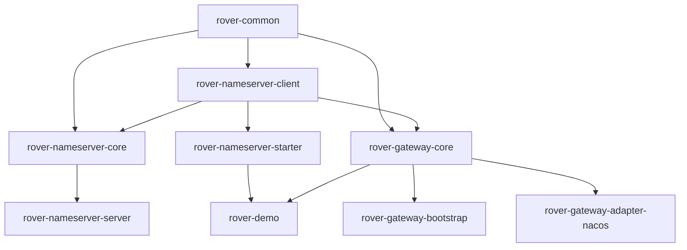

# Rover-Suite / 轻量级自研微服务中间件套件

> [English](README.md) | [简体中文](README.zh-CN.md)

> 一套由 Java 17 + Netty 驱动的自研微服务基础中间件：TCP 注册中心（Nameserver）+ 轻量网关（Gateway）。

---

## 📖 项目简介

Rover-Suite 是一套完全自研的轻量级微服务基础中间件套件，包含基于 Netty 实现的 TCP 注册中心（Nameserver）与轻量级网关（Gateway）。它面向"去框架套壳"的轻量场景，采用严格的 Maven 多模块分层架构，业务服务只需引入一个 Spring Boot Starter 即可完成注册与发现，网关则通过订阅注册中心动态感知实例变更。适用于对部署体积敏感、希望理解底层原理或需要私有化定制的场景。

---

## ✨ 核心特性

- ✅ **完全自研**：基于 Java 17 + Netty + Protostuff，TCP 注册中心与网关均为自研实现，无框架套壳。
- ✅ **分层架构**：基础层 → 通信层 → 核心层 → 接入层 → 部署层，模块依赖严格自底向上，无循环依赖。
- ✅ **独立进程部署**：Nameserver 与 Gateway 各自打包为可执行 Jar 独立运行，核心逻辑与启动入口完全分离。
- ✅ **业务无侵入**：业务服务仅需引入 `rover-nameserver-starter` 并配置 YAML，零代码接入注册与发现。
- ✅ **SPI 可扩展**：预留 `ServiceDiscovery`、`Filter` 等 SPI 扩展点，已提供 Nacos 适配模块，可按需接入其他注册中心。

---

## 🏗️ 整体架构

### 部署架构



### 模块依赖

> 箭头方向表示依赖流向：`A --> B` 即 "B 依赖 A"。



### 模块清单

| 模块 | 职责 |
|---|---|
| `rover-common` | 公共基础模块：工具类、常量、事件总线接口、SPI 接口、统一模型、异常体系、注解 |
| `rover-nameserver-core` | 注册中心核心逻辑：注册表、心跳检测、主动推送、健康检查、数据模型 |
| `rover-nameserver-server` | 注册中心独立启动入口（可执行 Jar，shade 打包） |
| `rover-nameserver-client` | 通用 TCP 客户端：连接管理、处理器、本地缓存 |
| `rover-nameserver-starter` | Spring Boot Starter：自动装配，业务服务接入 SDK（唯一依赖 Spring Boot 的模块） |
| `rover-gateway-core` | 网关核心能力：过滤器链、路由匹配、负载均衡、反向代理、SPI |
| `rover-gateway-bootstrap` | 网关独立启动入口（可执行 Jar，shade 打包） |
| `rover-gateway-adapter-nacos` | Nacos 适配扩展：实现 `ServiceDiscovery` SPI，接入 Nacos 注册中心 |
| `rover-demo` | 功能测试 Demo：业务服务示例（service / controller） |

---

## 🚀 快速开始

### 前置条件

- JDK 17
- Maven 3.6+
- （可选）Git

### 1. 编译打包

```bash
git clone <your-repo-url> rover-suite
cd rover-suite
mvn clean package
```

> 当前版本 `1.0.0-SNAPSHOT`，将打包产出 9 个模块的 Jar，其中 `rover-nameserver-server` 与 `rover-gateway-bootstrap` 为可直接运行的独立可执行 Jar。

### 2. 启动注册中心

```bash
java -jar rover-nameserver-server/target/rover-nameserver-server-1.0.0-SNAPSHOT.jar
```

预期输出：

```
Rover Nameserver starting...
```

### 3. 启动网关

```bash
java -jar rover-gateway-bootstrap/target/rover-gateway-bootstrap-1.0.0-SNAPSHOT.jar
```

预期输出：

```
Rover Gateway starting...
```

### 4. 启动业务服务

业务服务（如 `rover-demo`）作为独立 Spring Boot 应用启动，自动向 Nameserver 注册并接入网关流量。

```bash
mvn -pl rover-demo spring-boot:run
```

---

## 📝 使用示例

### 引入依赖

```xml
<dependency>
    <groupId>com.rover</groupId>
    <artifactId>rover-nameserver-starter</artifactId>
    <version>1.0.0-SNAPSHOT</version>
</dependency>
```

### 配置接入

```yaml
rover:
  registry:
    address: 127.0.0.1:8888
    service-name: demo-service
```

> 上述配置为示例占位，具体字段与默认端口以对应阶段实现为准。

---

## 📊 与主流方案对比

| 维度 | Nacos + Spring Cloud Gateway | Rover-Suite |
|---|---|---|
| 部署重量 | 重量级，依赖 Nacos Server + SCG 生态 | 轻量，2 个可执行 Jar 独立运行 |
| 框架依赖 | 强依赖 Spring Cloud 全家桶 | 核心零 Spring 依赖，仅 Starter 模块接入 Spring Boot |
| 注册中心实现 | Nacos 或依赖其 Server | 自研 TCP 注册中心（Nameserver） |
| 网关实现 | Spring Cloud Gateway（WebFlux） | 自研 Netty 网关，可自定义过滤链 |
| 配置管理 | 内置配置中心 | 不内置，可通过 SPI 适配 |
| 扩展机制 | 官方生态 + SPI | 自研 SPI（`ServiceDiscovery`、`Filter`） |
| 适用场景 | 大型微服务治理体系 | 轻量场景、学习实践、私有化定制 |

> 定位说明：Rover-Suite 面向轻量与自研场景，不追求替代 Nacos/SCG 的大型治理能力。

---

## 🗺️ 开发路线图

**V1.0 规划**

- [x] 工程骨架与 Maven 多模块结构
- [x] `rover-common` 公共基础模块（工具类、常量、事件总线、SPI 骨架）
- [ ] 注册中心核心：注册表、心跳检测、主动推送、健康检查
- [ ] Nameserver 独立进程启动与协议编解码
- [ ] 通用 TCP 客户端（连接管理、本地缓存）
- [ ] Spring Boot Starter 自动装配
- [ ] 网关核心：路由匹配、过滤器链、负载均衡、反向代理
- [ ] Nacos 适配模块
- [ ] Demo 端到端联调验证

---

## 🤝 如何贡献

贡献指南待补充。欢迎提交 Issue 与 Pull Request，具体的贡献规范（代码风格、提交信息、分支管理）将在后续补充。

`<!-- TODO -->`

---

## 📄 许可证

本项目计划采用 **Apache License 2.0**。许可证文件与版权信息待正式确定后补充。

`<!-- TODO -->`

---

## 📮 联系与交流

联系方式占位，后续补充（可填入邮箱 / 微信群 / 社区地址）。

`<!-- TODO -->`
