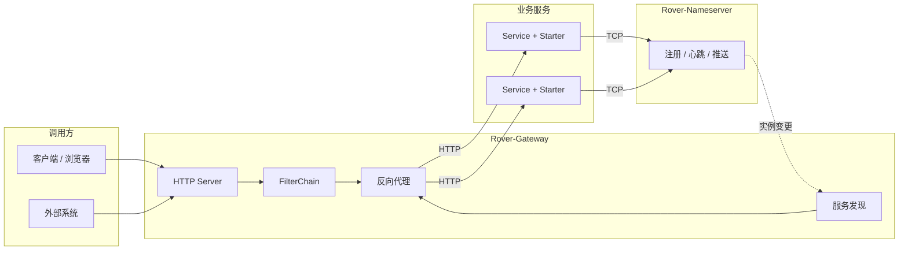

<div align="center">

<img src="data:image/png;base64,iVBORw0KGgoAAAANSUhEUgAAAgAAAAIACAYAAAD0eNT6AAAOiUlEQVR42u3dvW5URxgG4O+M3G9AQkbUqZxboKFJg5BCkY4UUa4LpQhdCiJFNGlouIW4So2wkGz2CpwiAiVEAtvs7pmZ93maSPljz+yZ+d755uzuUnRpc3xyaRSA0W3PThej0CdvjAIPICAIACj2AEKBAICCDyAQCAAo+AACgQCg6AMgDAgAij4AwoAAoOgDIAwIAAo/AIKAAKDoAyAMCAAKPwCCgACg8AMgCAgACj8AgoAAoPADIAgIAAo/AILAdTXFHwDy6sbiDQSAvG7AovADQF4QaIo/AOTVl8UbAwB53YCm+ANAXt1p3gQAyKs/i4EHgIo7EmiKPwDk1aVmkAEgrz4tBhYAKu5IoCn+AJBXt5pBBIC8+tUMHgDk1bFm0AAgr541gwUAeXWtGSQAyKtvzeAAQF6dawYFAPLqXTMYAJBX95pBAIC8+tcUfwDIq4NN8QeAvBDQFH8AyAsBTfEHgLwQ0BR/AMgLAU3xB4C8ENAMNwDkaXb/AJDXBWiKPwDkhYCm+ANAXgjwDAAAlGcA7P4BIKAL0BR/AMgLAU3xB4C8EOAZAAAozwDY/QNAQBegKf4AkBcCHAEAQDkCsPsHgIAugA4AAOgA2P0DQEIXoCn+AJAXAhwBAEA5ArD7B4CALoAOAADoANj9A0BCF0AHAAB0AOz+ASChC6ADAAA6AHb/AJDQBdABAAAdALt/AEjoAugAAIAOAAAgAJT2PwDUhMcAOgAAoANg9w8ACV0AHQAA0AEAAKIDgPY/ANS0xwBHhghgN37/6avP/juPnr4zUHRh0QEA2G/RFwZYy/bsdLlWAFD8AfZX+AUBeggBAgDASoVfEGDNAOBTAAAdFP9D/P/hkwHA7h9gveIsBFAH+jSADgBAZ0VZCMAXAQGEFX8hAAEAILT4CwEcPAA4/wfoq/gKAdSengPQAQAARwAA9Lbr1gVAAAAAdhsAnP8D9Lvb1gWgdvwcgA4AADgCAAAEAIDS/vf6EAAAgHkCgAcAAaCiHgTUAQAARwAAgAAAAAgAAIAAAAAIAACAAAAwmEdP33l95AQA3wEAABX3XQA6AADgCACgHAN4XQgAAIAAAKALYPePAAAACAAAugB2/wgAAIAAAAAIAACAAAAACAAAgAAAAAgAAIAAAAAIAACAAAAACAAAgAAAAAIAACAAAAACAAAgAAAAAgAAIAAAAAIAACAAAAACAAAgAAAAAgAAIAAAAAIAACAAAAACAAAgAAAAAgAACAAAgAAAAAgAAIAAAAAIAACAAAAA9O3IELCWr0++MQiT+Ov0T4MAAgAo+OnvrUAAAgAo/MHvuSAAAgAKP4IAIACg8CMIAOVTACj+uD8AAQCLO+4ToBwBYEHHkQCgA4Dij/sHEACweOM+AgQAAEAAwK4N9xMgAGCxxn0FCABYpHF/gQAAAAgAYHeG+wwEAABAAMCuDNxvIAAAAAIAdmPgvgMBAAAQAAAAAQAAEAAo57Dg/gMBAAAQAAAAAQAAEAAAAAEAABAAAAABAAAEAABAAAAABAAAQAAAAAQAAEAAAAAEAABAAAAABAAAQAAAAAQAAEAAAAAEAABAAAAABAAAQAAAAAQAABAAAAABAAAQAAAAAQAAEAAAAAEAABAAAAABAAAQAAAAAQAAEAAAAAEA4JAePX0X/ecjAAAAAgCALoDdPwIAgBCg+CMAAAgBij/9OzIEVFVtbt8yCLg3P+PJ83/++uzx5R7+38tBr3d7fuHmEgCwoAI3KdazrQNCgQCAgv/B2zev687dewaRVbx989ogrLhWCAQCAHb6QPAaIggIACj6QPi6IgwIACj8gK4A5WOArDgZ9138ncNSzv9ZYe1BAMCuH7AOIQCwRvK2G8P9hm6AAIC0DWB9EgBImVx2ZbjPEALKpwAwoQB8UkAHgJDib3eG+wubFwGA0MljkcZ9hRAgABA6aSzWuJ8QAgQATBYA65oAQMoksWvDfYQQIAAQOjks3rh/EALKxwDJXsTv3L1nMFD4QQeAtFRsUcd9gi6AAEDoZLC44/5ACChHAGROAkcCKPxcdf3zbYECAJ4NQOEHBAC7f0EAhR9dAAQAxX/KoiAQKPggBAgAKBoAlE8B2P0DWBcRAAAAAUDKBbA+IgAAAAIAACAAlPYWgHUSAQAAEACkWgDrpQAAAAgAAIAAAAAIAJTzLADrpgAAAAgAAED5OWC4ulcvXxiEj9x/8LCb1/Ls8aU35MCePF8MAju1bI5PzORylqXwCwIKvyDQm+35hTd8X2N7dro4AlD8FX/jpPgPJOl9sH6WZwBQ1Fh3vBR/IQABABT/sHFTbIQABAAAQAAAu//Zx88uUxcAAQAAEAAAAAEAABAAAAABAAAQAAAAAQAAEAAAAAEAABAAAAABAAAQAAAAAQAAEAAAAAEAAAQAAEAAAAAEAABAAAAABAAAQAAAAAQAAEAAAAAEAABAAAAABAAAQAAAAAQAAEAAYEj3Hzw0CB2P35Pni0HumPcHAQAAEACwizVudpl2/yAAoJgZL8VG8QcBAEXNOCk6ij8sm+OTS8OwP5vbtwzCDbx6+cIgdByQnj22bCj8h7E9v/Dm72Ncz04XAUAAABAAAgOAIwAAKM8AAAACAAAgAAAAAgAAIAAAAAIAACAAAAACAAAgAAAAAgAAIAAAAAIAACAAAAACAAAgAAAAAgAAIAAAgAAAAAgAAIAAAAAIAACAAAAACAAAgAAAAAgAAIAAAAAIAACAAAAACAAAgAAAAAgAAIAAAAAIAACAAAAAAgAAIAAAAAIAN7Q9vzAIANZPAQAAEAAAAAEAABAAAAABoDzIAmDdRAAAAAQAAEAAAAAEgHKeBWC9RAAAAAEAqRbAOikAAAACAAAgAFDaWwDWRwEAABAAkHIBrIsCAAAgACDtAlgPBQA3PYB1EAEAABAApF8A6x8CgEkAYN1DADAZAKx3CAAAgAAgFQNY5xAATA4A6xsCgEkCYF0TADBZAKxnAgAmDYB1TADA5AGwfs3myBCMM4k2t28ZDEDhRwfApAKwTqEDEDO59tUJ+Pbhd1f+d/948Zs3AzrSw/xV/MeybI5PLg3DmL40CFxnwRAIYNyCv+/5q/APuJk8O10EgLAQsMtFQxiAcYv+ruav4i8A0HkQOMTCIQjAuIX/uvNX4RcA6DwIrLFwCAIwbuH/3PxV+AUABvD9Dz9281qEABiv+L/36y8/e0MEABR+QQBSCr8gMHcA8D0Air/FDcyPKdYXyhcBKf4WOVD8hQDK9wAo/qWdCOav+Us5ArB4eN1gHpi/5QgAi4fXD+5/81cAwORzHeC+N38FAEw61wPud/NXAAAABACkbdcF7nPzt3wMEJOsUj9edJ33xkeoMsfP/KU6+hjgkWGAwy/mH/+3iYum8QMdAOwehtlFHOI9mLmYJY+f+YsOAChcV/qzZlpEjR/oAGD3MNQuoodxH7mQGT/zF18FDIqXr4o1ftARRwAwQMEYqa1t/KB8DwB2MKNdd+9j7fW5p8xfBAAIXbB6fZ3GDwQAUPzDXq/xAwEAFP/ykJ3xAwEAi1TX1+/32I2f8XH9AgBYnFyH8QMBABR/12P8QAAAAAQAsNtLvS7jBwIAWOTLQ23GDwQAAEAAALu7ma7T+IEAAAAIAGBXN/v1Gj8QAAAAAYB9S//9cr/fjvvX9SMAQGnnHv66jR8IAACAAAAACACUczTXDe5j81cAgHKOO/r1Gz/PASAAAAACAKWd5nrB/ex6BQAAQABAqnadYP4iAAAAnQWA7dnpYhika9cH7m/Xl+F93dcBMMlcF7jPXZcjAABAAEDadj3gfjd/BQBMOtcB7nvzVwDA5Ov+9fs99p+Nn/vT60cAsEh53WAemL8IABYRrxfMB/M3OwD4LgCLiNcJ5oX5WzHfAaADYBGJeH1+j934uVfNJf7vyBDMu3D19FvmFg4wfynPAJA1aS0eYP7Snw9nAZvjk0vDMa81dhO9LRw97ahGHHvjZ/5SUz0DcPTvvykEaCtaOMD8Zf7i/58OgC6ArkDCopGwi93ne2H8zF/mCQAeArSruNGCYsEA85ea4xkAHQBK58Pu1fiZIMR0ANqn/iFY5F2X8YP5ir+PAQJA+R4A0AVwPcYPBAAQAlyH8YOYAOA5AIQAr9/4QU19/q8DAH6P3fiBDgAIAV6v8YPoAOAYACHA6zR+UNO2/3UAwO+xe31QvgmwfCsgVJffeDdi4TJ+MGgHwDEAugEesjN+MGfx/2QHQBcA/B678QMBAPB77MYPUgKAEAB+j934wXzFXwCAlQqagmX8oPsAIAQAwFzFv8r3AABA+SZAAEAAKN8JAAA1W/tfBwAAdAB0AQAgYfevAwAAOgC6AACQsPvXAQAAHQBdAABI2P3rAACADoAuAAAk7P51AABAB0AXAAASdv9f3AEQAgBgvOLvCAAAyhGALgAABOz+dQAAQAdAFwAAEnb/O+0ACAEAMEbxdwQAAOUIQBcAAAJ2/3vpAAgBANB/XW0jvVgAUPw9AwAA9BYAdAEAoN862kZ+8QCg+Hd6BCAEAEB/ddMzAABQngHQBQCAyXf/B+0ACAEA0E+dbDNfHAAo/p08AyAEAMD6dbElXSwAKP4rfwpACABA8a+KCwBCAACKf2gAEAIAUPxDA4AQAIDiHxoAhAAAFP/QACAEAKD4hwYAIQAAxT80AAgBACj+wb8GKAQAoPiH/hywEACA4h8YAIQAABT//RiquG6OTy7dWgAo/AEdAN0AANSn8AAgBACgLlXeEUA5EgBA4c/sAOgGAKD+hAcAIQAAdafyjgDKkQAACn9mB0A3AAD1JbwDoBsAgMIfHgAEAQAU/so4AnAsAIC6oQOgGwCAwi8ACAIAKPzRAUAQACD9iNj5uCAAoPALAIKAUQBQ+AUAYQAARV8AEAQAUPgFAGEAAEVfABAGAFD0BQBhAABFXwAQCABQ8AUAgQAABV8AEAoAFHsEAAQEQIEHAGC3/gZ3jAZ3sy91VwAAAABJRU5ErkJggg==" alt="Rover-Suite" width="96" />

# Rover-Suite

轻量级微服务中间件套件

Java 17 + Netty · 注册中心 · HTTP 网关 · Spring Boot Starter

[English](README.md) · [简体中文](README.zh-CN.md) · [Architecture](docs-public/architecture.md)


[简介](#-项目简介) · [特性](#-核心特性) · [架构](#-架构概览) · [快速开始](#-快速开始) · [接入](#-业务接入) · [路线图](#-路线图)

</div>

---

## 📖 项目简介

**Rover-Suite** 是一套可独立部署的轻量微服务基础设施，核心能力包括：

| 组件 | 说明 |
| :--- | :--- |
| **Rover-Nameserver** | 基于 TCP 的服务注册与发现 |
| **Rover-Gateway** | 基于 Netty 的 HTTP 网关（路由、发现、负载均衡、反向代理） |
| **Rover-Starter** | Spring Boot 接入，业务侧自动注册与优雅下线 |
| **Rover-Admin** | 可选管理控制台，支持运行时配置查看与更新 |

适合希望部署轻量、链路清晰、便于私有化与二次扩展的场景。

---

## ✨ 核心特性

| 特性 | 说明 |
| :--- | :--- |
| **自研核心组件** | Nameserver 与 Gateway 均基于 Netty 实现，核心不依赖 Spring Cloud |
| **独立进程部署** | 注册中心与网关均可单独打包运行 |
| **低侵入接入** | 引入 Starter 并完成 YAML 配置即可注册 |
| **静态 / 动态路由** | 支持固定上游与注册中心动态发现，共用负载均衡能力 |
| **可扩展** | Filter、负载均衡、服务发现等提供 SPI 扩展点 |
| **运行时管理** | Admin 可查看并更新网关 / 注册中心运行时配置 |

---

## 🗺️ 架构概览



模块依赖与主链路说明见 **[docs-public/architecture.md](./docs-public/architecture.md)**。

---

## 🏗️ 模块一览

| 模块 | 职责 |
| :--- | :--- |
| `rover-common` | 协议、编解码与公共能力 |
| `rover-nameserver-core` | 注册中心核心逻辑 |
| `rover-nameserver-server` | Nameserver 可执行进程 |
| `rover-nameserver-client` | 注册中心客户端 |
| `rover-nameserver-starter` | Spring Boot Starter |
| `rover-gateway-core` | 网关核心逻辑 |
| `rover-gateway-bootstrap` | Gateway 可执行进程 |
| `rover-gateway-adapter-nacos` | 外部注册中心适配扩展 |
| `rover-admin` | 管理控制台 |
| `rover-demo` | 示例业务服务 |

---

## 🚀 快速开始

### 环境要求

- JDK 17+
- Maven 3.6+

### 1. 构建

```bash
git clone https://gitee.com/zzl-java/roverSuite.git
cd roverSuite
mvn clean package -DskipTests
```

### 2. 启动 Nameserver

```bash
java -jar rover-nameserver-server/target/rover-nameserver-server-1.0.0-SNAPSHOT.jar
```

默认监听 TCP `8888`。

### 3. 启动 Gateway

```bash
java -jar rover-gateway-bootstrap/target/rover-gateway-bootstrap-1.0.0-SNAPSHOT.jar
```

默认端口见 `rover-gateway.yml`（本机可按需改为 `8080`）。

### 4. 启动示例服务

```bash
mvn -pl rover-demo spring-boot:run
```

### 5. 可选：Admin

```bash
mvn -pl rover-admin spring-boot:run
```

默认访问地址：`http://127.0.0.1:9090`

---

## 🔌 业务接入

### Maven 依赖

```xml
<dependency>
    <groupId>com.rover</groupId>
    <artifactId>rover-nameserver-starter</artifactId>
    <version>1.0.0-SNAPSHOT</version>
</dependency>
```

### 配置示例

```yaml
spring:
  application:
    name: demo-service

server:
  port: 8081

rover:
  nameserver:
    enabled: true
    address: 127.0.0.1:8888
    host: 127.0.0.1
    weight: 100
    ephemeral: true
    heartbeat-interval-ms: 5000
```

Gateway 动态发现示例：

```yaml
rover:
  gateway:
    discovery:
      type: nameserver
      nameserver:
        address: 127.0.0.1:8888
    loadbalance:
      strategy: round_robin
    routes:
      - id: demo-api
        businessPrefix: /api/demo
        serviceName: demo-service
        stripPrefix: /api/demo
```

---

## 📊 定位对比

| 维度 | 传统 Spring Cloud 方案 | Rover-Suite |
| :--- | :--- | :--- |
| 部署形态 | 依赖较重的组件生态 | 核心链路以独立 Jar 运行 |
| 框架耦合 | 通常强依赖 Spring Cloud | 核心基于 Netty；仅 Starter 使用 Spring Boot |
| 注册中心 | 常见为 Nacos 等 | 自研 TCP Nameserver |
| 网关 | 常见为 Spring Cloud Gateway | 自研 Netty Gateway |
| 适用场景 | 大规模微服务治理 | 轻量部署、私有化与可定制扩展 |

---

## 🗺️ 路线图

- [x] Nameserver 注册 / 心跳 / 推送
- [x] Gateway 路由、发现、负载均衡与反向代理
- [x] Spring Boot Starter 接入
- [x] Admin 运行时管理
- [ ] 流量治理能力增强（限流、鉴权、熔断等）
- [ ] 外部注册中心适配完善
- [ ] 高可用与集群能力增强

---

## 📚 文档

- [公开文档索引](./docs-public/README.md)
- [架构说明](./docs-public/architecture.md)

---

## 🤝 贡献

欢迎通过 Issue 与 Pull Request 参与贡献。

---

## 📄 许可证

本项目基于 [Apache License 2.0](./LICENSE) 开源。

---

## 📮 联系

- 仓库：https://gitee.com/zzl-java/roverSuite
- Issue：请在仓库中提交

<p align="center">
  <sub>Rover-Suite — Lightweight microservice infrastructure.</sub>
</p>
