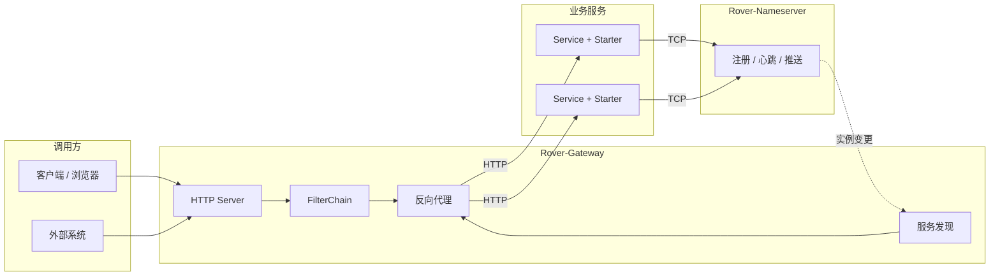

<div align="center">


<br/>

[English](README.md) · [简体中文](README.zh-CN.md) · [Architecture](docs-public/architecture.md)

<br/>


<br/>

[简介](#-项目简介) · [特性](#-核心特性) · [架构](#-架构概览) · [快速开始](#-快速开始) · [接入](#-业务接入) · [路线图](#-路线图)

</div>

---

## 📖 项目简介

**Rover-Suite** 是一套面向小团队的轻量微服务基础设施，解决的核心问题是：

> 后端有多个单体项目（可能是 Java/Python/PHP/Go 等不同语言），前端多个 App 各自硬编码后端端口，用 Nginx 做反向代理需要手动维护大量静态配置，上 OpenResty/APISIX 又太重、不好定制。

Rover-Suite 提供**自带注册中心的一体化轻量方案**：后端服务启动后自动注册，网关实时感知实例变化，无需手动维护 IP 端口。

| 组件 | 说明 |
| :--- | :--- |
| **Rover-Nameserver** | 基于 TCP 的服务注册与发现（心跳检测、健康检查、实例变更推送） |
| **Rover-Gateway** | 基于 Netty 的 HTTP 网关（路由、发现、负载均衡、反向代理） |
| **Rover-Starter** | Spring Boot 接入，业务侧自动注册与优雅下线 |
| **Rover-Admin** | 可选管理控制台，支持运行时配置查看与更新 |

---

## ✨ 核心特性

| 特性 | 说明 |
| :--- | :--- |
| **自研核心组件** | Nameserver 与 Gateway 均基于 Netty 实现，核心不依赖 Spring Cloud |
| **独立进程部署** | 注册中心与网关均可单独打包运行，两个 jar 即可跑通全链路 |
| **低侵入接入** | 引入 Starter 并完成 YAML 配置即可注册，支持优雅下线 |
| **健康检查** | 心跳超时自动剔除临时实例 / 标记持久实例不健康，网关实时感知 |
| **静态 / 动态路由** | 支持固定上游与注册中心动态发现，共用负载均衡能力 |
| **多种负载均衡** | 轮询、加权轮询、随机、IP Hash、最少连接数 |
| **可扩展** | Filter、负载均衡、服务发现等提供 SPI 扩展点，支持插件 jar 热加载 |
| **运行时管理** | Admin 可查看并更新网关 / 注册中心运行时配置，路由热更新 |
| **管理面安全** | 监听地址可配置 + 管理口与注册/订阅协议 token 鉴权 |
| **Java 原生** | 定制开发用 Java SPI，对 Java 团队零学习成本，可直接改源码二开 |

---

## 🗺️ 架构概览



模块依赖与主链路说明见 **[docs-public/architecture.md](./docs-public/architecture.md)**。

---

## 🏗️ 模块一览

| 模块 | 职责 |
| :--- | :--- |
| `rover-common` | 协议、编解码与公共能力 |
| `rover-nameserver-core` | 注册中心核心逻辑 |
| `rover-nameserver-bootstrap` | Nameserver 可执行进程 |
| `rover-nameserver-client` | 注册中心客户端 |
| `rover-nameserver-starter` | Spring Boot Starter |
| `rover-gateway-core` | 网关核心逻辑 |
| `rover-gateway-bootstrap` | Gateway 可执行进程 |
| `rover-gateway-adapter-nacos` | 外部注册中心适配扩展 |
| `rover-admin` | 管理控制台 |
| `rover-gateway-test/demo/backend` | 网关验证测试服务 |
| `rover-gateway-test/demo/frontend` | 测试前端面板（独立于核心套件） |

---

## 🚀 快速开始

### 环境要求

- JDK 17+
- Maven 3.6+

### 1. 构建

```bash
git clone https://gitee.com/zzl-java/roverSuite.git
cd roverSuite
mvn clean package -DskipTests
```

### 2. 启动 Nameserver

```bash
java -jar rover-nameserver-bootstrap/target/rover-nameserver-bootstrap-1.0.0-SNAPSHOT.jar
```

默认监听 TCP `8888`。

### 3. 启动 Gateway

```bash
java -jar rover-gateway-bootstrap/target/rover-gateway-bootstrap-1.0.0-SNAPSHOT.jar
```

默认端口见 `rover-gateway.yml`（本机可按需改为 `8080`）。

### 4. （可选）测试网关

如需测试网关路由与负载均衡：

```bash
# 后端测试服务
mvn -pl rover-gateway-test/demo/backend spring-boot:run --server.port=8081

# 前端测试面板（独立项目）
cd rover-gateway-test/demo/frontend && npm install && npm run dev
```

完整测试套件见 **[rover-gateway-test/demo/README.md](./rover-gateway-test/demo/README.md)**。

### 5. 可选：Admin

```bash
mvn -pl rover-admin spring-boot:run
```

默认访问地址：`http://127.0.0.1:9090`

---

## 🔌 业务接入

### Maven 依赖

```xml
<dependency>
    <groupId>com.rover</groupId>
    <artifactId>rover-nameserver-starter</artifactId>
    <version>1.0.0-SNAPSHOT</version>
</dependency>
```

### 配置示例

```yaml
spring:
  application:
    name: demo-service

server:
  port: 8081

rover:
  nameserver:
    enabled: true
    address: 127.0.0.1:8888
    host: 127.0.0.1
    weight: 100
    ephemeral: true
    heartbeat-interval-ms: 5000
```

Gateway 动态发现示例：

```yaml
rover:
  gateway:
    discovery:
      type: nameserver
      nameserver:
        address: 127.0.0.1:8888
    loadbalance:
      strategy: round_robin
    routes:
      - id: demo-api
        businessPrefix: /api/demo
        serviceName: demo-service
        stripPrefix: /api/demo
```

### 安全加固（可选）

监听地址默认绑定 `0.0.0.0`，管理口与注册/订阅协议默认不鉴权（向后兼容）。如需加固：

- `rover.nameserver.bindHost` / `manageBindHost`、`rover.gateway.server.bindHost` —— 收紧监听地址
- `rover.nameserver.token` / `adminToken`、`rover.gateway.adminToken`、`rover.admin.admin-token` —— 开启 token 鉴权

开启 token 后，客户端需携带一致的值：Starter 与 Gateway 发现读取 `rover.nameserver.token`，Admin 调用管理口时携带 `X-Rover-Admin-Token` 请求头。所有配置项均在 `rover-nameserver.yml`、`rover-gateway.yml` 与 `rover-admin` 的 `application.yml` 中带注释说明。

---

## 📊 定位对比

### 与常见方案对比

| 维度 | Nginx | OpenResty / APISIX | Spring Cloud | **Rover-Suite** |
| :--- | :--- | :--- | :--- | :--- |
| 服务发现 | 无，静态配置 | 需对接外部注册中心 | 有（Nacos 等） | **自带注册中心** |
| 后端接入 | 手动维护 upstream | 手动配置路由 | 引入 SDK | **引入 Starter 自动注册** |
| 定制开发 | C 模块 | Lua 脚本 | Java | **Java SPI，零学习成本** |
| 部署依赖 | 无 | etcd（APISIX） | 组件生态较重 | **两个 jar，无外部依赖** |
| 适用场景 | 静态代理 | 大规模流量治理 | 大规模微服务 | **小团队多单体、轻量私有化** |

### Rover-Suite 适合你，如果

- 后端有多个单体项目（Java/Python/PHP/Go 等混合技术栈）
- 不想为每个前端 App 硬编码后端端口
- 嫌 Nginx 静态配置维护麻烦，又不想上 APISIX 那么重的方案
- 团队是 Java 技术栈，希望用 Java 做网关定制开发
- 并发量不大，不需要百万 QPS，但需要动态注册和基本的负载均衡

### Rover-Suite 不适合你，如果

- 需要完整的流量治理能力（限流、熔断、鉴权等，规划中）
- 需要大规模集群高可用（当前为单点部署，集群在规划中）
- 需要极致的网关性能（APISIX 等基于 Nginx 的方案性能上限更高）

---

## 🗺️ 路线图

**已完成：**

- [x] Nameserver 注册 / 心跳 / 推送 / 健康检查
- [x] Gateway 路由、发现、负载均衡（5 种策略）与反向代理
- [x] Spring Boot Starter 接入（自动注册 + 优雅下线）
- [x] Admin 运行时管理（配置热更新、路由热更新）
- [x] SPI 插件扩展机制（Filter、负载均衡、服务发现）
- [x] 运行时配置管理（YAML 配置 + 热更新）

**规划中：**

- [ ] 可观测性（内置轻量指标采集 + Admin 可视化面板）
- [ ] 请求链路时间线（网关内阶段耗时拆解 + traceId 透传）
- [ ] HTTP 注册接口（支持 Python/PHP/Go 等非 Java 服务接入）
- [ ] 流量治理能力（限流、鉴权、熔断）
- [ ] 外部注册中心适配完善
- [ ] Nameserver 持久化与集群高可用

---

## 📚 文档

- [公开文档索引](./docs-public/README.md)
- [架构说明](./docs-public/architecture.md)
- [网关测试套件](./rover-gateway-test/demo/README.md) - **仅用于测试**

---

## 🤝 贡献

欢迎通过 Issue 与 Pull Request 参与贡献。

---

## 📄 许可证

本项目基于 [Apache License 2.0](./LICENSE) 开源。

---

## 📮 联系

- 仓库：https://gitee.com/zzl-java/roverSuite
- Issue：请在仓库中提交

<p align="center">
  <sub>Rover-Suite — Lightweight microservice infrastructure.</sub>
</p>
