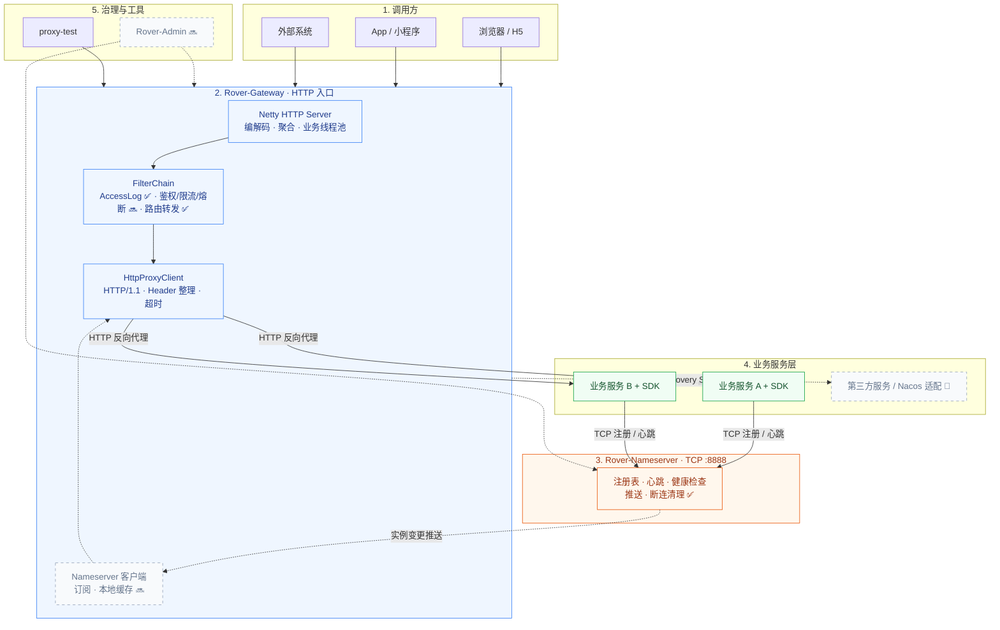
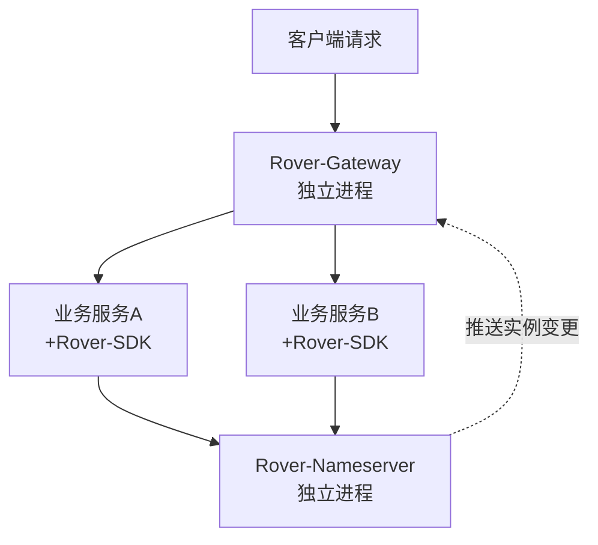
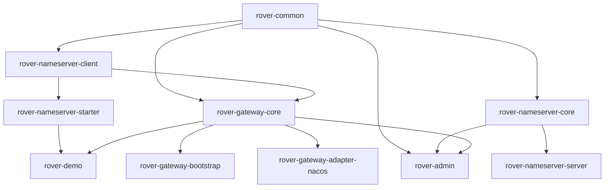

# Rover-Suite / 轻量级自研微服务中间件套件

> [English](README.md) | [简体中文](README.zh-CN.md)

> 一套由 Java 17 + Netty 驱动的自研微服务基础中间件：TCP 注册中心（Nameserver）+ 轻量网关（Gateway）。

---

## 📖 项目简介

Rover-Suite 是一套完全自研的轻量级微服务基础中间件套件，包含基于 Netty 实现的 TCP 注册中心（Nameserver）与轻量级网关（Gateway）。它面向"去框架套壳"的轻量场景，采用严格的 Maven 多模块分层架构，业务服务只需引入一个 Spring Boot Starter 即可完成注册与发现，网关则通过订阅注册中心动态感知实例变更。适用于对部署体积敏感、希望理解底层原理或需要私有化定制的场景。

> 配套文档：  
> - [完整架构模型（含时序图/模块依赖/演进路线）](./docs/ARCHITECTURE.md)  
> - [源码学习指南（选型对照 + 跟读路径 + 可靠性）](./docs/learn/README.md)

---

## 🗺️ 一图看懂

> 图例：✅ 已实现　🔜 规划中　🧩 占位



> 完整架构模型（部署拓扑 / 模块依赖 / 核心时序 / SPI 扩展点 / 演进路线）请见 **[docs/ARCHITECTURE.md](./docs/ARCHITECTURE.md)**。

---

## ✨ 核心特性

- ✅ **完全自研**：基于 Java 17 + Netty + Protostuff，TCP 注册中心与网关均为自研实现，无框架套壳。
- ✅ **分层架构**：基础层 → 通信层 → 核心层 → 接入层 → 部署层，模块依赖严格自底向上，无循环依赖。
- ✅ **独立进程部署**：Nameserver 与 Gateway 各自打包为可执行 Jar 独立运行，核心逻辑与启动入口完全分离。
- ✅ **业务无侵入**：业务服务仅需引入 `rover-nameserver-starter` 并配置 YAML，零代码接入注册与发现。
- ✅ **SPI 可扩展**：预留 `ServiceDiscovery`、`Filter` 等 SPI 扩展点（Nacos 适配模块为占位，待实现），可按需接入其他注册中心。

---

## 🏗️ 整体架构

### 部署架构



### 模块依赖

> 箭头方向表示依赖流向：`A --> B` 即 "B 依赖 A"。



### 模块清单

| 模块 | 职责 |
|---|---|
| `rover-common` | 公共基础：协议模型、TCP 编解码、工具类、事件总线、SPI、异常、注解 |
| `rover-nameserver-core` | 注册中心核心逻辑：注册表、心跳检测、主动推送、健康检查、数据模型 |
| `rover-nameserver-server` | 注册中心独立启动入口（可执行 Jar，shade 打包） |
| `rover-nameserver-client` | 通用 TCP 客户端：连接管理、处理器、本地缓存（编解码在 common） |
| `rover-nameserver-starter` | Spring Boot Starter：自动装配，业务服务接入 SDK（唯一依赖 Spring Boot 的模块） |
| `rover-gateway-core` | 网关核心能力：过滤器链、路由匹配、负载均衡、反向代理、SPI |
| `rover-gateway-bootstrap` | 网关独立启动入口（可执行 Jar，shade 打包） |
| `rover-gateway-adapter-nacos` | Nacos 适配扩展：实现 `ServiceDiscovery` SPI，接入 Nacos 注册中心（占位，待实现） |
| `rover-admin` | 管理后台：Gateway / Nameserver 运行时配置的查看与提交 |
| `rover-demo` | 功能测试 Demo：业务服务示例（占位，待实现） |

> 另有独立的网关代理测试工程 `proxy-test/`（自带 pom 的 Spring Boot 项目，不属于 Maven 模块，不参与 rover 构建与发布），用于验证网关反向代理能力，详见「网关代理测试」章节。

---

## 🚀 快速开始

### 前置条件

- JDK 17
- Maven 3.6+
- （可选）Git

### 1. 编译打包

```bash
git clone <your-repo-url> rover-suite
cd rover-suite
mvn clean package
```

> 当前版本 `1.0.0-SNAPSHOT`，将打包产出 10 个模块的 Jar，其中 `rover-nameserver-server` 与 `rover-gateway-bootstrap` 为可直接运行的独立可执行 Jar。

### 2. 启动注册中心

```bash
java -jar rover-nameserver-server/target/rover-nameserver-server-1.0.0-SNAPSHOT.jar
```

> 监听端口 8888（`rover-nameserver-server` 内的 `rover-nameserver.yml` 配置）。

预期输出：

```
Rover Nameserver starting...
```

### 3. 启动网关

```bash
java -jar rover-gateway-bootstrap/target/rover-gateway-bootstrap-1.0.0-SNAPSHOT.jar
```

> 默认监听 8080（`rover-gateway-bootstrap` 内的 `rover-gateway.yml` 配置 `rover.gateway.port`；若本机 80 端口空闲，可改回 80）。

预期输出：

```
Rover Gateway starting...
```

### 4. 启动业务服务

业务服务（如 `rover-demo`）作为独立 Spring Boot 应用启动，自动向 Nameserver 注册并接入网关流量。

```bash
mvn -pl rover-demo spring-boot:run
```

---

## 🧪 网关代理测试（proxy-test）

`proxy-test/` 是一个**独立于 rover 项目的 Spring Boot 测试工程**（自带 pom，不参与 rover 构建与发布，纳入 git 管理），用于验证网关反向代理能力，覆盖 31 个企业场景用例。

### 启动（IDE 直接 Run main，无需打包）

1. 后端实例一（默认 8081，同时托管测试页）：`com.rover.test.MockBackendApplication`
2. 后端实例二（对应网关 `test-api` 路由）：Run 配置追加参数 `--server.port=8070`
3. 被测对象：`com.rover.gateway.bootstrap.GatewayApplication`（网关，8080）

### 请求链路

```
浏览器(测试页 http://127.0.0.1:8081/) → 网关(8080) → MockBackend(8081 / 8070) → 网关 → 浏览器
```

### 覆盖场景

- **基础透传**：GET/POST/PUT/PATCH/DELETE/HEAD/OPTIONS、JSON / 表单 / 中文 query、状态码 201/204/404/500、慢请求、1MB 大响应、无路由 404
- **企业场景规格校验**（后端逐项断言，期望值经 `X-Verify-Spec` 头下发）：认证凭证、租户头、链路追踪、标准转发头、Host 改写、Accept 协商、gzip 请求体、256KB 大 body、复杂嵌套 JSON、multipart 上传、Cookie 回传、路由重写、query 逐值校验

## 📝 使用示例

### 引入依赖

```xml
<dependency>
    <groupId>com.rover</groupId>
    <artifactId>rover-nameserver-starter</artifactId>
    <version>1.0.0-SNAPSHOT</version>
</dependency>
```

### 配置接入

```yaml
rover:
  registry:
    address: 127.0.0.1:8888
    service-name: demo-service
```

> 上述配置为示例占位，具体字段与默认端口以对应阶段实现为准。

---

## 📊 与主流方案对比

| 维度 | Nacos + Spring Cloud Gateway | Rover-Suite |
|---|---|---|
| 部署重量 | 重量级，依赖 Nacos Server + SCG 生态 | 轻量，2 个可执行 Jar 独立运行 |
| 框架依赖 | 强依赖 Spring Cloud 全家桶 | 核心零 Spring 依赖，仅 Starter 模块接入 Spring Boot |
| 注册中心实现 | Nacos 或依赖其 Server | 自研 TCP 注册中心（Nameserver） |
| 网关实现 | Spring Cloud Gateway（WebFlux） | 自研 Netty 网关，可自定义过滤链 |
| 配置管理 | 内置配置中心 | 不内置，可通过 SPI 适配 |
| 扩展机制 | 官方生态 + SPI | 自研 SPI（`ServiceDiscovery`、`Filter`） |
| 适用场景 | 大型微服务治理体系 | 轻量场景、学习实践、私有化定制 |

> 定位说明：Rover-Suite 面向轻量与自研场景，不追求替代 Nacos/SCG 的大型治理能力。

---

## 🗺️ 开发路线图

**V1.0 规划**

- [x] 工程骨架与 Maven 多模块结构
- [x] `rover-common` 公共基础模块（工具类、常量、事件总线、SPI 骨架）
- [x] 注册中心核心：注册表、心跳检测、主动推送、健康检查
- [x] Nameserver 独立进程启动与协议编解码（TCP + Protostuff）
- [x] 通用 TCP 客户端（连接管理、本地缓存、订阅推送）
- [x] 网关核心：路由匹配、过滤器链、反向代理、负载均衡
- [x] 网关代理测试工具箱（`proxy-test`，31 个企业场景用例）
- [ ] Spring Boot Starter 自动装配（占位，待实现）
- [ ] Nacos 适配模块（占位，待实现）
- [ ] Demo 端到端联调验证（占位，待实现）

---

## 🤝 如何贡献

贡献指南待补充。欢迎提交 Issue 与 Pull Request，具体的贡献规范（代码风格、提交信息、分支管理）将在后续补充。

`<!-- TODO -->`

---

## 📄 许可证

本项目计划采用 **Apache License 2.0**。许可证文件与版权信息待正式确定后补充。

`<!-- TODO -->`

---

## 📮 联系与交流

联系方式占位，后续补充（可填入邮箱 / 微信群 / 社区地址）。

`<!-- TODO -->`
