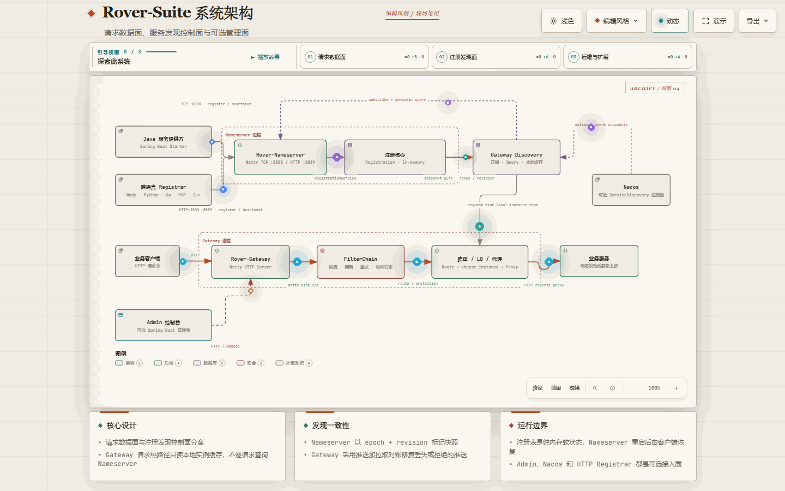

# Rover-Suite Documentation / Rover-Suite 公开文档

This is the public documentation shipped with the source repository.

本目录是随源码一起发布的公开文档。若你是第一次打开项目，建议先看“最快路线”，再按具体任务查阅参考文档。

  

<strong>Gateway · Service Discovery · Runtime Admin</strong> A focused, source-backed documentation set for the current single-node preview.

  <a href="./quick-start.md">Quick Start</a> ·
  <a href="./architecture.md">Architecture</a> ·
  <a href="../README.md">Project README</a>

## Fast path / 最快路线

| Step | English | 简体中文 | Goal / 目标 |
| :--- | :--- | :--- | :--- |
| 1 | [Quick Start](./quick-start.md) | [快速上手](./quick-start.zh-CN.md) | Build, start Nameserver/Gateway/Admin, and send one real request |
| 2 | [User Guide](./user-guide.md) | [使用指南](./user-guide.zh-CN.md) | Understand routes, discovery, Admin, and current runtime boundaries |
| 3 | [Troubleshooting](./troubleshooting.md) | [故障排查](./troubleshooting.zh-CN.md) | Fix common 404/502/registration/config issues |

## Visual overview / 视觉总览

The system is easiest to understand as three cooperating surfaces: the Gateway request path, the Nameserver discovery path, and the optional Admin/adapter surface.

系统可以先按三个协作面理解：Gateway 请求链路、Nameserver 注册发现链路，以及可选的 Admin/适配器管理面。

  

> Animated signals cover provider registration, discovery reconciliation, request processing, and Admin control paths. If GIF playback is unavailable, use the static preview or interactive diagram below.
> 动态信号覆盖服务注册、发现对账、请求处理和 Admin 管理链路。如果当前阅读器不播放 GIF，请使用下方的静态预览或可交互架构图。

[Static preview / 静态预览](./assets/rover-suite-architecture.png) · [Open the interactive architecture diagram / 打开可交互架构图](./rover-suite-architecture-editorial.html)

> **Current status / 当前状态:** `1.0.0-SNAPSHOT` single-node preview. The guides describe released code and call out explicit boundaries such as in-memory recovery, grouped discovery, WebSocket/SSE, and client HTTPS termination.

## Choose by task / 按任务找文档

| I want to... / 我想做什么 | English | 简体中文 |
| :--- | :--- | :--- |
| Run the first end-to-end request / 本地跑通一次完整链路 | [Quick Start](./quick-start.md) | [快速上手](./quick-start.zh-CN.md) |
| Use Gateway routes and runtime config / 使用路由与运行时配置 | [User Guide](./user-guide.md) | [使用指南](./user-guide.zh-CN.md) |
| Open and understand Admin / 使用 Admin 控制台 | [Admin User Guide](./admin-guide.md) | [Admin 使用手册](./admin-guide.zh-CN.md) |
| Call Admin APIs directly / 直接调用 Admin API | [Admin API](./admin-api.md) | [Admin API](./admin-api.zh-CN.md) |
| Register Java or non-Java services / 接入 Java 或非 Java 服务 | [Service Registration](./service-registration.md) | [服务注册指南](./service-registration.zh-CN.md) |
| Check every YAML/Admin key / 查询全部配置项 | [Configuration Reference](./configuration-reference.md) | [配置项参考](./configuration-reference.zh-CN.md) |
| Troubleshoot runtime issues / 排查运行问题 | [Troubleshooting](./troubleshooting.md) | [故障排查](./troubleshooting.zh-CN.md) |
| Design a reproducible benchmark / 设计可复现压测 | [Benchmark Guide](./benchmark-guide.md) | [性能测试指南](./benchmark-guide.zh-CN.md) |
| Review benchmark method and reference data / 查看压测方法和参考数据 | [Performance Report](./performance-report.md) | [性能报告](./performance-report.zh-CN.md) |
| Deploy outside local development / 生产或类生产部署 | [Production Deployment](./production-deployment.md) · [Small-team go-live](./small-team-go-live.md) · [Production templates](../deploy/production/README.md) · [Docker Compose](../deploy/docker/README.md) | [生产部署](./production-deployment.zh-CN.md) · [小团队上线 10 条](./small-team-go-live.zh-CN.md) · [生产样例](../deploy/production/README.md) · [Docker Compose](../deploy/docker/README.md) |
| Understand architecture and trade-offs / 理解架构与取舍 | [Architecture](./architecture.md) | [架构与权衡](./architecture.zh-CN.md) |
| Modify source code / 修改源码二开 | [Development Guide](./development-guide.md) | [二次开发指南](./development-guide.zh-CN.md) |
| Write and mount plugins / 开发并挂载插件 | [Plugin Development](./plugin-development.md) | [插件开发与接入](./plugin-development.zh-CN.md) · [插件挂载操作手册](./plugin-mounting-guide.zh-CN.md) |
| Confirm compatibility before upgrade / 升级前确认兼容性 | [Compatibility and Extensions](./compatibility-and-extensions.md) | [升级与扩展](./compatibility-and-extensions.zh-CN.md) |
| Prepare an open-source release / 开源发布前检查 | [Release Checklist](./release-checklist.md) | [发布前检查清单](./release-checklist.zh-CN.md) |

## Extension boundaries / 扩展边界速查

| Extension need / 扩展需求 | Supported path / 当前方式 |
| :--- | :--- |
| Request auth, audit, tenant labels, custom rate limiting / 鉴权、审计、租户标记、自定义限流 | User `Filter` plugin JAR / 用户 Filter 插件 |
| Custom upstream selection / 自定义负载均衡 | `LoadBalancer` strategy plugin JAR; used by the fixed proxy stage / 负载均衡策略插件，由固定转发环节调用 |
| Plugin runtime settings visible in Admin / 插件自己的动态配置 | Implement `ConfigurablePlugin` |
| Nacos or other registry integration / Nacos 或其他发现源 | Optional source-level adapter; Nacos discovery is available in the Nacos adapter module |
| Built-in local rate limiting / 内置本地限流 | `rover.gateway.rateLimit.*`, local to each Gateway instance |
| Built-in process-local circuit breaker / 进程内熔断 | `rover.gateway.circuitBreaker.*`, consecutive failures per `host:port` |
| Connect-fail retry / 连不上换台 | `rover.gateway.retry.enabled`, one extra attempt if the request was never sent |

## References / 参考入口

| Topic | Link |
| :--- | :--- |
| Cross-language Registrar examples / 多语言注册示例 | [Node.js / Python / Go / PHP / C++](../examples/http-registration/README.md) |
| HTTP Registration API contract / HTTP 注册 API 契约 | [OpenAPI v1](../rover-nameserver-core/src/main/resources/openapi/rover-registration-v1.yaml) |
| Gateway demo and test suite / Gateway 测试套件 | [rover-gateway-test](../rover-gateway-test/README.md) |

## Project entry points / 项目入口

- [English README](../README.md)
- [中文 README](../README.zh-CN.md)
- [Gateway demo and test suite](../rover-gateway-test/README.md)
- [Issue feedback policy](../CONTRIBUTING.md)
- [Open an Issue / 提交 Issue](https://github.com/zzl-qz/Rover-Suite/issues)
- [Apache 2.0 License](../LICENSE)
- [Third-party notices](../NOTICE)
- [Security policy](../SECURITY.md)
- [Docker Compose demo](../deploy/docker/README.md)

Current source status: JDK 17+, Maven build, version `1.0.0-SNAPSHOT`. Snapshot artifacts are built from source
and are not documented as published to a public Maven repository yet.

当前源码状态：JDK 17+、Maven 构建、版本 `1.0.0-SNAPSHOT`。SNAPSHOT 构件需要从源码构建，尚不能按已发布到公共 Maven 仓库使用。

This is currently a single-node preview. It is complete enough for the documented ordinary HTTP and empty-group
workflow, while operational boundaries such as last-instance reconciliation, grouped discovery, cold-start recovery,
WebSocket/SSE, and client HTTPS termination are listed in
[User Guide: Current runtime boundaries](./user-guide.md#9-current-runtime-boundaries).

当前定位是单机预览版，已覆盖文档中的普通 HTTP 与默认空分组链路。最后实例对账、分组发现、冷启动恢复、WebSocket/SSE，
以及网关进程不终止 HTTPS 等运行边界，统一记录在[使用指南：当前运行边界](./user-guide.zh-CN.md#9-当前运行边界)，
避免 README 与真实代码能力不一致。

Documentation should describe released code, not planned behavior. When a public contract, configuration key, or
extension boundary changes, update the corresponding guide and both root READMEs in the same change.

公开文档只描述当前代码已实现的行为。修改公开契约、配置项或扩展边界时，请在同一次变更中同步更新对应指南与中英文 README。
