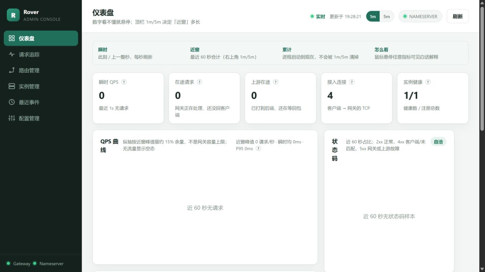
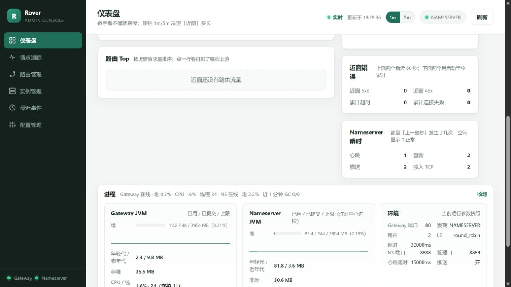
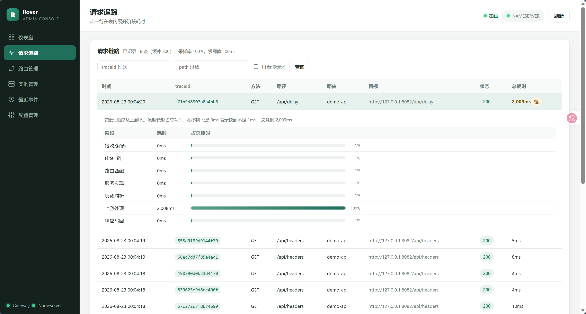
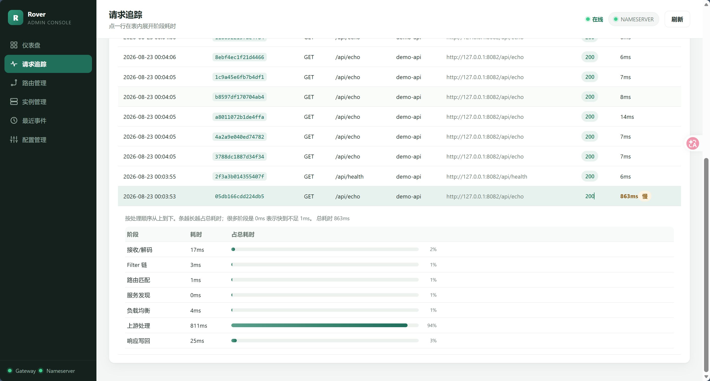
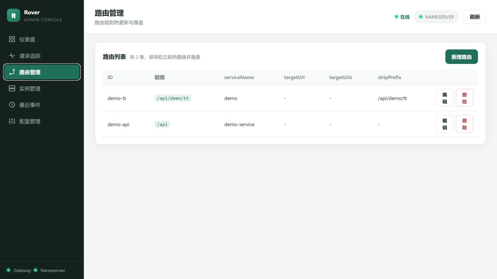
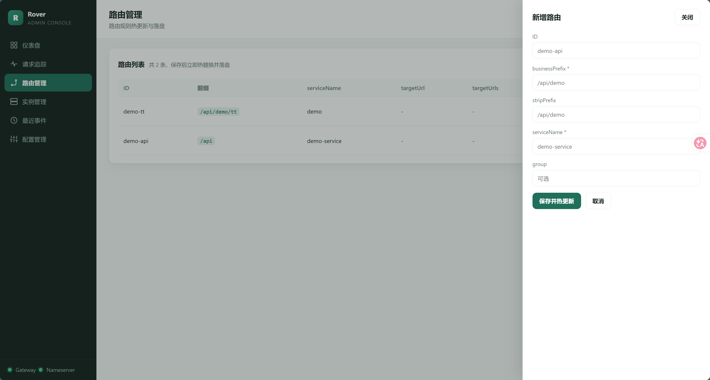
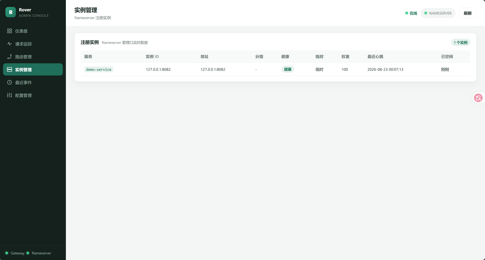
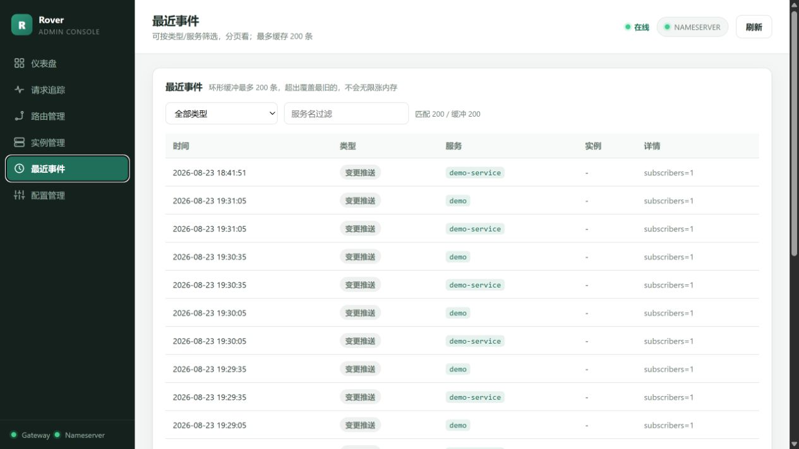
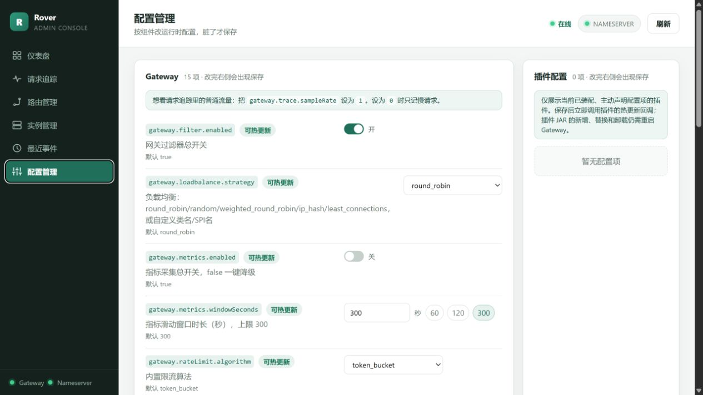
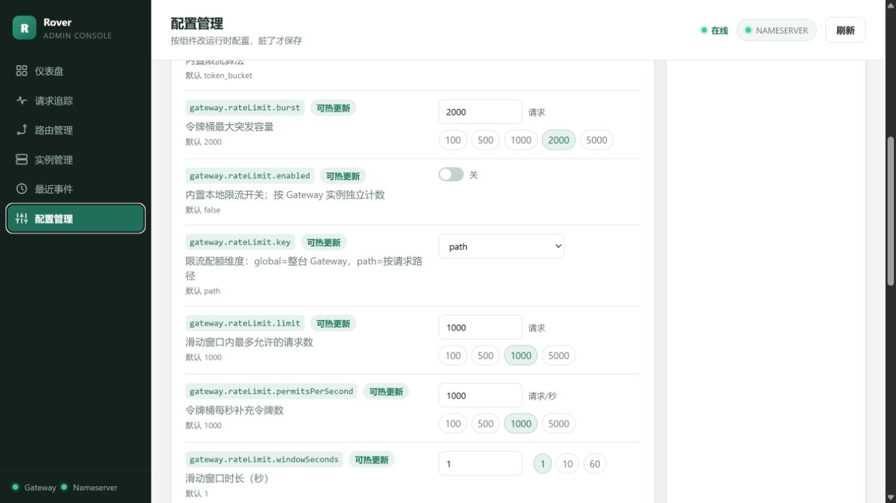

# Rover-Admin User Guide

[Admin API](./admin-api.md) · [Documentation index](./README.md)

Rover-Admin is an optional same-origin static console. It does not store
Gateway or Nameserver business configuration. It reads management snapshots
and forwards route/runtime configuration changes to the components.

## Start

```bash
mvn -pl rover-admin spring-boot:run
```

Default URL: `http://127.0.0.1:9090/`. In production, copy
`rover-admin/src/main/resources/application.yml` to a protected external
configuration and set the Gateway/Nameserver management URLs and a non-empty
`rover.admin.admin-token`.

The Agent Workbench is a three-column layout: the session list on the left, the multi-turn conversation and
investigation progress in the middle, and the active incident context on the right. The main input is a single natural
language box (e.g. "why does /api/demo/tt fail?"); the collapsible "advanced context" lets you pin route / service /
instance and a time range, all optional. Later questions in the same session are treated as follow-ups on the active
incident ("why are there no instances?", "what about yesterday?"), and a new incident opens only when the target
changes. Sessions, messages, incidents, tasks, steps, and evidence are written to the record store and **survive a
restart**: a historical session can be reopened as-is and a follow-up continues on its incident. A task that was still
running is marked "interrupted" with its latest safe resume point, and the steps and evidence it had already collected
stay readable. Only with no record store path configured (`rover.admin.log-store-path` blank) does the agent fall back
to in-memory storage.

The workbench works with route and instance snapshots even when no model is configured. To enable AI explanations,
set these environment variables:

| Variable | Value |
| --- | --- |
| `ROVER_AGENT_MODEL_CHAT` | `openai` |
| `ROVER_AGENT_API_KEY` | API key for the selected OpenAI-compatible service |
| `ROVER_AGENT_BASE_URL` | Service base URL; include `/v1` when that service requires it |
| `ROVER_AGENT_MODEL` | Model name supported by that service and tool calling |

These environment variables now act only as **first-boot seeding**: they apply
only while no model configuration file exists. Once you have saved from the
Model configuration page, the file wins and later changes to these variables do
not overwrite it. The existing startup method still works and is not deprecated,
but the Model configuration page (below) is the recommended long-term path.

Keep the key outside the repository. Investigations and workbench sessions are
stored in the local record store and survive a restart. The Agent only reads
management snapshots; it does not send requests to business paths or change routes
and configuration.

Once a model is configured, the answer is written into the reply bubble as it is
generated (the console subscribes to deltas over SSE; a dropped connection does
not affect the investigation, and polling fills in the final text). Each question
gets exactly one answer: steps, plan, evidence, and hypotheses stay in a collapsed
process row above the bubble — expand "view investigation process" to read them.
When an investigation finishes, its conclusion is recorded as an Agent reply, and
the bubble prefers the model's interpretation (`aiAnalysis` in the task result),
falling back to the rule-based conclusion when there is none. The "investigation
started / continued" notice stays in the process row instead of taking the
answer's place.

## Agent execution limits

Every task has a shared budget. Target interpretation, model retries, investigation
planning, and the conversation's tool loop use the same counters. Configure these
values in the external Spring configuration; changes take effect after restart:

| Property | Default | Meaning |
| --- | --- | --- |
| `rover.agent.limits.max-model-calls` | `20` | Maximum model requests per task, including retries |
| `rover.agent.limits.max-output-tokens` | `4096` | Maximum output per model request; streamed reasoning is included in local accounting |
| `rover.agent.limits.max-total-tokens` | `100000` | Task budget for cumulative input and output, including repeated conversation history and tool results |
| `rover.agent.limits.task-timeout-seconds` | `180` | Total time from Worker execution start; incoming stream chunks do not extend it |
| `rover.agent.limits.max-repeated-tool-results` | `3` | Stop when the same tool and JSON arguments return the same result this many times in a row for that argument set |

Input is estimated before each request using the local tokenizer; streamed output
is accounted for while it arrives. When provider usage is available, larger
reported counts replace the estimates. Estimates vary by model and do not promise
an exact billing ceiling. Output limits are also sent to the provider.

Spring AI additionally limits conversation tool calls to **30 total / 10 per
tool**, using `spring.ai.tools.limits.*` and `on-limit-exceeded: THROW`. Model and
task budget exhaustion produce `FAILED` with a readable reason, cancel the model
response stream, and keep the evidence already saved. Late responses cannot
replace the terminal state. Cancelling a request stops local execution; a provider
may continue work already accepted, and blocking tools must cooperate with
interruption or enforce their own IO timeouts.

## First login

The console stops on the login page. The default username and password are both
`admin`, and everyone shares that one account. It is stored in the `admin_user`
table of the same H2 file as the record store, and the default row is written
only when the table is empty.

Other behavior:

- Login page: `/login.html`; session timeout is 30 minutes.
- Logout is `POST /api/logout` only (a GET logout cannot be CSRF-protected, so
  it is not supported).
- After the failure limit is reached from one source, `POST /login` returns `429`.

Windows has no POSIX file permissions, so you can harden the model
configuration file by removing inherited permissions and granting only the
current user:

```
icacls "<file>" /inheritance:r /grant:r "%USERNAME%:F"
```

## Agent HTTP API

调查任务的触发、查询、取消与事件接入入口（均位于 `/api/agent` 之下，需登录；CSRF 保护的写操作需带 CSRF token）：

| 方法 | 路径 | 说明 |
| --- | --- | --- |
| POST | `/api/agent/sessions/{sessionId}/submit` | 在会话中提问（人工排查入口） |
| POST | `/api/agent/investigate` | 按路由前缀直接发起一次调查 |
| GET  | `/api/agent/tasks/{taskId}` | 任务详情：步骤、证据、结论 |
| GET  | `/api/agent/tasks/{taskId}/events` | 任务事件流（SSE），终态/澄清点自动收尾 |
| POST | `/api/agent/tasks/{taskId}/cancel` | 取消仍在执行中的任务（协作式） |
| POST | `/api/agent/events/ingest` | 事件接入：告警 / 网关切面异常触发一次自动调查 |

### 取消任务

`POST /api/agent/tasks/{taskId}/cancel` 为协作式取消：

- `404`：任务不存在或不属于当前用户（与任务详情同一归属判定）；
- `409`（`TASK_NOT_CANCELLABLE`）：任务已结束，取消无意义；
- `200`：已标记取消并中断执行线程，结论不会再产出，事件流随 `TASK_CANCELLED` 收尾。

前端的任务卡片在任务处于 `PENDING` / `RUNNING` 时显示「取消」按钮。

### 事件接入（自动调查）

`POST /api/agent/events/ingest` 把一次告警转成「对哪条路由、在什么窗口、怀疑什么」三要素，为该事件独立开会话、记一笔 `ALERT` 来源的事件，并复用与人工提问完全相同的取数链路开始调查。调查异步执行，返回 `202` 与任务视图，接入方凭 `taskId` 轮询详情或订阅事件流。

请求体：

```json
{ "path": "/api/demo/tt", "message": "5xx 告警", "fromMillis": 0, "toMillis": 0 }
```

- `path`（必填）：要排查的路由前缀；
- `message`（可选）：告警文本，作为调查问题上下文；
- `fromMillis` / `toMillis`（可选，需同时给出）：观测窗口；不传则按各数据源默认窗口取数。

会话按事件独立开（无归属用户），因此不会与某个人工会话争「单活跃任务」锁（不会 409）。

## Model configuration

The entry point is the "Model configuration" item in the console's left
navigation. The form combines a preset dropdown with free-text fields: after
choosing a preset you can still edit the base URL and model name.

The four buttons:

- **Save and apply**: saves the configuration and swaps in the new client
  immediately; **no Admin restart is needed**.
- **Test connection (no save)**: probes connectivity with the current form
  values; nothing is written and the active configuration is untouched, with a
  fixed 8-second timeout.
- **Verify active configuration**: runs the connectivity test again against the
  configuration currently in effect.
- **Clear stored key**: removes the stored API key.

Key handling: leaving the API Key field empty keeps the stored key; it is
cleared only by **Clear stored key** or by sending `clearApiKey:true` when
saving.

**Proving it took effect without a restart**: after saving, the "effective
version #N" and "effective time" on the **Effective status** card change; you
can also call `POST /api/model/verify` and read `buildId` to confirm that the
configuration in effect is the one you just saved. If building the client
fails, the previous working client is kept and the reason is reported in
`lastError`.

Storage and backup:

- The model configuration file (`ROVER_ADMIN_MODEL_CONFIG_FILE`, default
  `config/admin-model.properties` under the working directory) holds the non-secret fields;
  its `api-key-enc` field is AES-256-GCM ciphertext. It sits in the same `config/` directory as the
  Gateway / Nameserver local runtime configs, so it is maintained and backed up with the project;
  the whole `config/` directory is gitignored and an empty config is created on startup when missing.
- The master key file (`ROVER_ADMIN_MASTER_KEY_FILE`, default `master.key` next
  to the configuration file) is generated automatically on first encryption.
- Back up the key and the master key file **separately**: keeping them together
  is the same as not encrypting.
- Windows has no POSIX file permissions, so confidentiality comes from AES-GCM
  encryption rather than file mode. Hardening with
  `icacls "<file>" /inheritance:r /grant:r "%USERNAME%:F"` is recommended
  (startup logs print two hardening commands).

| Variable | Default | Meaning |
| --- | --- | --- |
| `ROVER_ADMIN_MODEL_CONFIG_FILE` | `config/admin-model.properties` under the working directory | Model configuration file path |
| `ROVER_ADMIN_MASTER_KEY` | empty | A base64 value that decodes to 32 bytes is used directly as the AES key; otherwise it is treated as a passphrase and derived with PBKDF2-HMAC-SHA256 (65536 rounds) |
| `ROVER_ADMIN_MASTER_KEY_FILE` | `master.key` next to the configuration file | Master key file; a 32-byte random key is written on first encryption |

Built-in presets (still editable after selection):

| Preset | Base URL | Model |
| --- | --- | --- |
| DeepSeek | `https://api.deepseek.com` | `deepseek-chat` |
| Zhipu GLM | `https://open.bigmodel.cn/api/paas/v4` | `glm-4.6` |

Only these two are preseted because they are the common choices. Other OpenAI-compatible services still
work (base URL and model name are free-form; unauthenticated local Ollama / vLLM included) — they simply
have no thinking content to show.

**To see the model's reasoning**: use `deepseek-reasoner` on DeepSeek, or `glm-4.6` or later on Zhipu.
Both are integrated over their native protocols, and the workbench then shows a "deep thinking" panel —
streaming while the model reasons, collapsed to a single line with elapsed time once the answer starts.

**About the Zhipu compatibility shim**: the available `spring-ai-zhipuai` versions (2.0.0-M1..M4) predate
`spring-ai-model` 2.0.1, and the `ToolExecutionEligibilityPredicate` types they reference were renamed in
that version — class loading fails before any request is made. The project supplies two shim types under
`org.springframework.ai.model.tool` in `rover-admin`: they only fill in the missing types and do not
invent semantics (the verdict matches 2.0.1 exactly), which lets Zhipu use its native protocol. Delete
both once that module ships a 2.0.1-aligned release.

The page also shows three status cards: effective status, connection test and
effect verification.

## Pages

| Page | Purpose |
| --- | --- |
| Dashboard | QPS, latency, status codes, in-flight requests, JVM and registry overview |
| Request tracing | Sampled Gateway request timelines |
| Routes | Create, update and delete routes |
| Instances | Registered Nameserver instances and health |
| Recent events | Registration, removal, health and push events |
| Configuration | Runtime Gateway/Nameserver settings |
| Diagnosis | Hypothesis-based read-only investigation over route, instance, metric, trace, configuration, and registry-event evidence, with an optional streamed-live AI explanation |

## Screenshots and quick orientation

The following screenshots come from a local demo environment. Addresses,
service names, timestamps and traffic are demonstration data.

### Dashboard



The dashboard separates **instant** values (the previous full second), **near
window** values (the selected 1m/5m window), and **cumulative/process** values
(JVM, CPU, threads, GC and uptime). The QPS axis follows the observed peak; it
is not a Gateway capacity limit.



Use the process section when latency rises without an obvious error-rate
increase. Check heap, old generation, CPU, threads and GC, then confirm the
Gateway port, discovery mode, load-balancer strategy and Nameserver settings.

### Request tracing



Tracing contains only sampled requests. Filter by `traceId`, path or slow
requests. Higher sampling improves visibility but increases Gateway recording
and memory overhead.



Expand a row to inspect decode, filters, route matching, discovery,
load-balancing, upstream processing and response writing. Start with the phase
that owns the largest share of total time.

### Routes



The route list shows `businessPrefix`, the versioned targets and their weights,
static targets and `stripPrefix`. Saving applies the update to Gateway and
persists it. Check for overlapping prefixes before changing a route.



In dynamic discovery, pick registry or static address first. Registry routes use
a `targets` list of `{serviceName, group, weight}` — here the registry's `group`
(a general-purpose business group) is reused as the gray dimension and
`weight: 0` pauses a version without deleting it; all targets on one route must
share the same `serviceName`. Static routes use `targetUrl` or `targetUrls`. Do
not keep both kinds on one route. `stickyHeader` optionally names the header used
for sticky version selection (default: the client IP). `stripPrefix` is removed
before the request reaches the upstream; set it per route instead of relying on
global `rewrite.stripPrefix`.

Before saving, the editor previews the per-route diff (`ADDED` / `REMOVED` /
`MODIFIED`). Every save sends the `revision` it last read; if someone else changed
the routes first, Gateway returns `409`, the page refreshes to the latest
revision and asks you to save again instead of silently overwriting.

### Version metrics

For a versioned route, `GET /_manage/metrics/routes?routeId=..&range=60|300`
returns the declared `targets`, a per-version `byVersion` rollup, and a
`versionCheck` comparison of declared vs observed versions. These metrics reuse
the "route × instance" dimension (each forwarded instance carries its `group`),
so they add no second store and keep the 5-minute sliding window.

Read the time semantics carefully — they are mixed on purpose.
`windowRequests`, `status5xx`, `connectFail`, `timeout`, `avgMillis`, `p95Millis`,
`sampleSize`, `sufficient`, and `errorRate` are window values, but
`noUpstreamRejects` / `circuitOpenRejects` are the route's **cumulative** reject
counters. So `capacityProblem` ("this version hit a no-instance or
all-circuit-open 503 at some point since startup") is a conservative hint, not
proof that the current window is broken. A version with fewer than
`sampleThreshold` (`5`) window samples is not enough to judge (`sufficient=false`),
and `p95Millis` is the maximum of the version's instance p95 values (a
conservative upper bound), not the version's true p95.

### Instances



Check service name, instance address, group, health, ephemeral status, weight,
last heartbeat and idle time. When Gateway cannot find a service, verify this
page before debugging the route.

### Recent events



The ring buffer retains up to 200 recent events. The filter always contains
registration, unregistration, expiration eviction, unhealthy marking and
change push. High-frequency heartbeats and queries remain counters rather than
individual events so they do not hide lifecycle changes.

### Configuration



Green “hot reload” badges identify settings that can be applied immediately.
Save controls appear only after a value changes. Gateway also exposes the
default-off local rate limiter: choose token bucket or sliding window, a quota
key, and thresholds. It counts per Gateway instance and is not a replacement
for a business limit shared across instances. The same page also has a
default-off process-local circuit breaker: failure threshold, rest window, and
`recovery` (`all` after the rest, or `half` for one probe). It counts per
upstream `host:port` and is not shared across Gateway replicas.
`gateway.retry.enabled` retries one other instance when connect failed and the
request was never sent.

Plugins that explicitly implement `ConfigurablePlugin` are shown with the
Gateway settings. Their fields use the same save and rollback flow as built-in
settings; only mounted plugins that declare properties appear. If no plugin
setting appears, the plugin may still be mounted.



`gateway.loadbalance.strategy` is a startup/plugin-mounting setting and is not
edited from Admin. Configure a built-in strategy, SPI `name()`, or implementation
FQCN in `rover-gateway.yml`, then restart Gateway. `gateway.trace.sampleRate`
accepts a decimal from 0 to 1; `0` records only slow requests and `1` records
all requests. Window values use seconds, while most timeouts and health settings
use milliseconds.

## Lightweight usage

- Live data is polled while the dashboard is visible; background tabs and other
  pages avoid the high-frequency live request.
- Admin talks to component management APIs, not business services.
- Restrict port `9090` to the operations network; do not expose Admin publicly.
