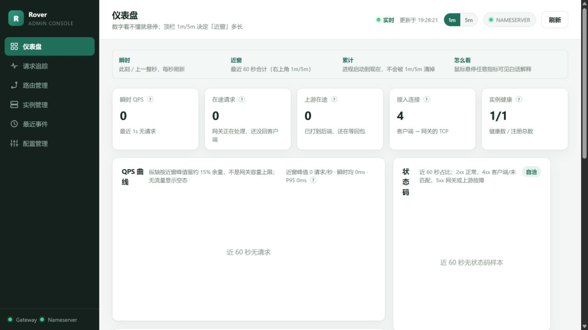
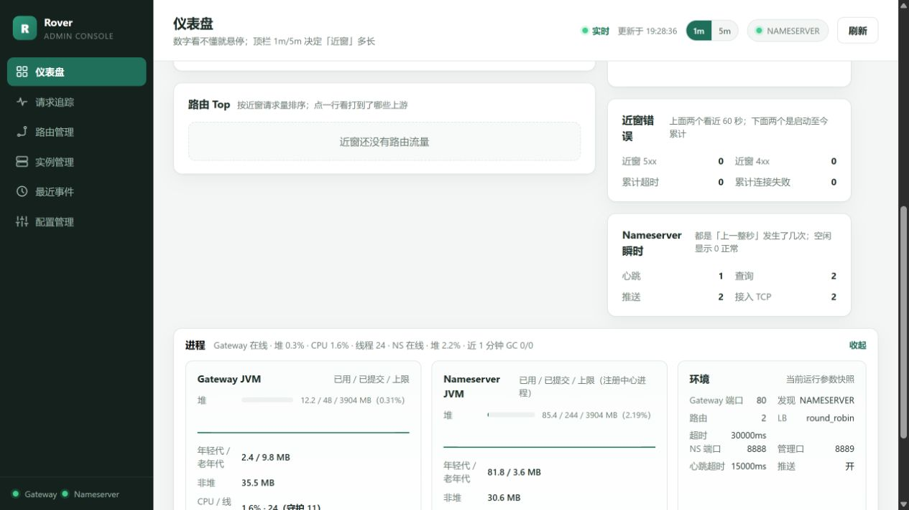
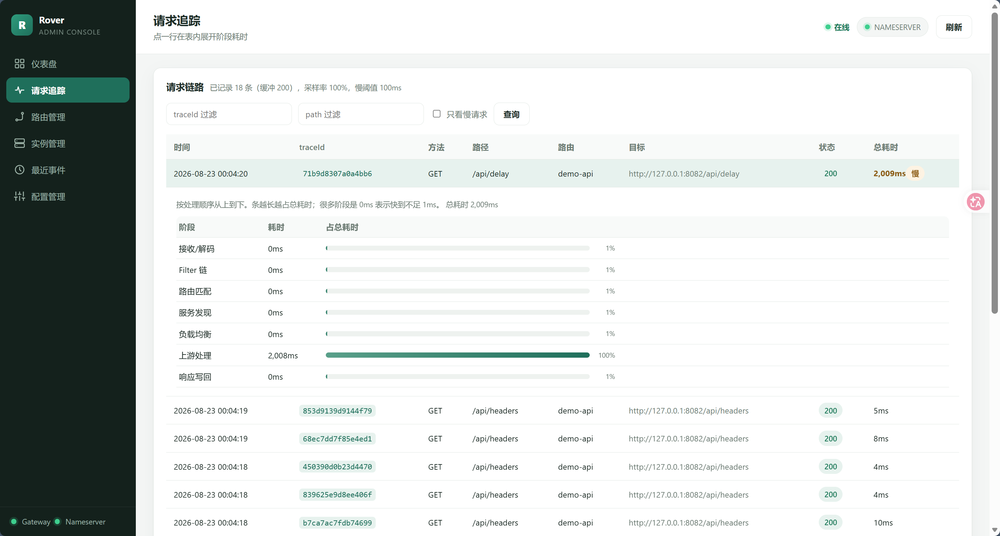
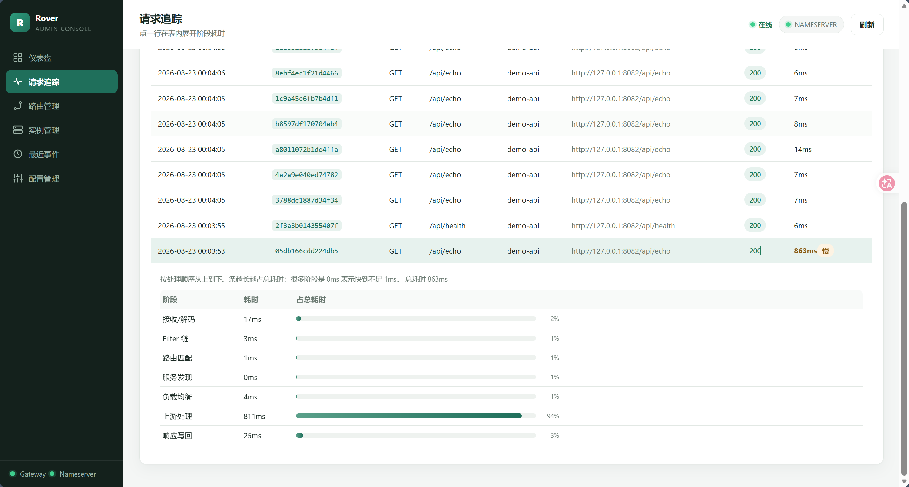
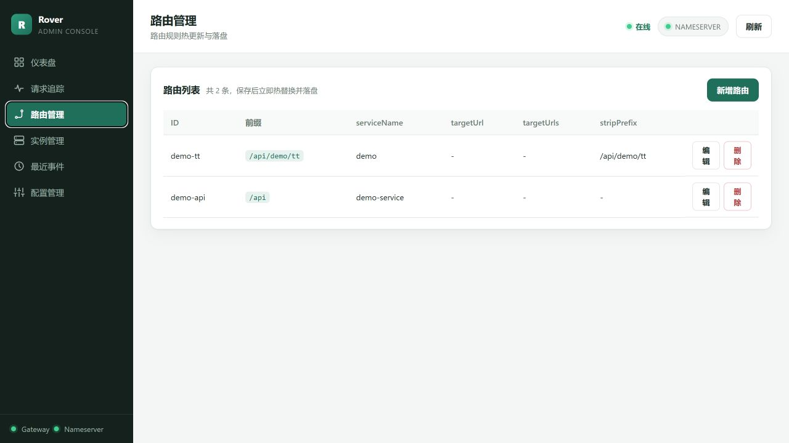
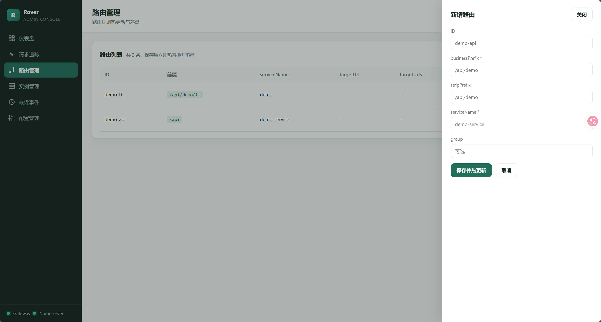
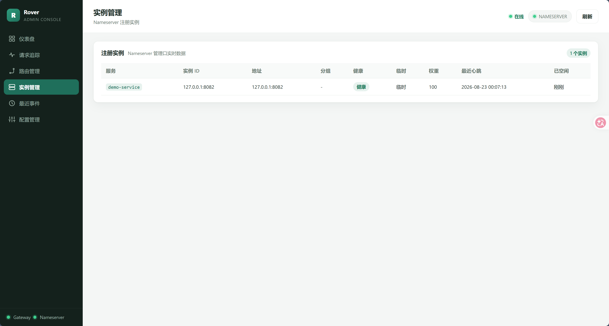
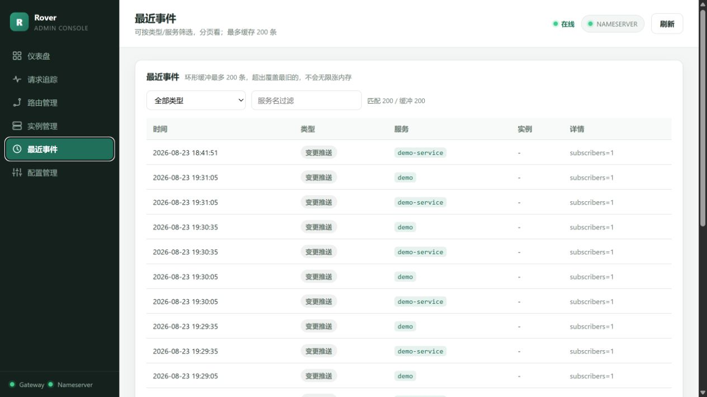
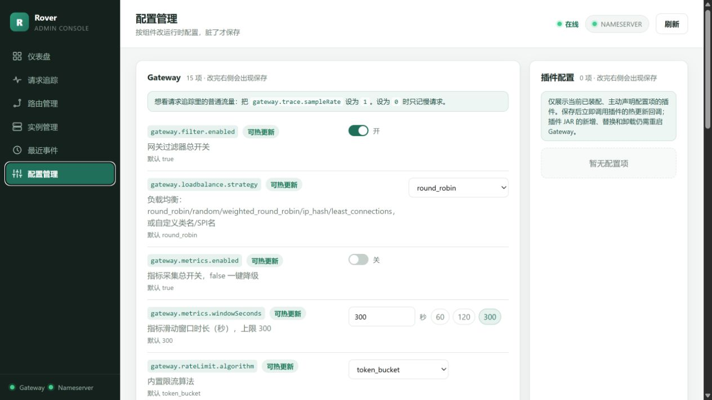
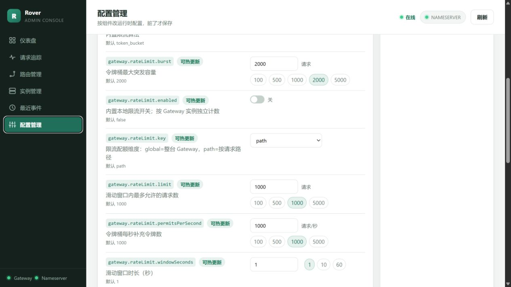

# Rover-Admin 使用手册

[Admin API](./admin-api.zh-CN.md) · [文档索引](./README.md)

Rover-Admin 是可选的同源静态控制台。它不保存 Gateway 或 Nameserver 的业务配置，主要通过管理 API 读取快照，
并把路由和运行时配置更新转发给组件。

## 启动

```bash
mvn -pl rover-admin spring-boot:run
```

默认地址：`http://127.0.0.1:9090/`。生产环境请复制 `rover-admin/src/main/resources/application.yml` 到受保护
的外部配置，并设置 Gateway、Nameserver 管理地址和非空 `rover.admin.admin-token`。

## 页面

| 页面 | 用途 |
| --- | --- |
| 仪表盘 | QPS、延迟、状态码、在途请求、JVM 和 Nameserver 概览 |
| 请求追踪 | 查看 Gateway 已采样的请求时间线 |
| 路由管理 | 新增、修改和删除路由 |
| 实例管理 | 查看 Nameserver 注册实例及健康状态 |
| 最近事件 | 查看注册、注销、推送和剔除事件 |
| 配置管理 | 修改支持热更新的 Gateway/Nameserver 配置 |

## 页面速览

下面的截图来自本地演示环境，地址、服务名、实例和请求数据均为演示数据。它们用于说明页面职责和常用操作，
不代表固定的默认数据量。

### 1. 仪表盘：先看流量，再看资源



仪表盘把数据分成三层：

- **瞬时**：上一整秒完成的请求、在途请求和当前连接数；空闲时显示 0 是正常的。
- **近窗**：最近 1 分钟或 5 分钟的 QPS、延迟、状态码、路由 Top 和错误。
- **累计/进程**：JVM 堆、CPU、线程、GC、运行时长和进程号。

QPS 曲线的纵轴会按实际峰值自动调整，它不是 Gateway 的容量上限。状态码图用于区分正常响应、客户端问题和 Gateway / 上游问题。



进程区域适合排查“请求变慢但错误率不高”的情况：观察堆使用、老年代、CPU、线程和 GC 是否持续上升；环境区域则确认
Gateway 端口、发现模式、负载均衡策略、Nameserver 端口和心跳超时。

### 2. 请求追踪：定位慢在哪里



请求追踪只显示 Gateway 已采样的请求。可以按 `traceId`、路径或“只看慢请求”过滤。采样率越高，观测越完整，但对
Gateway 的记录和内存开销也越大。



点击一行会展开阶段耗时：接收/解码、Filter 链、路由匹配、服务发现、负载均衡、上游处理和响应写回。通常应先看占比最高
的阶段；上游处理占比高，优先检查后端服务，而不是先调 Gateway。

### 3. 路由管理：修改请求如何到达服务



路由列表展示 `businessPrefix`、服务名、静态目标和 `stripPrefix`。保存后会请求 Gateway 热更新并落盘；修改前应确认前缀
不会与其他路由重叠。



编辑时最重要的是：

- 动态发现模式填写 `serviceName`，由 Nameserver 提供实例。
- 静态模式填写 `targetUrl` 或 `targetUrls`，并确认目标网络可达。
- `stripPrefix` 决定转发给上游时是否移除匹配前缀。

### 4. 实例管理：确认 Nameserver 是否有可用后端



实例页展示服务名、实例 ID、地址、分组、健康状态、临时实例、权重、最近心跳和空闲时间。Gateway 找不到服务时，先在这里
确认实例是否存在且健康，再检查路由和服务名是否一致。

### 5. 最近事件：看 Nameserver 发生过什么



事件列表是固定容量的环形缓冲，最多保留最近 200 条。筛选器固定包含注册、注销、心跳剔除、标记不健康和变更推送五类；没有
发生过的类型筛选后会显示 0 条。心跳和查询等高频操作只进入指标计数，不逐条写入事件列表，以免淹没生命周期事件。

### 6. 配置管理：只改明确支持热更新的项



配置页按 Gateway 和 Nameserver 展示。绿色“可热更新”表示保存后可以立即应用；修改后才会出现保存按钮，撤销可以恢复本次读取
到的值。Gateway 区域还包含默认关闭的本地限流：可选择令牌桶或滑动窗口、配额维度和阈值；它按单个 Gateway 实例计数，不能替代
需要跨实例一致性的业务限流。

主动实现 `ConfigurablePlugin` 的插件会显示在 Gateway 配置中，和内置配置一样支持保存、撤销、校验与热更新；
只有当前已装配且主动声明配置项的插件会出现。没有实现该可选接口时，不出现插件配置项是正常状态，不代表插件未加载。



几个容易混淆的配置：

- `gateway.loadbalance.strategy` 属于启动/插件装配配置，不在 Admin 配置管理中修改；请在 `rover-gateway.yml` 中配置内置策略、SPI `name()` 或实现类全名，然后重启 Gateway。
- `gateway.trace.sampleRate` 才接受 `0~1` 的小数，`0` 表示只记录慢请求，`1` 表示全量记录。
- 指标窗口单位是秒，超时和健康检查配置通常是毫秒。

保存失败时避免连续重复提交；先看字段类型、取值范围和组件日志。Admin 只是管理面，最终校验和生效仍由 Gateway 或
Nameserver 完成。

## 轻量使用原则

- 仪表盘可见时才请求实时数据；离开页面或切到后台标签会停止实时轮询。
- 非仪表盘页面只做低频探活和按页面读取，避免对 Gateway/Nameserver 产生观察流量。
- Admin 不直连业务服务，只调用组件管理口。
- 生产环境应限制 `9090` 的访问来源，避免把 Admin 暴露到公网。

## 常见操作

负载均衡策略请在 Gateway 配置文件里选择 `round_robin`、`random`、`weighted_round_robin`、`ip_hash`、`least_connections`，或填写插件 SPI `name()` / 实现类全名。
`gateway.trace.sampleRate` 才是可在 Admin 中热更新的 0~1 小数采样率。

保存失败时先查看具体字段错误，避免重复提交同一个无效值；失败不会代表组件已经应用了新配置。
