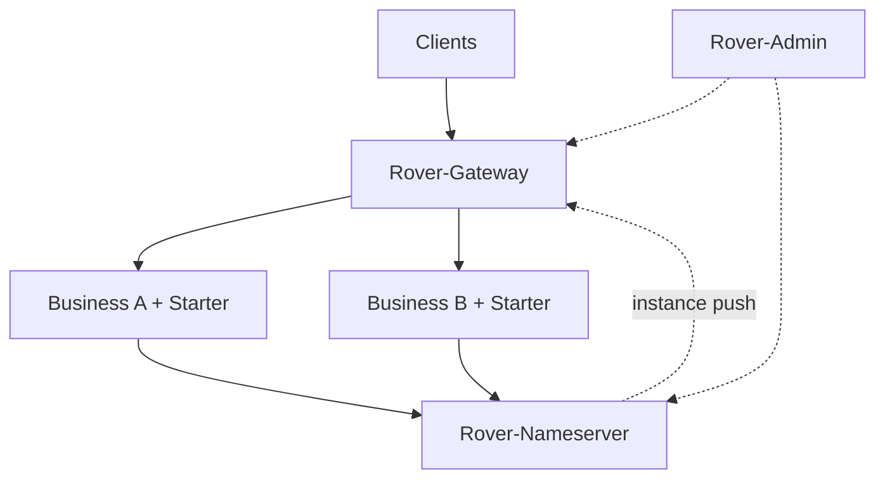
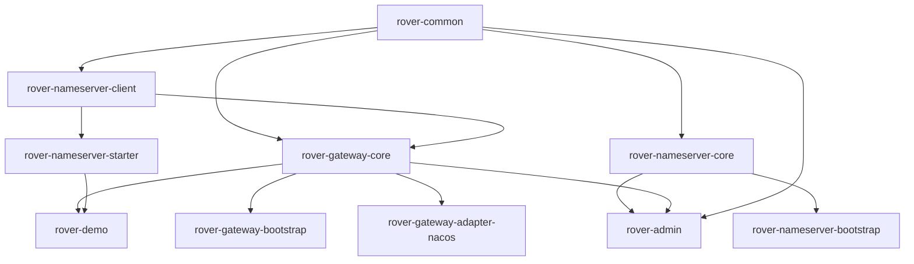

# Rover-Suite Architecture

> Companion to [README.zh-CN.md](../README.zh-CN.md) / [README.md](../README.md).  
> Public docs live in [`docs-public/`](./README.md).

---

## 1. Overview

```text
Clients
  → Rover-Gateway          (HTTP entry)
      → Business Services  (HTTP)
  ↔ Rover-Nameserver       (TCP registry / push)
  ↔ Rover-Admin            (optional runtime console)
```

| Component | Responsibility |
| :--- | :--- |
| Nameserver | Service registration, heartbeat, subscription push |
| Gateway | Routing, discovery, load balancing, reverse proxy, filters |
| Starter | Business-side registration and graceful shutdown |
| Admin | Runtime configuration console |

---

## 2. Deployment



| Process | Default port |
| :--- | :--- |
| Nameserver | `8888` |
| Gateway | configured in `rover-gateway.yml` |
| rover-demo | `8081` |
| Admin | `9090` |

---

## 3. Module dependency

`A → B` means **B depends on A**.



Conventions:

- `rover-common` holds shared contracts
- `*-core` holds business logic
- `*-server` / `*-bootstrap` are process entry points
- `rover-admin` is an optional console

---

## 4. Gateway request path

```text
HTTP request
  → Netty server
  → FilterChain
  → Route match
  → Upstream selection (static or discovery) + load balancing
  → Reverse proxy
  → Business service
```

Gateway keeps a local instance cache for discovery mode and continues serving from cache if the registry is temporarily unavailable.

---

## 5. Business registration path

```text
Spring Boot startup
  → Starter autoconfiguration
  → Connect to Nameserver
  → Register
  → Heartbeat
  → Deregister on shutdown
```

Configuration prefix: `rover.nameserver.*`

Nameserver registry notes:

- Each service has a monotonic `revision`. Register, unregister, and health flips all bump it and push a snapshot to subscribers.
- Ephemeral instances are removed after heartbeat expiry. Persistent instances are marked unhealthy (not deleted) and the change is pushed.
- Events on the same TCP connection are applied in publish order so disconnect cannot race ahead of register.

---

## 6. Extension points

| Extension | Purpose |
| :--- | :--- |
| Filter | Request pipeline customization |
| LoadBalancer | Upstream selection strategy |
| ServiceDiscovery | External registry integration |
