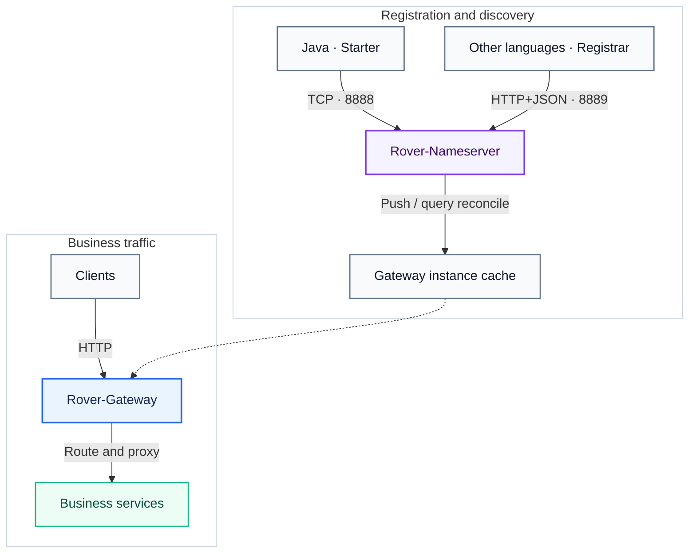
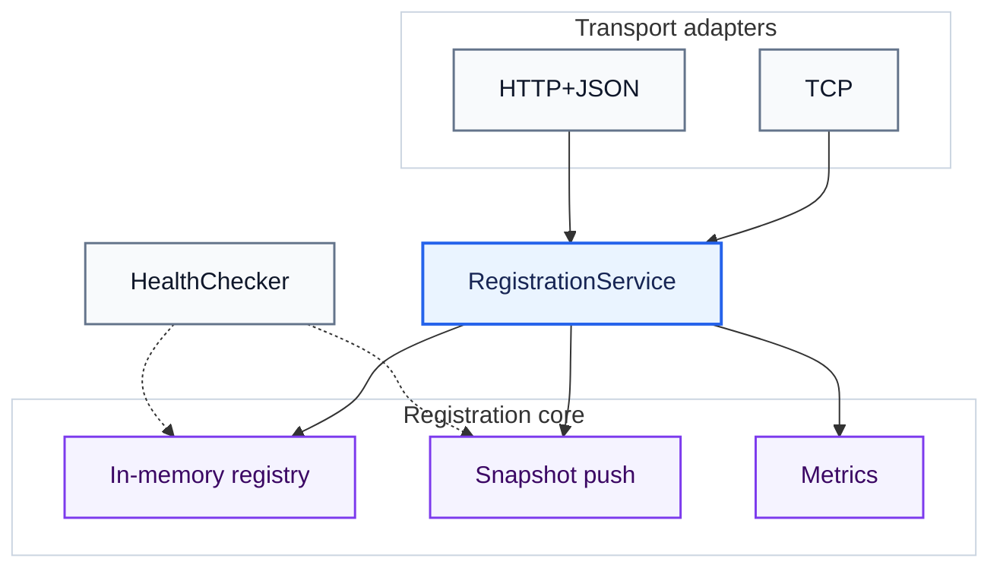
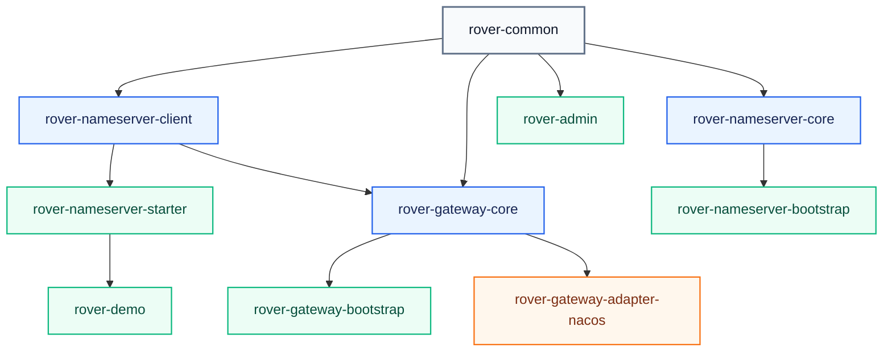

# Rover-Suite Architecture

[简体中文](./architecture.zh-CN.md) · [Documentation index](./README.md)

> Companion to [README.zh-CN.md](../README.zh-CN.md) / [README.md](../README.md).  
> See [Service Registration](./service-registration.md) for the HTTP contract and client lifecycle, and
> [Development Guide](./development-guide.md) for local build and extension workflows.

---

## 1. Overview

Rover-Suite separates the request data plane from the registration and discovery control plane:

```text
Clients
  → Rover-Gateway
      → Business Services

Business Services
  → Rover-Nameserver       (provider registration and lease renewal)

Rover-Nameserver
  → Rover-Gateway          (instance snapshot push)

Rover-Gateway
  → Rover-Nameserver       (initial query and periodic reconciliation)
```

| Component | Responsibility |
| :--- | :--- |
| Nameserver | In-memory service registration, lease expiry, query, subscription, and snapshot push |
| Gateway | Routing, local discovery cache, load balancing, reverse proxy, and filters |
| Java Client / Starter | TCP registration, heartbeat, reconnect, state replay, and Spring Boot lifecycle integration |
| HTTP Registrar | Minimal cross-language registration, heartbeat, retry, and best-effort deregistration |
| Admin | Optional runtime configuration console |

The Nameserver deliberately supports two provider-side transports while keeping one registration model:

- Java applications use the existing custom TCP client and Spring Boot Starter.
- Node.js, Python, Go, long-running PHP processes, and C++ applications can use the HTTP+JSON Registration API.

Both transports enter the same
[`RegistrationService`](../rover-nameserver-core/src/main/java/com/rover/nameserver/core/registration/RegistrationService.java)
and the same
[`InMemoryServiceRegistry`](../rover-nameserver-core/src/main/java/com/rover/nameserver/core/registry/InMemoryServiceRegistry.java).
Transport adapters do not maintain separate registration rules.

---

## 2. Deployment and ports



| Process or listener | Default port | Purpose |
| :--- | :--- | :--- |
| Nameserver TCP listener | `8888` | Java registration, query, subscribe, push, and protocol heartbeat |
| Nameserver HTTP listener | `8889` | `/_manage/**` and optional `/v1/client/**` Registration API |
| Gateway | configured in `rover-gateway.yml` | Public request entry |
| `rover-demo` | `8081` | Example business service |
| Admin | `9090` | Optional management console |

Ports `8888` and `8889` belong to the same Nameserver process. The HTTP Registration API does not add a
sidecar, daemon, separate server process, or separate deployment JAR. It is disabled by default and must be
enabled explicitly with `rover.nameserver.clientApiEnabled: true`. Rover does not force authentication; when a
deployment crosses a trust boundary, it can configure `rover.nameserver.token`, narrow the bind address, or add
outer network policy.

---

## 3. Provider registration plane

### 3.1 Java TCP path

```text
Spring Boot application ready
  → RoverNameserverLifecycle
  → NameserverClient
  → TCP REGISTER_REQUEST
  → RegisterListener
  → RegistrationService
  → InMemoryServiceRegistry
```

The Java client keeps a TCP connection, sends periodic heartbeats, reconnects at a fixed interval, and replays
its locally remembered registration after reconnection. Ephemeral registrations are bound to the owning TCP
channel, so a confirmed disconnect can remove them immediately; the lease expiry scan remains a fallback.

Relevant implementation:

- [`RoverNameserverLifecycle`](../rover-nameserver-starter/src/main/java/com/rover/nameserver/starter/autoconfigure/RoverNameserverLifecycle.java)
- [`NameserverClient`](../rover-nameserver-client/src/main/java/com/rover/nameserver/client/connection/NameserverClient.java)
- [`RegisterListener`](../rover-nameserver-core/src/main/java/com/rover/nameserver/core/event/listener/RegisterListener.java)
- [`ChannelInactiveListener`](../rover-nameserver-core/src/main/java/com/rover/nameserver/core/event/listener/ChannelInactiveListener.java)

Rover's current Java transport is a custom Netty TCP protocol with Protostuff serialization. It is not gRPC.

### 3.2 Cross-language HTTP path

```text
Business endpoint ready
  → HTTP Registrar
  → POST /v1/client/instances/register
  → POST /v1/client/instances/heartbeat on a fixed schedule
  → POST /v1/client/instances/unregister during graceful shutdown
  → NameserverClientApi
  → RegistrationService
  → InMemoryServiceRegistry
```

The HTTP API only covers the provider registration lifecycle. It does not expose query, subscription, local
caching, load balancing, or Gateway routing as a cross-language SDK.

HTTP registration uses a process-scoped UUID `sessionId` as logical ownership fencing because short HTTP
requests have no durable channel identity. The registry key remains `serviceName + instanceId`:

- Repeating the same registration with the same owner and unchanged public fields only renews the lease.
- Registering the same instance key with a new owner follows **last-register-wins** semantics and creates a new
  service revision.
- Heartbeat and deregistration from an older owner are rejected as `STALE_SESSION`.
- A new `sessionId` cannot determine which concurrent process is semantically newer. Concurrent replicas must
  therefore use unique `instanceId` values.

The default reference lifecycle is intentionally predictable: register immediately, retry transient failures
after a fixed 5-second delay, heartbeat every 5 seconds, and use a 3-second request timeout. It does not use
exponential backoff. HTTP instances normally rely on graceful deregistration or lease expiry because there is no
long-lived channel disconnect event.

Implementation and contract:

- [`NameserverClientApi`](../rover-nameserver-core/src/main/java/com/rover/nameserver/core/clientapi/NameserverClientApi.java)
- [OpenAPI v1 contract](../rover-nameserver-core/src/main/resources/openapi/rover-registration-v1.yaml)
- [Reference Registrars](../examples/http-registration/README.md)
- [Detailed registration guide](./service-registration.md)

### 3.3 One shared domain model



The shared domain layer owns registration, heartbeat, deregistration, ownership checks, revision changes,
metrics, and change notification. The registry performs the atomic compare-and-update operations. Pushes are
emitted only when consumer-visible state changes; an ordinary heartbeat does not create a new revision.

Within one Nameserver `epoch`, each service has its own monotonic `revision`. A new instance, deregistration,
owner takeover, public instance field update, expiry, or health-state transition increments that service revision.
A same-owner retry against an already healthy and otherwise unchanged record does not. A restart creates a new
epoch and revisions start again, so consumers compare `epoch` before `revision`.

---

## 4. Soft-state leases and in-memory recovery

Online instances are **soft state**, not durable business data:

- The registry exists only in process memory.
- The Nameserver does not persist instance snapshots to a database, WAL, or configuration overlay.
- Every Nameserver process start creates a new `epoch` and an empty online registry.
- Live clients re-register after reconnect, `INSTANCE_NOT_FOUND`, or their next recovery cycle.
- A historical address is never restored merely because it was previously registered.

This is a safety decision, not an unfinished persistence feature. A past Pod IP or process port does not prove
that an endpoint is still alive. A short empty-registry window after restart is safer than routing traffic to a
stale endpoint that no active client has reaffirmed.

The
[`HealthChecker`](../rover-nameserver-core/src/main/java/com/rover/nameserver/core/health/HealthChecker.java)
only scans `lastHeartbeatMillis` in memory. It does **not** connect to provider ports and does not call a provider
`/health` endpoint. By default, an HTTP ephemeral instance expires after 30 seconds without a successful renewal;
with the default 5-second scan interval, removal normally occurs roughly 30–35 seconds after the last successful
heartbeat.

Runtime configuration overlays and logs may be written to disk independently, while the lightweight metrics stay
in memory. None of them is used to reconstruct the online registry.

---

## 5. Discovery plane: push plus pull reconciliation

Rover is not a pure pull system and not a push-only system. It uses a hybrid discovery flow:

```text
Gateway startup
  → subscribe over TCP
  → query the current full snapshot

Registry change
  → Nameserver pushes a full snapshot with epoch + revision
  → Gateway updates its local cache

Periodic reconciliation or rejected push
  → Gateway queries the current snapshot again
  → service state is reconciled with the Nameserver
```

The three directions should not be conflated:

| Direction | Mechanism | Semantics |
| :--- | :--- | :--- |
| Provider → Nameserver | TCP heartbeat or HTTP periodic renewal | Client-driven reporting / lease renewal |
| Nameserver → Gateway | TCP snapshot notification | Server push |
| Gateway → Nameserver | Initial query and periodic reconciliation | Client pull |

HTTP Registration is therefore not strictly a “pull mode”: the provider actively reports its own lease. The true
pull path is Gateway reconciliation. Push is the low-latency notification path; query is the repair path for
startup, reconnect, a missed or rejected push, and epoch/revision reconciliation.

This is not a strong real-time consistency guarantee. Two current boundaries are explicit: Gateway protects the
empty snapshot produced by the last instance and clears it at the next periodic reconciliation, while a failed
initial subscription when Nameserver is unavailable may also recover only at that reconciliation. With the default
`reconcileIntervalMs=30000`, either window can last roughly 30 seconds.

`group` is a query/subscription filter rather than part of the instance identity. Multi-group snapshot isolation is
still being finalized; the recommended current mode is an empty group.

Relevant implementation:

- [`PushService`](../rover-nameserver-core/src/main/java/com/rover/nameserver/core/push/PushService.java)
- [`InstanceCache`](../rover-nameserver-client/src/main/java/com/rover/nameserver/client/cache/InstanceCache.java)
- [`NameserverServiceDiscovery`](../rover-gateway-core/src/main/java/com/rover/gateway/core/discovery/NameserverServiceDiscovery.java)

Gateway continues serving from its local instance cache during a temporary Nameserver outage. Periodic query
reconciliation repairs the cache after connectivity returns. If the outage happens before Gateway's first
subscription, recovery may wait until the next reconciliation.

---

## 6. Lightweight trade-offs

The HTTP path is optimized for a small team that needs provider registration across several languages without
maintaining a complete discovery SDK in every ecosystem.

| Decision | Benefit | Accepted cost |
| :--- | :--- | :--- |
| Standard HTTP+JSON for non-Java providers | Easy to inspect with ordinary tools; minimal language-specific code | More header and JSON parsing overhead than a compact binary heartbeat |
| Small copyable Registrar instead of a full SDK | No package publishing matrix or cross-language discovery cache to maintain | Non-Java callers receive registration only |
| Reuse the existing Nameserver HTTP listener | No sidecar, agent, daemon, or extra deployment artifact | Registration and management APIs share port `8889`; their token domains are separate but may both be left empty |
| All-interface listeners and empty tokens by default | Zero-config startup on a local or trusted network | The deployer adds bind restrictions, tokens, ACLs, VPN, or TLS when needed |
| Fixed retry interval | Predictable recovery behavior and simple state machines | Very large synchronized fleets may create a recovery spike; current references deliberately keep fixed behavior |
| HTTP lease expiry | No active probe configuration or server-side probe fan-out | Abnormal HTTP instance removal is slower than a confirmed TCP disconnect |
| Pure in-memory online state | No stale endpoint restoration and no storage dependency | Clients must re-register after a Nameserver restart |

“Lightweight” here refers to deployment, dependencies, maintenance surface, and ease of modification. It does not
claim that HTTP uses fewer bytes or detects failures faster than a long-lived binary connection. A gRPC or custom
streaming transport remains a valid future adapter if measured scale or latency requirements justify its ongoing
cross-language maintenance cost.

---

## 7. Explicit non-goals

The current Registration API intentionally does not provide:

- Nameserver-initiated TCP or HTTP health probes against business endpoints.
- Persistence or restoration of historical online instances.
- An Agent, sidecar, or separate registration proxy.
- Query, subscribe, push-cache, load-balancing, or routing APIs for non-Java providers.
- A complete gRPC/Protobuf SDK matrix for every language.
- Embedded TLS termination or a tenant-aware governance platform in the registration core.

Keep TCP on a trusted network/VPN/TLS tunnel, and use a reverse proxy for HTTP HTTPS termination and perimeter
controls. If non-Java consumers later require
full discovery, or if HTTP heartbeat cost and expiry latency become measured bottlenecks, a new transport adapter
can be added without replacing `RegistrationService` or the registry semantics.

---

## 8. Gateway request path

```text
HTTP request
  → Netty server
  → FilterChain
  → Route match
  → Upstream selection from static configuration or the discovery cache
  → LoadBalancer
  → Reverse proxy
  → Business service
```

Discovery is outside the hot request path: request routing reads the Gateway's local cache rather than querying
the Nameserver synchronously for every request.

The current proxy path aggregates complete request and response bodies. The default request-body limit is 1 MiB,
and the hard response-body limit is 16 MiB. It targets ordinary HTTP APIs and does not provide WebSocket, SSE, or
general streaming proxying. If every persistent discovered instance is unhealthy, Gateway falls back to the full
cached set and keeps trying, which is an availability-first fail-open policy. A static upstream URL contributes only
its scheme, host, and port; use route options such as `stripPrefix` for path rewriting instead of relying on a base
path in the upstream URL.

---

## 9. Module dependency

`A → B` means **B depends on A**.



Conventions:

- `rover-common` holds shared contracts and protocol primitives.
- `*-core` modules hold business logic.
- `*-bootstrap` modules are process entry points.
- `rover-admin` is an optional console that calls management APIs over HTTP; it does not compile against the
  Nameserver or Gateway core modules.
- `rover-gateway-adapter-nacos` is currently a reserved skeleton, not a working runtime adapter.
- Cross-language Registrar examples live under [`examples/http-registration/`](../examples/http-registration/README.md).

---

## 10. Extension points

| Extension | Purpose |
| :--- | :--- |
| Filter plugin JAR | Request pipeline customization; loaded when the chain is assembled |
| LoadBalancer plugin JAR | Upstream selection strategy; loaded when a strategy is created/switched |
| ServiceDiscovery source adapter | External registry integration; not a drop-in plugin today |
| Registration transport source adapter | Add another wire protocol while retaining `RegistrationService` semantics |

There is no continuous plugin-directory watcher. Rebuilding the relevant runtime object or restarting Gateway is
required before a replaced JAR is used predictably.

For extension boundaries and validation commands, see the [Development Guide](./development-guide.md).
