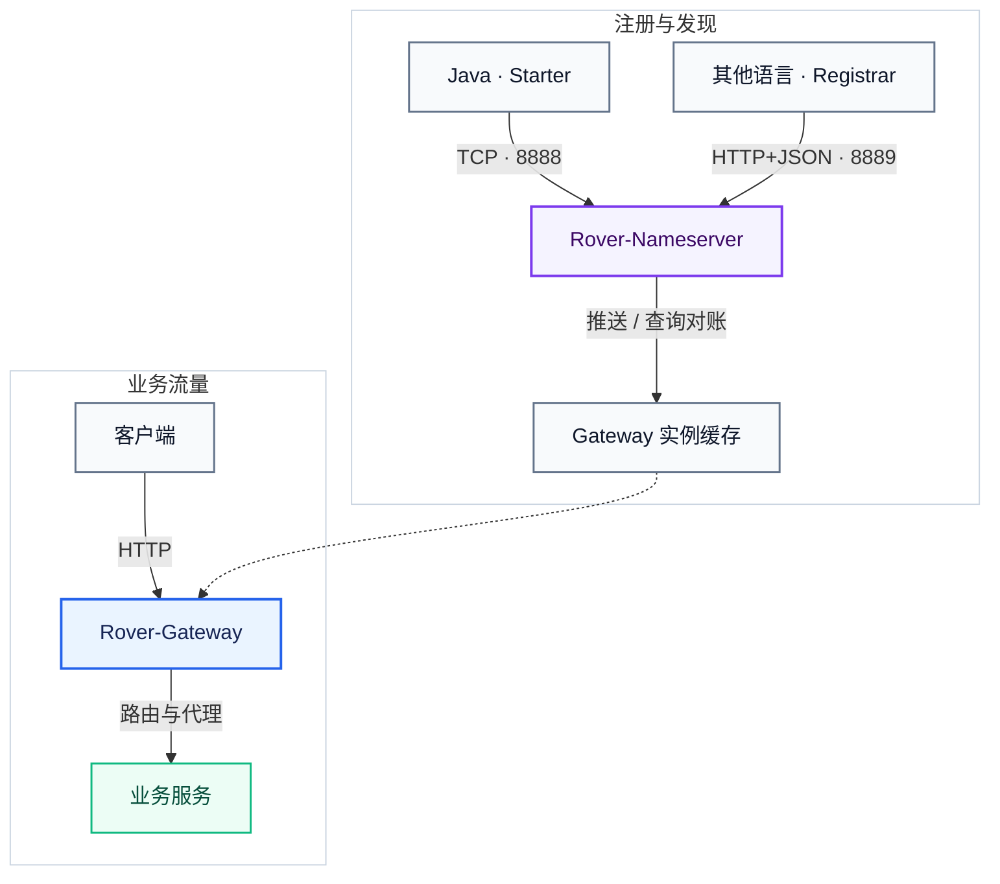
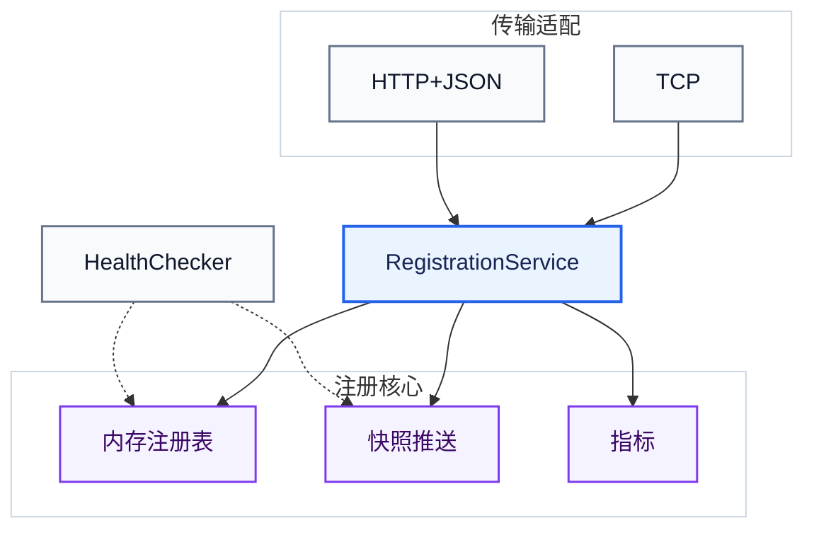
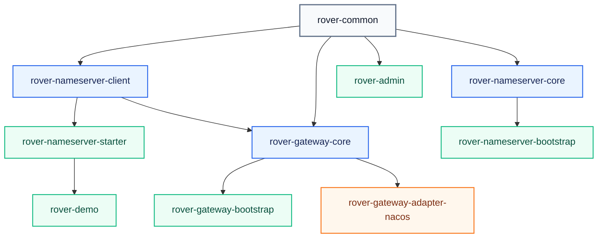

# Rover-Suite 架构

[English](./architecture.md) · [公开文档索引](./README.md)

> 本文与 [中文 README](../README.zh-CN.md) / [English README](../README.md) 配套阅读。  
> HTTP 契约与客户端生命周期见[服务注册指南](./service-registration.zh-CN.md)，本地构建与扩展流程见
> [二次开发指南](./development-guide.zh-CN.md)。

---

## 1. 概览

Rover-Suite 将请求数据面与注册发现控制面分开：

```text
客户端
  → Rover-Gateway
      → 业务服务

业务服务
  → Rover-Nameserver       （服务提供方注册与租约续约）

Rover-Nameserver
  → Rover-Gateway          （实例快照推送）

Rover-Gateway
  → Rover-Nameserver       （首次查询与周期对账）
```

| 组件 | 职责 |
| :--- | :--- |
| Nameserver | 纯内存服务注册、租约过期、查询、订阅与实例快照推送 |
| Gateway | 路由、本地发现缓存、负载均衡、反向代理与 Filter |
| Java Client / Starter | TCP 注册、心跳、重连、状态重放与 Spring Boot 生命周期集成 |
| HTTP Registrar | 最小化的跨语言注册、心跳、重试与尽力注销 |
| Admin | 可选管理台：仪表盘可见时 1 秒拉 live 快照，切走/后台停轮询；不进转发热路径 |

Nameserver 有意保留两种服务提供方传输方式，但只维护一套注册模型：

- Java 应用使用现有自定义 TCP Client 与 Spring Boot Starter。
- Node.js、Python、Go、长驻 PHP 进程与 C++ 应用使用 HTTP+JSON Registration API。

两种传输最终都进入同一个
[`RegistrationService`](../rover-nameserver-core/src/main/java/com/rover/nameserver/core/registration/RegistrationService.java)
和同一个
[`InMemoryServiceRegistry`](../rover-nameserver-core/src/main/java/com/rover/nameserver/core/registry/InMemoryServiceRegistry.java)。
传输适配层不各自维护注册规则。

---

## 2. 部署与端口



| 进程或监听器 | 默认端口 | 用途 |
| :--- | :--- | :--- |
| Nameserver TCP 监听器 | `8888` | Java 注册、查询、订阅、推送与协议心跳 |
| Nameserver HTTP 监听器 | `8889` | `/_manage/**` 与可选的 `/v1/client/**` Registration API |
| Gateway | 在 `rover-gateway.yml` 中配置 | 对外请求入口 |
| `rover-demo` | `8081` | 示例业务服务 |
| Admin | `9090` | 可选管理台 |

`8888` 与 `8889` 属于同一个 Nameserver 进程。HTTP Registration API 不会增加 Sidecar、Agent、守护进程、
独立 Server 进程或额外部署 JAR。该 API 默认关闭，需要显式配置
`rover.nameserver.clientApiEnabled: true`。Rover 不强制开启鉴权；部署跨越信任边界时，可以配置非空的
`rover.nameserver.token`、收紧监听地址或增加外层网络策略。

---

## 3. 服务提供方注册面

### 3.1 Java TCP 链路

```text
Spring Boot 应用 ready
  → RoverNameserverLifecycle
  → NameserverClient
  → TCP REGISTER_REQUEST
  → RegisterListener
  → RegistrationService
  → InMemoryServiceRegistry
```

Java Client 保持 TCP 长连接，周期发送心跳，按固定间隔重连，并在重连后重放本地记忆的注册信息。
临时实例注册与所属 TCP Channel 绑定，因此在确认连接断开时可以立即摘除；租约过期扫描仍作为兜底。

相关实现：

- [`RoverNameserverLifecycle`](../rover-nameserver-starter/src/main/java/com/rover/nameserver/starter/autoconfigure/RoverNameserverLifecycle.java)
- [`NameserverClient`](../rover-nameserver-client/src/main/java/com/rover/nameserver/client/connection/NameserverClient.java)
- [`RegisterListener`](../rover-nameserver-core/src/main/java/com/rover/nameserver/core/event/listener/RegisterListener.java)
- [`ChannelInactiveListener`](../rover-nameserver-core/src/main/java/com/rover/nameserver/core/event/listener/ChannelInactiveListener.java)

Rover 当前的 Java 传输是基于 Netty 与 Protostuff 序列化的自定义 TCP 协议，不是 gRPC。

### 3.2 跨语言 HTTP 链路

```text
业务端点 ready
  → HTTP Registrar
  → POST /v1/client/instances/register
  → 按固定周期 POST /v1/client/instances/heartbeat
  → 优雅退出时 POST /v1/client/instances/unregister
  → NameserverClientApi
  → RegistrationService
  → InMemoryServiceRegistry
```

HTTP API 只覆盖服务提供方注册生命周期，不会把查询、订阅、本地缓存、负载均衡或 Gateway 路由包装成跨语言 SDK。

短 HTTP 请求没有持久 Channel 身份，因此 HTTP 注册使用进程级 UUID `sessionId` 作为逻辑所有权围栏。
注册表键仍是 `serviceName + instanceId`：

- 同一 owner 使用相同公开字段重复注册时，只续约租约。
- 新 owner 注册相同实例键时，按 **last-register-wins** 语义接管，并产生新的服务 revision。
- 旧 owner 的心跳与注销会被拒绝并返回 `STALE_SESSION`。
- 新 `sessionId` 无法判断两个并发进程在业务语义上谁更新，因此并发副本必须使用不同的 `instanceId`。

默认参考生命周期有意保持可预测：启动后立即注册，暂态失败后固定等待 5 秒重试，每 5 秒心跳一次，
单次请求超时 3 秒，不使用指数退避。HTTP 实例没有长连接断开事件，通常依赖优雅注销或租约过期完成摘除。

实现与契约：

- [`NameserverClientApi`](../rover-nameserver-core/src/main/java/com/rover/nameserver/core/clientapi/NameserverClientApi.java)
- [OpenAPI v1 契约](../rover-nameserver-core/src/main/resources/openapi/rover-registration-v1.yaml)
- [Registrar 参考实现](../examples/http-registration/README.md)
- [服务注册详细指南](./service-registration.zh-CN.md)

### 3.3 共享领域模型



共享领域层统一负责注册、心跳、注销、owner 检查、revision 变化、指标与变更通知；注册表负责原子的比较与更新。
只有消费方可见状态发生变化时才会推送，普通心跳不会产生新的 revision。

在同一个 Nameserver `epoch` 内，每个服务分别拥有单调递增的 `revision`。新增实例、注销、owner 接管、
公开实例字段更新、过期或健康状态变化都会增加对应服务的 revision；同 owner 对已经健康且其他字段未变化的记录重试注册则不会。
Nameserver 重启会产生新 epoch，revision 也会重新开始，因此消费方必须先比较 `epoch`，再比较 `revision`。

---

## 4. 软状态租约与纯内存恢复

在线实例是**软状态**，不是需要持久化的业务数据：

- 注册表只存在于进程内存中。
- Nameserver 不会将实例快照持久化到数据库、WAL 或配置 overlay。
- 每次 Nameserver 进程启动都会生成新的 `epoch` 和空的在线注册表。
- 仍存活的客户端会在重连、收到 `INSTANCE_NOT_FOUND` 或下一次恢复周期重新注册。
- 某个历史地址不会仅仅因为以前注册过就被恢复。

这是安全取舍，不是尚未完成的持久化功能。过去的 Pod IP 或进程端口不能证明端点现在仍然存活。
Nameserver 重启后的短暂空注册表窗口，比把流量发给尚未被任何活跃客户端重新确认的陈旧端点更安全。

[`HealthChecker`](../rover-nameserver-core/src/main/java/com/rover/nameserver/core/health/HealthChecker.java)
只扫描内存中的 `lastHeartbeatMillis`，**不会**连接服务提供方端口，也不会调用其 `/health` 接口。
默认情况下，HTTP 临时实例在 30 秒未成功续约后过期；加上默认 5 秒扫描周期，通常会在最后一次成功心跳后的约
30～35 秒内被摘除。

运行时配置 overlay 与日志可以独立写入磁盘，轻量指标则保存在内存中；这些数据都不会用于重建在线注册表。

---

## 5. 发现面：推送加拉取对账

Rover 既不是纯 pull 系统，也不是只依赖 push 的系统，而是使用混合发现链路：

```text
Gateway 启动
  → 通过 TCP 订阅
  → 查询当前完整快照

注册表变化
  → Nameserver 推送带 epoch + revision 的完整快照
  → Gateway 更新本地缓存

周期对账或推送被拒绝
  → Gateway 再次查询当前快照
  → 按 Nameserver 当前状态对账服务实例
```

以下三个方向不能混为一谈：

| 方向 | 机制 | 语义 |
| :--- | :--- | :--- |
| 服务提供方 → Nameserver | TCP 心跳或 HTTP 周期续约 | 客户端主动周期上报 / 租约续约 |
| Nameserver → Gateway | TCP 实例快照通知 | 服务端 push |
| Gateway → Nameserver | 首次查询与周期对账 | 客户端 pull |

因此，HTTP Registration 并不是严格意义上的“拉模式”：服务提供方主动周期上报自身租约。
真正的 pull 链路是 Gateway 查询与对账。Push 是低延迟通知路径；query 是修复路径，用于启动、重连、
推送丢失或被拒绝，以及 `epoch` / `revision` 对账。

这不是强实时一致性承诺。当前实现有两个明确边界：最后一个实例产生的空快照会先被 Gateway 的推空保护拒绝，
最迟到下一次周期对账才清空；Gateway 启动时如果 Nameserver 不可用，首次订阅失败也可能到下一次对账才恢复。
默认 `reconcileIntervalMs=30000`，因此两类窗口最长约 30 秒。

`group` 是查询与订阅过滤条件，不属于实例唯一键。当前多组快照推送隔离仍在收口，默认空 group 是推荐使用方式。

相关实现：

- [`PushService`](../rover-nameserver-core/src/main/java/com/rover/nameserver/core/push/PushService.java)
- [`InstanceCache`](../rover-nameserver-client/src/main/java/com/rover/nameserver/client/cache/InstanceCache.java)
- [`NameserverServiceDiscovery`](../rover-gateway-core/src/main/java/com/rover/gateway/core/discovery/NameserverServiceDiscovery.java)

Nameserver 短暂不可用时，Gateway 会继续使用本地实例缓存提供请求服务；连接恢复后，周期 query/reconcile 会修复缓存。
如果不可用发生在 Gateway 第一次订阅之前，恢复可能等到下一次对账。

---

## 6. 轻量化取舍

HTTP 链路面向这样的场景优化：小团队需要支持多种服务提供方语言，但没有精力在每个语言生态中维护完整的发现 SDK。

| 决策 | 收益 | 接受的代价 |
| :--- | :--- | :--- |
| 非 Java 服务提供方使用标准 HTTP+JSON | 普通工具即可检查；每种语言只需少量代码 | 相比紧凑二进制心跳，有更多 Header 与 JSON 解析开销 |
| 使用可复制的小型 Registrar，而不是完整 SDK | 无需维护多语言包发布矩阵与多套发现缓存 | 非 Java 调用方只获得注册能力 |
| 复用现有 Nameserver HTTP 监听器 | 无需 Sidecar、Agent、守护进程或额外部署构件 | Registration API 与管理 API 共用 `8889`；两套 token 域独立但默认均可留空 |
| 默认全网卡监听、空 token | 本地或可信网络零配置启动 | 安全边界由部署方按需通过 bind、token、ACL、VPN/TLS 建立 |
| 固定重试间隔 | 恢复行为可预测，状态机简单 | 超大规模实例同时恢复时可能产生尖峰；当前参考有意保持固定策略 |
| HTTP 租约过期 | 无需主动探活配置，也没有服务端探测扇出 | HTTP 异常退出的摘除速度慢于确认 TCP 断连 |
| 纯内存在线状态 | 不恢复陈旧端点，也不依赖存储组件 | Nameserver 重启后客户端必须重新注册 |

这里的“轻量”指部署依赖、维护面、修改难度与整体复杂度，并不表示 HTTP 比长连接二进制协议传输字节更少或故障发现更快。
如果经过实际测量后，规模或延迟要求足以覆盖持续的跨语言维护成本，未来仍可以增加 gRPC 或自定义流式传输适配层。

---

## 7. 明确非目标

当前 Registration API 有意不提供：

- Nameserver 主动向业务端点发起 TCP 或 HTTP 健康探测。
- 持久化或恢复历史在线实例。
- Agent、Sidecar 或独立注册代理。
- 面向非 Java 服务提供方的查询、订阅、推送缓存、负载均衡或路由 API。
- 每种语言一套完整的 gRPC/Protobuf SDK。
- 注册核心内置 TLS 终止或多租户治理平台。

TCP 应放在可信网络/VPN/TLS 隧道中，HTTP 的 HTTPS 终止与边界访问控制由反向代理承担。
如果以后非 Java 消费方确实需要完整发现，或者实测证明
HTTP 心跳成本与过期延迟成为瓶颈，可以增加新的传输适配层，而无需替换 `RegistrationService` 或注册表语义。

---

## 8. Gateway 请求链路

```text
HTTP 请求
  → Netty Server
  → FilterChain
  → 路由匹配
  → 从静态配置或发现缓存选择上游
  → LoadBalancer
  → 反向代理
  → 业务服务
```

服务发现不在请求热路径上：请求路由读取 Gateway 本地缓存，不会为每个请求同步查询 Nameserver。

当前代理链路聚合完整请求体和响应体，默认请求体上限为 1 MiB，响应体硬上限为 16 MiB；它面向普通 HTTP API，
不提供 WebSocket、SSE 或通用流式代理。动态发现中，如果持久实例全部被标记为不健康，Gateway 会回退到缓存中的
全部实例继续尝试，属于可用性优先的 fail-open 策略。静态上游 URL 只使用 scheme、host 与 port，路径改写应通过
路由的 `stripPrefix` 等配置完成，而不是依赖上游 URL 的基路径。

---

## 9. 模块依赖

`A → B` 表示 **B 依赖 A**。



约定：

- `rover-common` 保存共享契约与协议原语。
- `*-core` 模块保存业务逻辑。
- `*-bootstrap` 模块是进程入口。
- `rover-admin` 是通过 HTTP 调用管理 API 的可选控制台，编译时不依赖 Nameserver 或 Gateway core 模块。
- `rover-gateway-adapter-nacos` 当前只是预留骨架，还不是可运行适配器。
- 跨语言 Registrar 示例位于 [`examples/http-registration/`](../examples/http-registration/README.md)。

---

## 10. 扩展点

| 扩展 | 用途 |
| :--- | :--- |
| Filter 插件 JAR | 自定义请求流水线；组装 FilterChain 时加载 |
| LoadBalancer 插件 JAR | 自定义上游选择策略；创建或切换策略时加载 |
| ServiceDiscovery 源码适配层 | 接入外部注册中心；当前不是即插即用插件 |
| Registration 传输源码适配层 | 增加新的线协议，同时保留 `RegistrationService` 语义 |

当前没有持续监听插件目录的 watcher。要让替换后的 JAR 可预测地生效，需要重建相关运行时对象或重启 Gateway。

二开边界与验证命令见[二次开发指南](./development-guide.zh-CN.md)。
