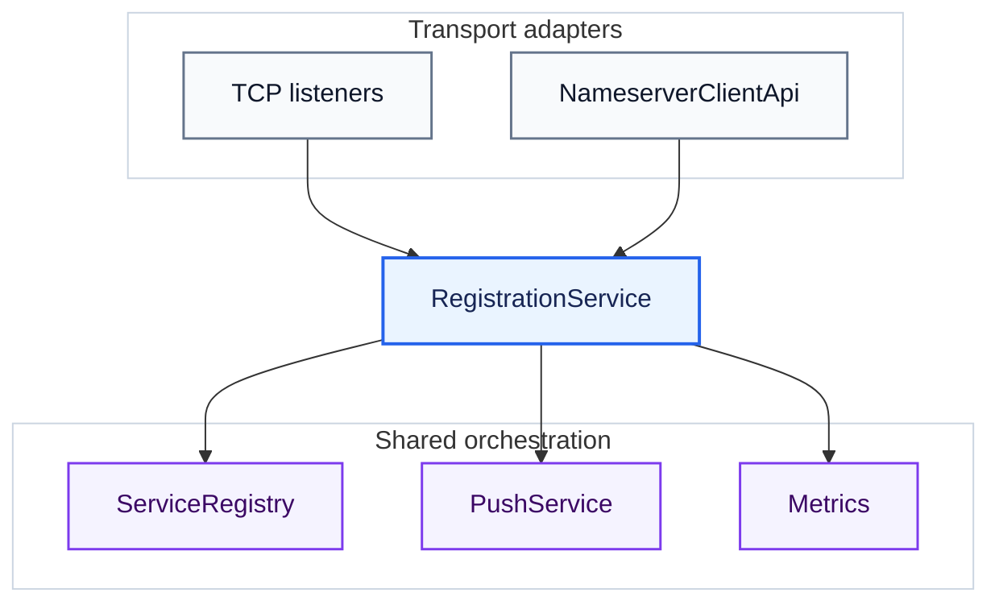

# Development Guide

[简体中文](./development-guide.zh-CN.md) · [Documentation index](./README.md)

This guide is for project maintainers and teams maintaining a private fork. Rover-Suite favors explicit Java
extension points and a small deployment surface; choose the narrowest extension that solves the problem. The public
repository accepts feedback through Issues only and does not accept external pull requests.

## 1. Local development

Requirements:

- JDK 17+
- Maven 3.6+
- Optional language runtimes only when changing the corresponding HTTP Registrar example

Build and run all Java tests:

```bash
mvn clean verify
```

Focused test commands:

```bash
mvn -pl rover-nameserver-core -am test
mvn -pl rover-nameserver-client -am test
mvn -pl rover-gateway-core -am test
```

Install snapshot artifacts for another local project:

```bash
mvn clean install -DskipTests
```

See [Quick Start](./quick-start.md) for the runnable end-to-end path.

## 2. Module map

| Module | Responsibility |
| :--- | :--- |
| [`rover-common`](../rover-common/) | Shared models, protocol primitives, JSON/config utilities, and public SPI contracts |
| [`rover-nameserver-core`](../rover-nameserver-core/) | Registry, ownership, health expiry, push, TCP listeners, HTTP/management adapters |
| [`rover-nameserver-bootstrap`](../rover-nameserver-bootstrap/) | Nameserver YAML mapping and executable assembly |
| [`rover-nameserver-client`](../rover-nameserver-client/) | Java TCP client, reconnect/recovery, cache, query, subscription |
| [`rover-nameserver-starter`](../rover-nameserver-starter/) | Spring Boot auto-configuration and provider lifecycle |
| [`rover-gateway-core`](../rover-gateway-core/) | Netty server, routes, filters, proxy, discovery, load balancing, runtime state |
| [`rover-gateway-bootstrap`](../rover-gateway-bootstrap/) | Gateway YAML mapping and executable assembly |
| [`rover-admin`](../rover-admin/) | Optional UI/server that calls management APIs over HTTP; it does not depend on either core module |
| [`rover-gateway-adapter-nacos`](../rover-gateway-adapter-nacos/) | Reserved module skeleton; it is not a working Nacos adapter yet |
| [`rover-gateway-test/demo/backend`](../rover-gateway-test/demo/backend/) | Spring Boot Starter integration example |

The [Architecture](./architecture.md) describes runtime flows and dependency direction.

## 3. Choose an extension route

| Need | Preferred extension |
| :--- | :--- |
| Add another provider language | Implement the HTTP Registrar state machine from the OpenAPI contract; no server change |
| Inspect, enrich, reject, or short-circuit Gateway requests | `Filter` plugin JAR |
| Add an upstream selection algorithm | `LoadBalancer` plugin JAR |
| Integrate another service registry | Source-level `ServiceDiscovery` adapter and Gateway wiring |
| Add another provider transport | Source adapter that calls `RegistrationService` |
| Change lease storage, revision, or ownership semantics | Core fork with concurrency and compatibility tests |
| Add a runtime-updatable setting | Runtime key + manager + applier + thread-safe runtime change |

Filter and LoadBalancer support ServiceLoader JARs. ServiceDiscovery currently exposes a source contract but is
not loaded from `plugins/`; do not describe all three as drop-in plugins.

## 4. Filter plugin

Implement [`Filter`](../rover-common/src/main/java/com/rover/common/spi/filter/Filter.java):

```java
package example.rover;

import com.rover.common.spi.filter.Filter;
import com.rover.common.spi.filter.FilterChain;
import com.rover.common.spi.filter.RequestContext;
import java.util.concurrent.CompletableFuture;

public final class TenantContextFilter implements Filter {
    @Override
    public int getOrder() {
        return -100;
    }

    @Override
    public CompletableFuture<Void> doFilter(RequestContext context, FilterChain chain) {
        context.setAttribute("tenant", "default");
        return chain.doFilter(context);
    }
}
```

Add this service descriptor to the plugin JAR:

```text
META-INF/services/com.rover.common.spi.filter.Filter
```

Its content is the implementation class name:

```text
example.rover.TenantContextFilter
```

Put the JAR in the configured `filters.pluginDir` (default `plugins`) or list a public no-argument class in
`filters.classes`. Lower `getOrder()` values run earlier. Return the `CompletableFuture`; do not block a Netty
thread. Keep plugin instances thread-safe and preferably stateless.

`RequestContext` can pass attributes and continue the chain. Writing a short-circuit response currently requires
casting to
[`GatewayRequestContext`](../rover-gateway-core/src/main/java/com/rover/gateway/core/filter/GatewayRequestContext.java)
and calling `writeText`, which couples that plugin to `rover-gateway-core`. Use `provided` scope for host APIs and
match the host version.

There is no plugin-directory watcher. Filter JARs are scanned when the filter chain is assembled/reassembled;
restarting Gateway is the predictable deployment path after replacing a JAR. Relevant loader:
[`GatewayFilterAssembler`](../rover-gateway-core/src/main/java/com/rover/gateway/core/filter/GatewayFilterAssembler.java).

## 5. LoadBalancer plugin

Implement [`LoadBalancer`](../rover-common/src/main/java/com/rover/common/spi/loadbalance/LoadBalancer.java):

```java
package example.rover;

import com.rover.common.model.ServiceInstance;
import com.rover.common.spi.loadbalance.LoadBalanceContext;
import com.rover.common.spi.loadbalance.LoadBalancer;

public final class FirstAvailableLoadBalancer implements LoadBalancer {
    @Override
    public String name() {
        return "first_available";
    }

    @Override
    public ServiceInstance choose(LoadBalanceContext context) {
        return context.hasInstances() ? context.getInstances().get(0) : null;
    }
}
```

Register it in:

```text
META-INF/services/com.rover.common.spi.loadbalance.LoadBalancer
```

Set:

```yaml
rover:
  gateway:
    filters:
      pluginDir: plugins
    loadbalance:
      strategy: first_available
```

The strategy may also be a fully qualified implementation class. `choose` is called concurrently: do not mutate
the candidate list and make internal state thread-safe. Implement `onStart`/`onComplete` only when the algorithm
tracks active requests. There is no close callback for plugin instances.

Plugin JARs are scanned when a strategy is created/switched, not continuously watched. See
[`LoadBalancerFactory`](../rover-gateway-core/src/main/java/com/rover/gateway/core/loadbalance/LoadBalancerFactory.java).

## 6. Registration extensions

### Add a language reference

Use the [OpenAPI v1 contract](../rover-nameserver-core/src/main/resources/openapi/rover-registration-v1.yaml)
and preserve the lifecycle documented in [Service Registration](./service-registration.md#33-lifecycle-behavior).
A new reference should include:

- A single small implementation with minimal ecosystem dependencies.
- Register-after-ready and close-before-exit integration examples.
- Fixed-delay retry/heartbeat, a bounded request timeout, and one in-flight request.
- Exact handling for `INSTANCE_NOT_FOUND`, `STALE_SESSION`, authentication, and transient errors.
- Local fake-server tests for state transitions, retry timing, request serialization, and shutdown.
- Multi-worker/runtime limitations in its README.

Do not add a new Nameserver endpoint for each language.

### Add a provider transport

Both current transports converge on
[`RegistrationService`](../rover-nameserver-core/src/main/java/com/rover/nameserver/core/registration/RegistrationService.java):



A new adapter should only handle wire decoding, authentication, DTO validation, owner construction, and status
mapping. It must call `RegistrationService`; writing directly to
[`ServiceRegistry`](../rover-nameserver-core/src/main/java/com/rover/nameserver/core/registry/ServiceRegistry.java)
would bypass the shared push/metrics orchestration and make it easy for an adapter to apply registry results
incorrectly. Atomic idempotency, revision, and ownership checks themselves live in the registry implementation.

Use [`RegistrationOwner`](../rover-nameserver-core/src/main/java/com/rover/nameserver/core/registration/RegistrationOwner.java)
for transport/session ownership and map
[`RegistrationResult`](../rover-nameserver-core/src/main/java/com/rover/nameserver/core/registration/RegistrationResult.java)
without weakening conditional heartbeat/deregistration. The HTTP route separation between `/v1/client/**` and
`/_manage/**` is implemented in
[`NameserverHttpApiHandler`](../rover-nameserver-core/src/main/java/com/rover/nameserver/core/manage/NameserverHttpApiHandler.java).

Preserve these invariants:

- Registry updates and owner checks are atomic.
- Same-owner unchanged registration is idempotent and does not emit a duplicate snapshot.
- Consumer-visible changes increment the service revision and publish once.
- Old owners, disconnect callbacks, and stale expiry scans cannot delete a newer owner.
- Online instances remain in-memory soft state unless an explicit architecture change is accepted.

These are target invariants for an extension; they do not imply that every discovery edge case is already closed.
See the [User Guide](./user-guide.md#9-current-runtime-boundaries) for the current last-instance empty-snapshot and
multi-`group` push boundaries. Changes to registry snapshots, push, or the Gateway cache must cover all of these:

- An exact-group subscription receives only that group's instances, while a wildcard subscription receives the full service snapshot.
- Within one epoch, a legitimate higher-revision empty snapshot can remove the final instance and cannot be rolled back by an older empty snapshot.
- Query/reconciliation restores current Nameserver state after a push is lost or rejected, or an initial subscription fails.

## 7. ServiceDiscovery adapter

[`ServiceDiscovery`](../rover-common/src/main/java/com/rover/common/spi/discovery/ServiceDiscovery.java) defines
`start`, `getInstances`, `ensureWatch`, and `close`. Keep remote watches/reconciliation in the background and make
`getInstances` a fast local-cache read because it participates in the request path.

This interface is not currently a drop-in plugin. Adding a registry requires source changes at least in:

1. [`DiscoveryType`](../rover-gateway-core/src/main/java/com/rover/gateway/core/discovery/DiscoveryType.java) and the configuration mapping.
2. [`GatewayHttpServer#createServiceDiscovery`](../rover-gateway-core/src/main/java/com/rover/gateway/core/server/GatewayHttpServer.java) or a new dedicated factory.
3. Lifecycle, cache, reconnect/watch, and reconciliation tests.
4. User and deployment documentation.

`NACOS` and `REDIS` enum values are reserved. The current `rover-gateway-adapter-nacos` module is a skeleton, not
a working adapter. Do not advertise it as supported until its runtime wiring and tests exist.

## 8. Runtime configuration extension

Startup configuration follows `./config/*.yml > classpath YAML > code defaults`. Runtime overlays support only
registered keys. Current hot-update areas are intentionally limited:

- Gateway: load-balancing strategy, proxy request timeout, metrics, filter enablement, and tracing.
- Nameserver: health scan interval, heartbeat timeout, instance expiry, and push enablement.

Ports, bind hosts, tokens, discovery type, plugin paths/classes, Client API enablement, and CORS require restart.
Route overlays replace the full YAML route list.

To add a hot key:

1. Add the key to the component's `*RuntimeConfigKeys`.
2. Register validation/normalization in its `*RuntimeConfigManager`.
3. Handle it in the `*RuntimeConfigApplier`.
4. Apply it safely to live runtime state without leaking threads or breaking in-flight requests.
5. Seed the initial YAML value at server startup and add update/rollback/restart tests.

Shared machinery starts at
[`AbstractRuntimeConfigManager`](../rover-common/src/main/java/com/rover/common/config/AbstractRuntimeConfigManager.java).

## 9. Compatibility boundaries

The project is currently `1.0.0-SNAPSHOT`; do not assume stable binary compatibility yet.

- Treat `/v1` OpenAPI, documented configuration keys, and `rover-common` SPI as the primary public contracts.
- `rover-*-core` registration/runtime/Netty classes are internal source-extension surfaces and may require a
  recompile and migration across versions.
- Use matching versions of the Java TCP client/Starter and Nameserver.
- Never reuse removed protocol field IDs or silently change status-machine meanings.
- Update both language variants of public docs whenever user-visible behavior changes.

## 10. Validation and change checklist

Registrar checks:

```bash
node --test examples/http-registration/node/rover_registrar.test.js
python3 -m unittest discover -s examples/http-registration/python -p 'test_*.py'
(cd examples/http-registration/go && go test ./...)
php -l examples/http-registration/php/RoverHttpRegistrar.php
php -l examples/http-registration/php/example.php
cmake -S examples/http-registration/cpp -B build/rover-http
cmake --build build/rover-http
```

Before merging into a maintained branch:

- Run the focused tests for changed modules and `mvn test` or `mvn clean verify` for cross-module changes.
- Add concurrency/error/reload tests for new core or plugin behavior.
- Keep secrets, local `config/` files, generated binaries, and IDE files out of the commit.
- Preserve unrelated user changes in a dirty worktree.
- Update OpenAPI, examples, both root READMEs, and public guides when their contract changes.
- Record behavior changes, compatibility impact, verification commands, and known runtime limitations.

Use Issues for public feedback. External pull requests are not accepted. Private-fork changes should still remain
focused so a small team can review, revert, and maintain them.
