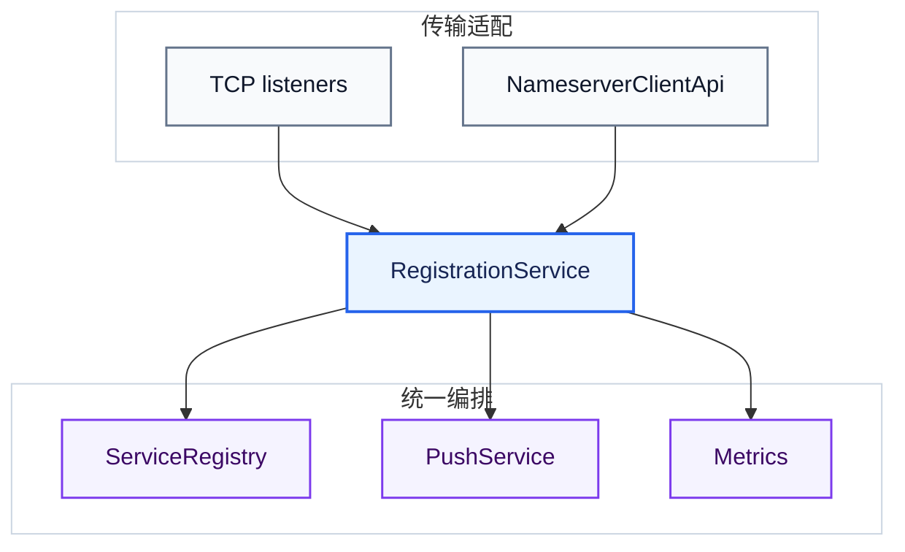

# 二次开发指南

[English](./development-guide.md) · [文档索引](./README.md)

这份指南适合需要扩展 Rover-Suite 或维护私有分支的团队。Rover-Suite 倾向使用显式的 Java 扩展点和尽可能小的部署面，优先选择能解决问题的最小扩展方式。欢迎提交 Issue、讨论和聚焦明确的 Pull Request；大型设计变更建议先提交 Issue 对齐方案。

面向普通使用者的插件创建、打包、配置和验证流程，请看[插件开发与接入](./plugin-development.zh-CN.md)。

## 1. 本地开发

环境要求：

- JDK 17+
- Maven 3.6+
- 只有修改对应 HTTP Registrar 示例时才需要其他语言运行时

构建并运行全部 Java 测试：

```bash
mvn clean verify
```

定向测试：

```bash
mvn -pl rover-nameserver-core -am test
mvn -pl rover-nameserver-client -am test
mvn -pl rover-gateway-core -am test
```

为另一个本地项目安装 SNAPSHOT 构件：

```bash
mvn clean install -DskipTests
```

端到端运行方式见[快速上手](./quick-start.zh-CN.md)。

## 2. 模块地图

| 模块 | 职责 |
| :--- | :--- |
| [`rover-common`](../rover-common/) | 公共模型、协议原语、JSON/配置工具与公开 SPI 契约 |
| [`rover-nameserver-core`](../rover-nameserver-core/) | 注册表、owner、健康过期、推送、TCP listener、HTTP/管理适配层 |
| [`rover-nameserver-bootstrap`](../rover-nameserver-bootstrap/) | Nameserver YAML 映射与可执行进程装配 |
| [`rover-nameserver-client`](../rover-nameserver-client/) | Java TCP 客户端、重连/恢复、缓存、查询、订阅 |
| [`rover-nameserver-starter`](../rover-nameserver-starter/) | Spring Boot 自动配置与服务提供方生命周期 |
| [`rover-gateway-core`](../rover-gateway-core/) | Netty Server、路由、Filter、代理、发现、负载均衡、运行时状态 |
| [`rover-gateway-bootstrap`](../rover-gateway-bootstrap/) | Gateway YAML 映射与可执行进程装配 |
| [`rover-admin`](../rover-admin/) | 可选 UI/Server，通过 HTTP 调用管理 API，不依赖两个 core 模块 |
| [`rover-gateway-adapter-nacos`](../rover-gateway-adapter-nacos/) | 可选 Nacos 服务发现适配器 |
| [`rover-gateway-test/backend`](../rover-gateway-test/backend/) | Spring Boot Starter 接入示例 |

运行时链路与依赖方向见[架构说明](./architecture.zh-CN.md)。

## 3. 先选择扩展方式

| 需求 | 推荐扩展方式 |
| :--- | :--- |
| 增加服务提供方语言 | 按 OpenAPI 实现 HTTP Registrar 状态机，无需改服务端 |
| 检查、补充、拒绝或短路 Gateway 请求 | `Filter` 插件 JAR |
| 增加上游选择算法 | `LoadBalancer` 插件 JAR |
| 接入外部发现源 | 源码级 `ServiceDiscovery` 适配与 Gateway 装配 |
| 增加服务提供方传输协议 | 调用 `RegistrationService` 的源码适配层 |
| 改变租约存储、revision 或 owner 语义 | 修改 core，并增加并发与兼容测试 |
| 增加可热更的运行时配置 | Runtime key + manager + applier + 线程安全应用 |

Filter 和 LoadBalancer 支持 ServiceLoader JAR。ServiceDiscovery 当前只提供源码契约，不会从 `plugins/` 目录加载。三者的扩展方式不同，不能都按“丢进 JAR 即可”的插件理解。

## 4. Filter 插件

实现 [`Filter`](../rover-common/src/main/java/com/rover/common/spi/filter/Filter.java)：

```java
package example.rover;

import com.rover.common.spi.filter.Filter;
import com.rover.common.spi.filter.FilterChain;
import com.rover.common.spi.filter.RequestContext;
import java.util.concurrent.CompletableFuture;

public final class TenantContextFilter implements Filter {
    @Override
    public int getOrder() {
        return -100;
    }

    @Override
    public CompletableFuture<Void> doFilter(RequestContext context, FilterChain chain) {
        context.setAttribute("tenant", "default");
        return chain.doFilter(context);
    }
}
```

在插件 JAR 中添加服务描述文件：

```text
META-INF/services/com.rover.common.spi.filter.Filter
```

文件内容是实现类全名：

```text
example.rover.TenantContextFilter
```

将 JAR 放到 `filters.pluginDir`（默认 `plugins`），或在 `filters.classes` 中填入带 public 无参构造器的类。
`getOrder()` 越小越先执行。避免阻塞 Netty 线程，需要返回 `CompletableFuture`；插件实例要线程安全，最好无状态。

`RequestContext` 可以传递属性并放行链路。当前短路回写响应需要转为
[`GatewayRequestContext`](../rover-gateway-core/src/main/java/com/rover/gateway/core/filter/GatewayRequestContext.java)
并调用 `writeText`，所以该类插件会额外耦合 `rover-gateway-core`。对宿主 API 使用 `provided` 依赖，并与宿主版本保持一致。

当前没有插件目录 watcher。Filter 只在过滤器链初始组装/重新组装时扫描 JAR；替换 JAR 后重启 Gateway 是最可预期的发布方式。实现见
[`GatewayFilterAssembler`](../rover-gateway-core/src/main/java/com/rover/gateway/core/filter/GatewayFilterAssembler.java)。

## 5. LoadBalancer 插件

实现 [`LoadBalancer`](../rover-common/src/main/java/com/rover/common/spi/loadbalance/LoadBalancer.java)：

```java
package example.rover;

import com.rover.common.model.ServiceInstance;
import com.rover.common.spi.loadbalance.LoadBalanceContext;
import com.rover.common.spi.loadbalance.LoadBalancer;

public final class FirstAvailableLoadBalancer implements LoadBalancer {
    @Override
    public String name() {
        return "first_available";
    }

    @Override
    public ServiceInstance choose(LoadBalanceContext context) {
        return context.hasInstances() ? context.getInstances().get(0) : null;
    }
}
```

将实现类写入：

```text
META-INF/services/com.rover.common.spi.loadbalance.LoadBalancer
```

配置：

```yaml
rover:
  gateway:
    filters:
      pluginDir: plugins
    loadbalance:
      strategy: first_available
```

`strategy` 也可以使用实现类全名。`choose` 会被并发调用：避免修改候选列表，内部状态需要线程安全。只有算法需要跟踪在途请求时才实现 `onStart`/`onComplete`。插件实例没有 close 回调。

插件 JAR 在策略创建/切换时扫描，不会持续监听目录。实现见
[`LoadBalancerFactory`](../rover-gateway-core/src/main/java/com/rover/gateway/core/loadbalance/LoadBalancerFactory.java)。

## 6. 注册扩展

### 增加语言参考实现

以 [OpenAPI v1](../rover-nameserver-core/src/main/resources/openapi/rover-registration-v1.yaml) 为契约，并保留
[服务注册指南](./service-registration.zh-CN.md#33-生命周期行为)中的状态机。新参考应包含：

- 一份依赖尽可能少的小型实现。
- 业务 ready 后启动、进程退出前关闭的接入示例。
- 固定间隔重试/心跳、有界超时与单一在途请求。
- 对 `INSTANCE_NOT_FOUND`、`STALE_SESSION`、鉴权与暂态错误的精确处理。
- 验证状态转移、重试时间、序列化与关闭的本地假服务端测试。
- README 中的多 worker/运行时限制。

避免为每种语言新增一套 Nameserver endpoint。

### 增加服务提供方传输层

现有两条传输路径统一进入
[`RegistrationService`](../rover-nameserver-core/src/main/java/com/rover/nameserver/core/registration/RegistrationService.java)：



新 adapter 只应处理传输编解码、鉴权、DTO 校验、owner 构造与状态映射。需要调用 `RegistrationService`；直接写
[`ServiceRegistry`](../rover-nameserver-core/src/main/java/com/rover/nameserver/core/registry/ServiceRegistry.java)
会绕过统一的 push/metrics 编排，也容易错误处理 registry 返回结果。原子幂等、revision 与 owner 检查本身位于 registry 实现中。

使用 [`RegistrationOwner`](../rover-nameserver-core/src/main/java/com/rover/nameserver/core/registration/RegistrationOwner.java)
表示传输/session owner，并严格映射
[`RegistrationResult`](../rover-nameserver-core/src/main/java/com/rover/nameserver/core/registration/RegistrationResult.java)，
不能削弱条件心跳/注销。`/v1/client/**` 与 `/_manage/**` 的 HTTP 路由隔离在
[`NameserverHttpApiHandler`](../rover-nameserver-core/src/main/java/com/rover/nameserver/core/manage/NameserverHttpApiHandler.java)中实现。

需要保持以下不变量：

- 注册表更新与 owner 检查原子完成。
- 同 owner、数据未变的重复注册幂等，不重复推送快照。
- 对消费方可见的变更增加服务 revision，并且只推送一次。
- 旧 owner、断连回调和过时过期扫描不能删除新 owner。
- 除非明确通过架构变更，在线实例继续保持纯内存软状态。

这些是扩展层需要遵守的目标不变量，不表示当前所有发现边缘都已经收口。当前最后实例空快照与多 `group` 推送隔离的
已知边界见[使用指南](./user-guide.zh-CN.md#9-当前运行边界)。修改注册表快照、推送或 Gateway 缓存时，需要同时覆盖：

- 精确分组订阅只能收到该组实例，通配订阅应收到完整服务快照。
- 同一 epoch 内更高 revision 的合法空快照能够清除最后一个实例，且不能被旧空快照回滚。
- push 丢失、拒绝或首次订阅失败后，query/reconcile 能恢复到 Nameserver 当前状态。

## 7. ServiceDiscovery 适配

[`ServiceDiscovery`](../rover-common/src/main/java/com/rover/common/spi/discovery/ServiceDiscovery.java)
定义 `start`、`getInstances`、`ensureWatch`、`close`。远端 watch/对账应在后台执行，`getInstances` 在请求路径中只读取本地缓存。

当前它不是可直接放入 `plugins` 目录的插件。`static` 走空实现；其它类型由
[`ServiceDiscoveryLoader`](../rover-gateway-core/src/main/java/com/rover/gateway/core/discovery/ServiceDiscoveryLoader.java)
用 ServiceLoader 找工厂。Nameserver 工厂在 core 里；Nacos 在可选模块里。
不做 Redis 发现：Redis 没有官方 Naming 协议，上报/拉取/摘除都得自研，和 Nacos/Nameserver 不是一类东西。
真有第三个中心（且它自带发现协议）再加类型：

1. 在 [`DiscoveryType`](../rover-gateway-core/src/main/java/com/rover/gateway/core/discovery/DiscoveryType.java) 加一个值，并补配置映射。
2. 实现 `ServiceDiscoveryFactory`，写入 `META-INF/services`。
3. 生命周期、缓存、重连/watch、对账测试。
4. 使用与部署文档。

`NACOS` 由可选的 `rover-gateway-adapter-nacos` 模块提供。可以使用 `-Pnacos` 打包 Gateway，或自行添加 adapter 依赖；当前只提供服务发现，不包含 Nacos Config 和服务注册。

## 8. 运行时配置扩展

启动配置顺序是 `./config/*.yml > classpath YAML > 代码默认值`。运行时 overlay 只支持已注册的键。当前热更范围有意保持在小集合：

- Gateway：负载均衡策略、代理请求超时、metrics、Filter 开关、trace。
- Nameserver：健康扫描周期、心跳超时、实例过期、push 开关。

端口、绑定地址、token、发现类型、插件路径/类、Client API 开关和 CORS 需要重启。路由 overlay 会整体替代 YAML 路由。

增加热配置键时：

1. 将 key 加入对应组件的 `*RuntimeConfigKeys`。
2. 在 `*RuntimeConfigManager` 注册校验和归一化。
3. 在 `*RuntimeConfigApplier` 中处理。
4. 线程安全地应用到在线运行时，不泄漏线程，不破坏在途请求。
5. Server 启动时注入 YAML 初值，并增加更新/回滚/重启测试。

公共机制入口是
[`AbstractRuntimeConfigManager`](../rover-common/src/main/java/com/rover/common/config/AbstractRuntimeConfigManager.java)。

## 9. 兼容边界

项目当前是 `1.0.0-SNAPSHOT`，还不建议假设二进制兼容已稳定。

- 将 `/v1` OpenAPI、已文档化配置键和 `rover-common` SPI 视为主要公开契约。
- `rover-*-core` 中的注册、Runtime、Netty 类属于源码二开内部面，升级可能需要重新编译和迁移。
- Java TCP Client/Starter 与 Nameserver 使用匹配版本。
- 避免复用已删除的协议字段 ID，避免静默修改状态机含义。
- 用户可见行为变更时，同步更新中英文公开文档。

## 10. 验证与变更检查

Registrar 检查：

```bash
node --test examples/http-registration/node/rover_registrar.test.js
python3 -m unittest discover -s examples/http-registration/python -p 'test_*.py'
(cd examples/http-registration/go && go test ./...)
php -l examples/http-registration/php/RoverHttpRegistrar.php
php -l examples/http-registration/php/example.php
cmake -S examples/http-registration/cpp -B build/rover-http
cmake --build build/rover-http
```

本地 Compose 发现行为（可选）：

```bash
./deploy/scripts/demo-fault.sh
```

本场参考：20 次 hello 为 10 / 10；`docker stop` / `kill` 其中一个都是立刻躲开；`docker pause` 约 35 秒躲开；
停 Nameserver 约 2 秒内仍转；停最后一个实例立刻 502，约 17 秒后 503。
`docker kill` 走断连清理，不是心跳超时。说明见 [`deploy/docker/README.md`](../deploy/docker/README.md)。

合入维护分支前：

- 运行变更模块的定向测试；跨模块变更运行 `mvn test` 或 `mvn clean verify`。
- 新的 core/插件行为补充并发、异常与重载测试。
- 避免提交密钥、本地 `config/` 文件、生成二进制和 IDE 文件。
- 在脏工作区保留其他用户变更。
- 契约变更时同步更新 OpenAPI、示例、两份根 README 与公开指南。
- 在变更记录中说明行为变化、兼容影响、验证命令与已知运行限制。

公开反馈可提交 Issue、讨论或 Pull Request；维护私有分支时仍建议保持变更聚焦，便于小团队审阅、回滚和维护。
