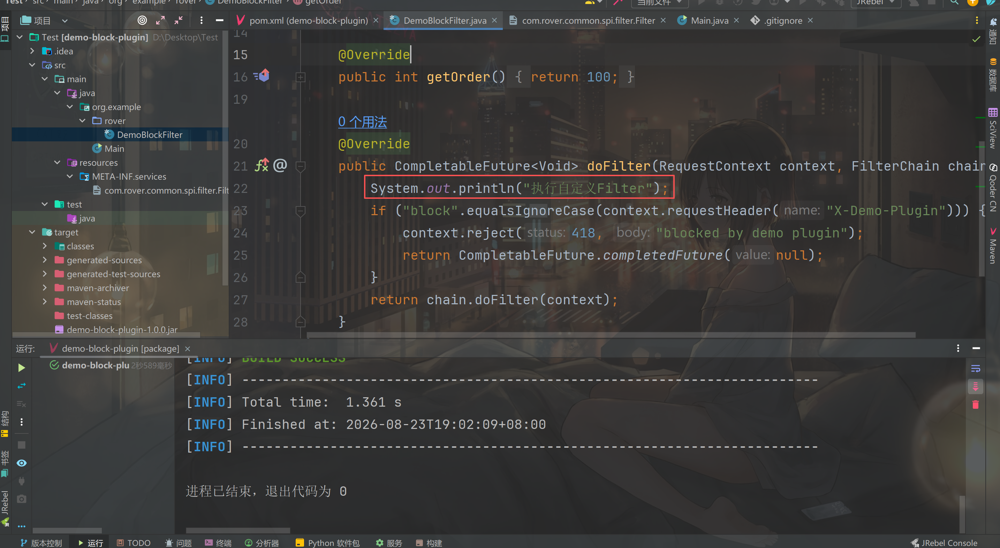
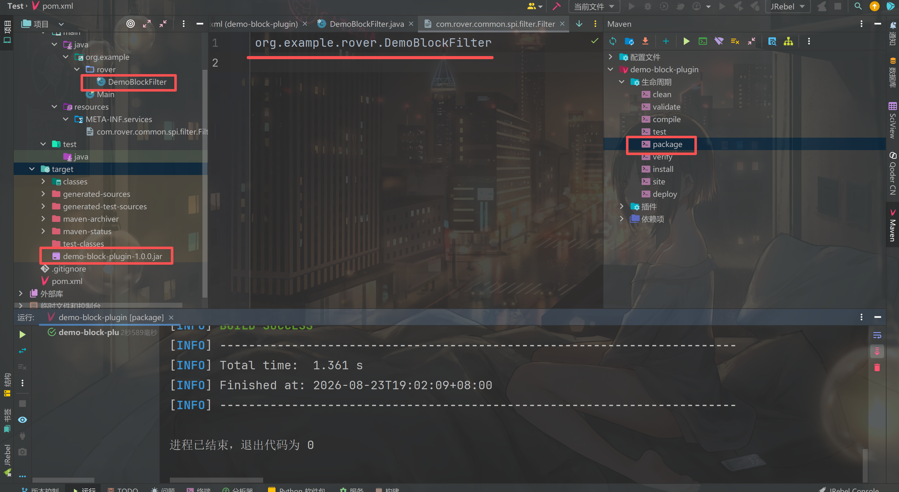
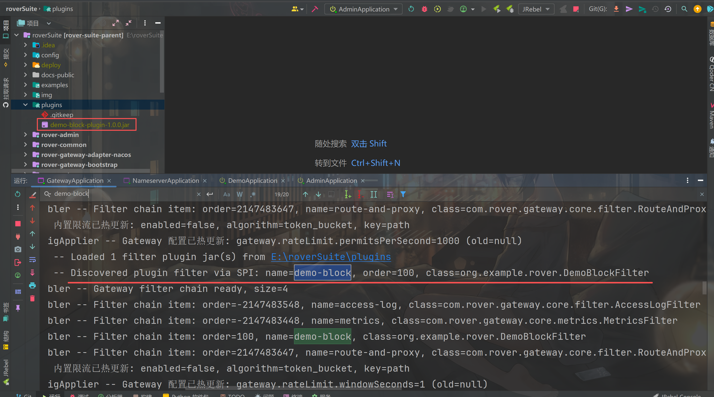
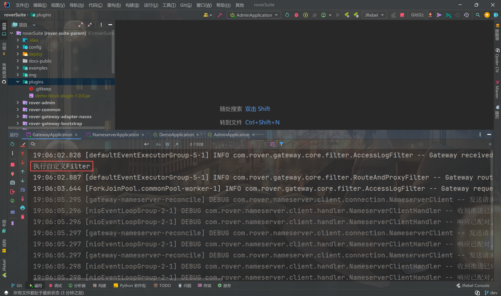
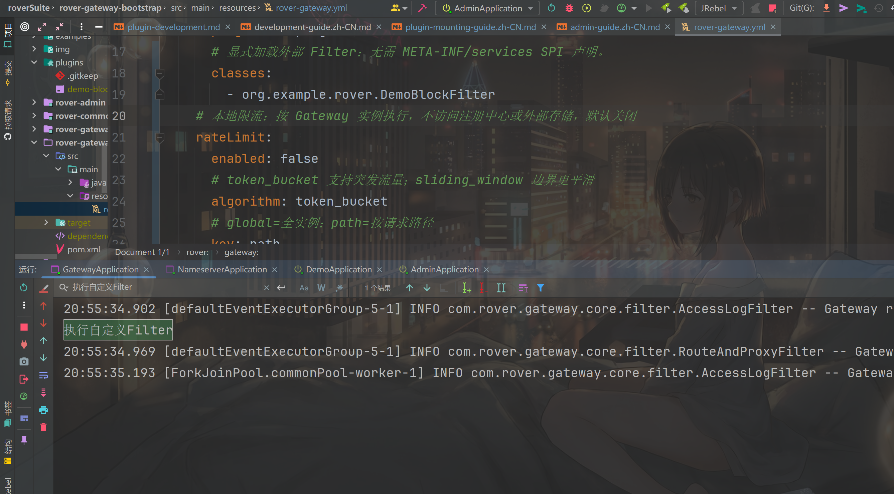
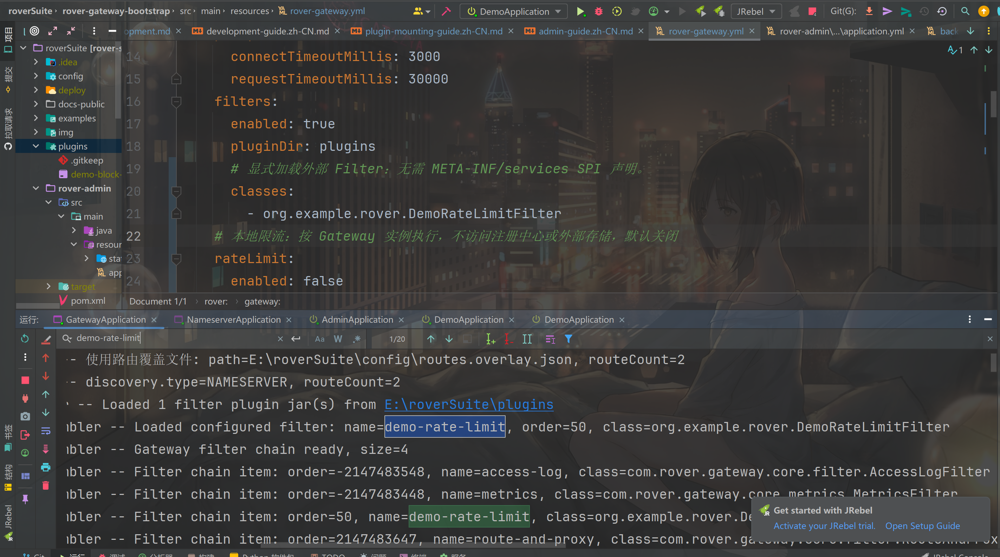
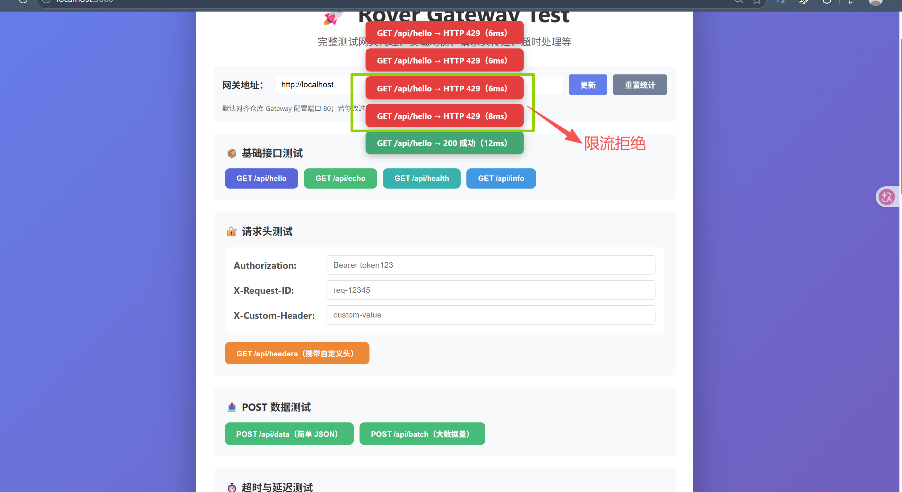
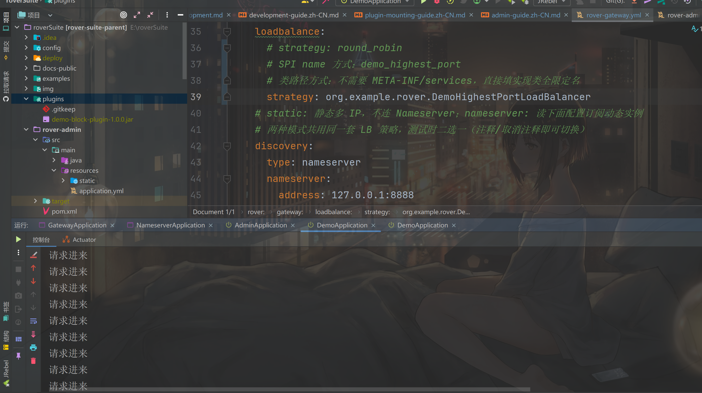

# Plugin Development and Integration

Rover Gateway plugins run inside the Gateway process. Rover currently exposes two pluggable extension points: user `Filter` plugins and load-balancing strategy plugins. They are not standalone services and are not Admin plugins: they participate directly in the Gateway request path and must match the Rover-Suite version.

This guide covers creating a JAR, declaring SPI metadata, placing it in Gateway, configuring it, and verifying it. A complete compilable demo can be maintained separately; before publishing a plugin, validate it with the same JDK and Rover-Suite version as the target deployment.

## Extension points and loading paths at a glance

There are **2 directly mountable extension points**. Each extension point supports SPI discovery and explicit configuration, so there are up to **4 operational loading paths**; these are not four plugin categories.

| Extension point | SPI auto-discovery | Explicit class loading |
| --- | --- | --- |
| User `Filter` plugin | `META-INF/services/com.rover.common.spi.filter.Filter`, then ordered by `getOrder()` | Put the Filter FQCN in `rover.gateway.filters.classes` |
| Load-balancing strategy plugin | `META-INF/services/com.rover.common.spi.loadbalance.LoadBalancer`, selected by `name()` | Put the implementation FQCN in `rover.gateway.loadbalance.strategy` |

Both extension points share the same `pluginDir` and `URLClassLoader`. A `LoadBalancer` is not inserted as a separate `Filter` node; it is the strategy slot inside the fixed terminal `RouteAndProxyFilter` stage. `ServiceDiscovery`, registration transport adapters, and Nacos are source-level extensions today and are not mounted from `plugins`; the EventBus `ServiceLoader` is also a separate classpath mechanism, not a `plugins`-directory plugin.

### Choosing a Filter mounting method

| Method | Operator experience | Best fit |
| --- | --- | --- |
| **SPI auto-discovery** | Declare implementations in the JAR's SPI file. Gateway loads every declared Filter, with no per-class YAML entry. | A drop-in capability whose declared Filters should all run in the environment. |
| **Explicit FQCN** | No SPI file is required. Put the JAR in `pluginDir` and list the exact class in `filters.classes`. | A JAR with optional Filters, or an environment where operations must decide exactly which classes run. |

SPI is simpler, but every registered Filter is enabled. Explicit loading is more flexible, but adding, removing, or
renaming a Filter also requires a configuration change and a Gateway restart.

## 1. Choose an extension point

| Extension point | Use | Integration |
| --- | --- | --- |
| `com.rover.common.spi.filter.Filter` | Lightweight auth, traffic labels, audit, business rate limiting, and request policy | Auto-discovered through SPI, or listed by FQCN in `filters.classes` |
| `com.rover.common.spi.loadbalance.LoadBalancer` | Upstream selection strategy used by the fixed proxy stage | Select by SPI `name()`, or configure the implementation FQCN |

Lower `Filter.getOrder()` values run earlier. A filter must call `chain.doFilter(context)` to continue. Use `context.requestHeader(name)` to read an authentication header and `context.reject(status, body)` to short-circuit a request, then return an already-completed future. Gateway's built-in local limiter is enabled with `rover.gateway.rateLimit`; disable it and implement a custom Filter when limits must use user, tenant, or shared global state.

## 2. Create a minimal Maven plugin project

The plugin only needs a compile-time dependency on `rover-common`. Gateway provides it at runtime, so do not package `rover-common` or the whole Gateway into the plugin JAR, and do not use a shade plugin to duplicate Rover classes.

```xml
<dependency>
  <groupId>com.rover</groupId>
  <artifactId>rover-common</artifactId>
  <version>1.0.0-SNAPSHOT</version>
  <scope>provided</scope>
</dependency>
```

If this snapshot is not available from a Maven repository, run `mvn -DskipTests install` in the Rover-Suite root first, or publish `rover-common` to an internal repository. Compile for a JDK supported by Gateway (JDK 17+ for the current project).

## 3. Implement the plugin

### Filter example

```java
package com.example.rover;

import com.rover.common.spi.filter.Filter;
import com.rover.common.spi.filter.FilterChain;
import com.rover.common.spi.filter.RequestContext;
import java.util.concurrent.CompletableFuture;

public final class RequestTagFilter implements Filter {
    @Override
    public String getName() {
        return "request-tag";
    }

    @Override
    public int getOrder() {
        return 100;
    }

    @Override
    public CompletableFuture<Void> doFilter(RequestContext context, FilterChain chain)
            throws Exception {
        context.setAttribute("plugin", "request-tag");
        return chain.doFilter(context);
    }
}
```

### LoadBalancer example

```java
package com.example.rover;

import com.rover.common.model.ServiceInstance;
import com.rover.common.spi.loadbalance.LoadBalanceContext;
import com.rover.common.spi.loadbalance.LoadBalancer;

public final class FirstHealthyLoadBalancer implements LoadBalancer {
    @Override
    public String name() {
        return "first_healthy";
    }

    @Override
    public ServiceInstance choose(LoadBalanceContext context) {
        return context.getInstances().isEmpty()
                ? null
                : context.getInstances().get(0);
    }
}
```

Implementations must be public, instantiable, and have a no-argument constructor. A LoadBalancer receives candidates that the caller has already filtered for health. Return `null` when there are no candidates; do not query Nameserver from the plugin.

### Optional: expose plugin settings in Admin

Implementing `ConfigurablePlugin` is optional for either a `Filter` or a
`LoadBalancer`. Gateway turns each declared property into
`gateway.plugin.<namespace>.<key>`, shows it in Admin under **Plugin
configuration**, validates it, applies it immediately, and persists it in the
Gateway runtime overlay.

```java
import com.rover.common.spi.plugin.ConfigurablePlugin;
import com.rover.common.spi.plugin.PluginConfigProperty;
import com.rover.common.spi.filter.Filter;
import com.rover.common.spi.filter.FilterChain;
import com.rover.common.spi.filter.RequestContext;
import java.util.List;
import java.util.concurrent.CompletableFuture;

public final class RequestTagFilter implements Filter, ConfigurablePlugin {
    private volatile boolean enabled = true;
    private volatile String tag = "request-tag";

    @Override public String configNamespace() { return "request-tag"; }

    @Override
    public List<PluginConfigProperty> configProperties() {
        return List.of(
                new PluginConfigProperty("enabled", "true", "Whether to add the tag",
                        List.of("true", "false"), false),
                new PluginConfigProperty("tag", "request-tag", "Attribute value to add"));
    }

    @Override
    public void validateConfig(String key, String value) {
        if ("enabled".equals(key) && !"true".equalsIgnoreCase(value)
                && !"false".equalsIgnoreCase(value)) {
            throw new IllegalArgumentException("enabled must be true or false");
        }
        if ("tag".equals(key) && (value == null || value.isBlank())) {
            throw new IllegalArgumentException("tag must not be blank");
        }
    }

    @Override
    public void applyConfig(String key, String value) {
        switch (key) {
            case "enabled" -> enabled = Boolean.parseBoolean(value);
            case "tag" -> tag = value;
            default -> throw new IllegalArgumentException("unknown plugin setting: " + key);
        }
    }

    @Override
    public CompletableFuture<Void> doFilter(RequestContext context, FilterChain chain) {
        if (enabled) {
            context.setAttribute("plugin", tag);
        }
        return chain.doFilter(context);
    }
}
```

The screenshot below shows the same minimal shape in a real plugin project. The
`System.out.println` is only useful for a first integration check; production
plugins should use the application's standard logger and avoid high-volume
per-request logging.



Keep runtime fields initialized to the same defaults declared in
`configProperties()`. `configNamespace()` and property keys may contain only
letters, digits, `.`, `_`, and `-`; the full key must be unique across active
plugins. The callback runs on Gateway's management request, so it must only
replace local state; never do blocking I/O, remote calls, or irreversible work.
Only loaded plugins are shown. Adding, replacing, or removing a plugin JAR
still requires a Gateway restart.

## 4. Declare SPI metadata

Create one or both of these files in the plugin project:

```text
src/main/resources/META-INF/services/com.rover.common.spi.filter.Filter
src/main/resources/META-INF/services/com.rover.common.spi.loadbalance.LoadBalancer
```

Each file contains one implementation FQCN per line, without `.class` or a JAR path:

```text
com.example.rover.RequestTagFilter
```

```text
com.example.rover.FirstHealthyLoadBalancer
```

File names, packages, and case must match exactly. SPI is optional for filters: you can instead list a filter FQCN in `filters.classes`. For a LoadBalancer, set `gateway.loadbalance.strategy` to the SPI `name()` or directly to an implementation FQCN.

For explicit Filter loading, do not include the Filter SPI file and configure the FQCN instead:

```yaml
rover:
  gateway:
    filters:
      enabled: true
      pluginDir: plugins
      classes:
        - org.example.rover.DemoBlockFilter
```

Gateway still scans JARs in `plugins/`; it uses the configured class name to instantiate the Filter instead of reading
an SPI descriptor.

## 5. Package and install it in Gateway

```bash
mvn -DskipTests package
mkdir -p <gateway-working-dir>/plugins
cp target/my-rover-plugin-1.0.0.jar <gateway-working-dir>/plugins/
```

In IntelliJ, run the Maven `package` lifecycle goal. The generated JAR is in
the plugin project's `target/` directory. Copy that JAR into Gateway's
`pluginDir`; the default `plugins` means `plugins/` below the **Gateway process
working directory**, not a Java source package or an Admin directory.



The default plugin directory is `plugins` under the Gateway process working directory. Use an absolute or custom relative path if needed:

```yaml
rover:
  gateway:
    filters:
      enabled: true
      pluginDir: plugins
      classes:
        - com.example.rover.RequestTagFilter
    loadbalance:
      strategy: first_healthy
```

`pluginDir` is a filesystem directory, not a classpath directory. Relative paths are resolved from the Gateway process working directory. Every `*.jar` in the directory is scanned; use unique filenames and remove old versions to avoid duplicate classes.

## 6. Verify the integration

1. Start Gateway and check for `Loaded ... plugin jar(s)`, `Discovered plugin filter via SPI`, or `Gateway filter chain ready` in the logs.
2. Configure `gateway.loadbalance.strategy` in `rover-gateway.yml` with a built-in strategy, a LoadBalancer SPI `name()`, or an implementation FQCN. This is a startup/plugin-mounting setting and is not edited from Admin; the Admin dashboard only shows the running state. Multiple strategies may coexist, but only one global strategy is active at a time; duplicate SPI names, including a built-in name, fail Gateway startup. A plugin implementing `ConfigurablePlugin` appears with the Gateway settings.
3. Send a request through a matching route and confirm the filter in tracing or application logs; for a LoadBalancer, observe that requests follow the custom selection policy.
4. Restart Gateway after changing a plugin JAR, SPI file, or class path. Whether a configuration-only change is hot-applied depends on that configuration item; do not rely on hot reload for adding or replacing JARs.

### Verified Filter SPI walkthrough

The local `demo-block` walkthrough verifies both required stages: Gateway finds
one JAR in `E:\\roverSuite\\plugins`, discovers
`org.example.rover.DemoBlockFilter` from SPI, and assembles it into the filter
chain at order `100`; a subsequent real request prints `执行自定义Filter`, proving
that the plugin executed rather than merely being scanned.





For this header-blocking example, test the rejection branch with:

```powershell
curl.exe -i -H "X-Demo-Plugin: block" http://127.0.0.1:80/any-matched-route
```

It should return `418` and `blocked by demo plugin`. Without that header, the
plugin calls `chain.doFilter(context)` and the request continues to routing and proxying.

### Verified explicit-class example (without SPI)

After removing the SPI file, run Maven `clean` before `package` so stale resources under `target/` are not packaged.
Place the resulting JAR back in `plugins/`, set `filters.classes` to
`org.example.rover.DemoBlockFilter`, and restart Gateway. The screenshot shows
both the configured FQCN and the `执行自定义Filter` log from a real request.



### Verified custom rate-limit Filter example

Rover's built-in limiter is `RateLimitFilter` with the built-in
`token_bucket` and `sliding_window` algorithms. For IP, user, tenant, canary,
or Redis-backed distributed limiting, do not extend the internal `RateLimiter`;
write a normal `Filter` plugin instead.

The local `DemoRateLimitFilter` walkthrough uses explicit class loading:

```yaml
rover:
  gateway:
    filters:
      enabled: true
      pluginDir: plugins
      classes:
        - org.example.rover.DemoRateLimitFilter
```

Gateway logs show `demo-rate-limit` assembled into the filter chain, and burst
requests to the same path return `429`. This proves that custom rate limiting
uses the same extension path as any other user Filter.





### Verified LoadBalancer FQCN example

A LoadBalancer can also skip SPI and use an implementation FQCN directly in
`gateway.loadbalance.strategy`. The verified example below uses
`org.example.rover.DemoHighestPortLoadBalancer`: Gateway loads the JAR from
`plugins/`, instantiates the custom LoadBalancer by class name, and real
requests follow that strategy.



`gateway.loadbalance.strategy` is a startup/plugin-mounting setting and is not
edited from Admin. To switch a custom LoadBalancer, update `rover-gateway.yml`
and restart Gateway. This avoids Admin overwriting a YAML-defined custom
strategy with a built-in value.

For a configurable `request-tag` plugin, changing a value directly through the
Gateway management API is equivalent to saving it in Admin:

```bash
curl -X POST http://127.0.0.1:8080/_manage/configs \
  -H 'Content-Type: application/json' \
  -d '{"key":"gateway.plugin.request-tag.enabled","value":"false"}'
```

The next request uses the new value. `GET /_manage/configs` lists the exact
keys that the currently loaded plugins declared.

## 7. Troubleshooting

- **Plugin is not discovered:** check that the directory exists, the file ends in `.jar`, the path is resolved from Gateway's working directory, and the JAR contains the expected `META-INF/services/...` file.
- **Invalid SPI file:** the file name must be the interface FQCN and each line must be an implementation FQCN; do not add Markdown, commas, or suffixes.
- **Explicit class cannot be loaded:** the class must be public, have a no-argument constructor, implement the expected interface, and be configured with its FQCN.
- **Unsupported `strategy`:** with SPI, use the implementation's `name()` and make the configured value match it (matching is case-insensitive); an FQCN containing `.` is also accepted.
- **`NoSuchMethod` or `ClassCastException`:** the plugin was compiled against a different `rover-common` version, or bundled a duplicate copy of `rover-common`.
- **Will plugins slow down Gateway?** Lightweight plugins such as header checks, request tagging, in-memory counters, or upstream selection usually add very small overhead. The real risk is plugin code doing blocking I/O, remote calls without timeouts, unbounded retries, or large-body logging in the request path. If a plugin must call an external system, set timeouts, limits, and fallbacks.

## 8. Security and compatibility boundaries

A plugin has Gateway process privileges. Review JARs as trusted code; there is currently no sandbox, signature verification, or tenant isolation. Never put tokens, cookies, Authorization headers, or complete request bodies in logs, attributes, or exceptions.

Pin the plugin to the same Rover-Suite version as Gateway and rebuild and verify it during upgrades. SPI interfaces, documented configuration keys, and the `ServiceInstance`/`RequestContext` contracts are extension boundaries; undocumented internal classes are not compatibility promises. Publish source, version, dependency inventory, and a compatibility matrix with the plugin.
